# Docker
* 참고 서적: 완벽한 IT 인프라 구축을 위한 Docker
* 최초 작성일: 2023.07.09
* 작성자: jang-nmau

## 목차
* [1장. 시스템 기반의 기초 지식](#1장-시스템-기반의-기초-지식)
    * [1.1 용어 정리](#1-용어-정리)
    * [1.2 네트워크 기초지식](#2-네트워크-기초지식)
    * [1.3 OS(Linux) 기초지식](#3-oslinux-기초지식)
    * [1.4 미들웨어 기초지식](#4-미들웨어-기초지식)
    * [1.5 인프라 구성관리 기초 지식](#5-인프라-구성-관리-기초-지식)
    * [1.6 CI/CD](#6-cicd)
* [2장. 컨테이너 기술과 Docker의 개요](#2장-컨테이너-기술과-docker의-개요)
    * [2.1 컨테이너 기술의 개요](#1-컨테이너-기술의-개요)
    * [2.2 LXC, (Linux Container)](#2-linux-containerlxc)
    * [2.3 Docker의 동작 구조](#3-docker의-동작-구조)
    * [2.4 Docker의 기능](#4-docker의-기능)
    * [2.5 Docker 컴포넌트](#5-docker-컴포넌트)
* [3장. Docker 설치, 튜토리얼](#3장-docker-설치-튜토리얼)
    * [3.1 Docker 실습 환경 구성](#1-docker-실습-환경-구성)
    * [3.2 Docker 실습 - Nginx](#2-docker-실습---nginx)
* [4장. Docker 실습](#4장-docker-실습)
    * [4.1 Docker 이미지](#1-docker-이미지)
    * [4.2 Docker 컨테이너](#2-docker-컨테이너)
    * [4.3 Docker 컨테이너 네트워크](#3-docker-컨테이너-네트워크)
    * [4.4 가동중인 컨테이너 조작](#4-가동중인-docker-컨테이너-조작)


    
# 1장. 시스템 기반의 기초 지식

## 1. 용어 정리
* Docker: 애플리케이션 실행 환경을 작성 및 관리하기 위한 플랫폼.
* 애플리케이션을 릴리스하여 최종 사용자가 이용하려면, 
    1. 시스템 기반 구축이 필요하고.
    2. 그 위에 애플리케이션 실행 환경을 마련해야 한다.

* 시스템 기반: 애플리케이션을 가동시키기 위해 필요한 하드웨어, 네트워크, OS/미들웨어와 같은 인프라

* 미들웨어: 서버 OS 상에서 서버가 특정 역할을 수행하기 위한 소프트웨어

* 온프레미스(on-premises): 자사에서 물리적인 데이터 센터를 두고 직접 서버를 운용.

* public 클라우드: 인터넷을 경유하여 불특정 다수에게 제공되는 클라우드 서비스
    * CSP(AWS, Azure, GCP) 이용. 서비스 종류: IaaS/PaaS/SaaS..
    * 이점: 오토스케일을 통한 유연성.

* private 클라우드: 특정 기업 그룹에만 제공되는 클라우드 서비스
    * 보안 확보의 이점. 독자 기능, 서비스 추가가 쉽다.

* 클라우드 사용의 이점
    * 오토스케일: 인프라 설계 중 sizing(트래픽 예측을 통한 설계) 과정의 어려움을 해결.
    * 백업: '업무 연속성'과 관련. 다양한 지점/국가의 데이터 센터에 백업 시스템을 두고 재난 발생 시 대책으로 사용.

* 일반적인 클라우드와 같은 분산환경에서는 인프라 엔지니어가 수동으로 운용하지 않고 자동화 된 툴을 사용해서 오케스트레이션 한다.


## 2. 네트워크 기초지식
* 방화벽: 내부 네트워크와 외부와의 통신을 제어하는 방법으로 내부 네트워크의 안전을 유지한다.
    * 패킷 필터형: 통과하는 패킷을 포트 번호나 IP주소를 방타으로 필터링하는 방법 
        * ex) 포트번호 80과 443만 통과해도 좋다, 안전한 세그먼트로부터 온 패킷 외에는 모두 파기한다.
        * 위와 같은 룰을 정해 필터링. 패킷 필터링 룰을 ACL(액세스 제어 리스트)라고 한다.
    * 애플리케이션 게이트웨이형: 애플리케이션 프로토콜 레벨에서 외부와의 통신을 대체 제어. __프록시 서버라고 불림__


## 3. OS(Linux) 기초지식
* Linux Kernel: OS의 코어로써 메모리 관리, 파일 시스템, 프로세스 관리, 디바이스 제어 등 OS로서 하드웨어나 애플리케이션 소트웨어를 제어하기 위한 기본적 기능을 갖고있는 소프트웨어.

* 디바이스 관리: 하드웨어(CPU/메모리/디스크/IO장치 등)를 디바이스 드라이버를 통해 제어
* 프로세스 관리: Linux 커널은 프로세스에 PID라는 식별자를 붙여 관리하고 이들의 실행을 위해 CPU를 효율적으로 할당(스케줄링)하는 역할을 한다.
* 메모리 관리: 프로세스의 실행을 위해 필요한 데이터는 모두 메모리상에 올라와야 한다.(부분적으로라도) Linux 커널은 프로그램/데이터를 메모리에 효율적으로 할당하고 해제한다.
    * 메모리 용량의 제한을 극복하기 위해, 하드디스크와 같은 보조기억장치에 가상 메모리 영역을 만든다. 이를 backing store라고 한다.
    * Linux 커널은 스와핑 정책에 따라 이용빈도가 낮은 데이터와, 필요한 데이터를 스와핑한다.(각각 swap out/ swap in)

* Shell: 쉘은 사용자와 커널 사이에서 명령을 해석/전달하는 중간다리. 인터페이스이다.
    * 애플리케이션 실행/정지/재실행
    * 환경변수 관리
    * 명령 이력 관리(히스토리), 실행 결과 표시 및 파일 출력
* 쉘 스크립트: 쉘에서 실행하고자 하는 명령을 모아 텍스트 파일에 기술한 것

* Linux 파일 시스템과 VFS(Virtual File System)
    * 데이터가 어떤 디스크에 저장되어 있는지에 따라, 당연히 해당 디스크를 읽는 방법도 다르다.
    * Linux커널은 VFS라는 장치를 사용해 어떤 디스크에 담겨있던 각 디바이스를 파일로 취급하여 동일한 방식으로 데이터를 읽을 수 있다.

* Linux 보안 기능
    * 계정에 대한 권한 설정
        * 일반 사용자와 root
        * 미들웨어와 같은 데몬을 기동시키기 위한 시스템 계정
        * 그룹 설정과 그룹별 액세스 권한(permission) 설정
    * 네트워크 필터링
        * iptables: 내장된 패킷 필터링 및 네트워크 주소 변환(NAT) 기능을 설정
        * 패킷 필터링: 패킷의 헤더 부분을 보고 조건(송/수신 IP, 포트번호 등)과 일치하면 설정한 액션(전송, 파기, 주소수정..) 수행. 방화벽과 같은 역할을 한다.
    * SELinux(Security Enhanced Linux)
        * 미 국가안보국에서 제공하는 Linux 커널에 강제 액세스 제어 기능을 추가한 기능이다.
        * 기존 리눅스 시스템이 root 계정 탈취에 취약하다는 점을 보완.
        * HTTP/FTP와 같은 프로세스마다 액세스 제한을 거는 TE(Type Enforcement)와 root도 포함한 모든 사용자에 관해 제어를 거는 롤베이스 액세스 제어(RBAC) 등으로 Linux를 제어한다.

## 4. 미들웨어 기초지식
* 미들웨어란 OS와 업무 처리를 수행하는 애플리케이션 사이에 들어가는 소프트웨어를 의미.
* 미들웨어는 OS의 기능을 확장한 것, 애플리케이션에서 사용하는 공통 기능을 제공하는 것, 각종 서버 기능을 제공하는 것 등 종류가 많다.

* 웹 서버/웹 애플리케이션 서버
    * 웹 서버: 클라이언트의 브라우저가 보내 온 HTTP 요청을 받아 웹 콘텐츠를 응답으로 반환하거나, 다른 서버사이드 프로그램을 호출하는 기능을 갖고있는 서버.
    * Apache, Nginx, 등이 있다.

* 데이터베이스 서버
    * 시스템이 생성하는 데이터를 관리하기 위한 미들웨어
    * 데이터의 CRUD와 같은 기본 기능 외에, 트랜잭션 처리 등도 포함하여 DBMS라고도 불린다.
    * MySQL, PostgreSQL, Oracle Database.. 등이 있다.
    * 전통적인 RDB와 다른 새로운 방식의 NoSQL이 존재한다.
    * NoSQL은 병렬분산처리나 유연한 스키마 설정 등이 특징으로, 주요 방식으로는 KVS(키-밸류 스토어)나 도큐먼트 지향 DB, XML DB등이 있다. 
    * 대용량 데이터 축적이나 병렬처리에 뛰어나, 다수의 사용자 액세스를 처리할 필요가 있는 온라인 시스템에서 널리 사용된다.
    * Redis: 메인메모리 상에서 KVS 구축. 캐시 서버로 이용된다. 메모리 상 데이터는 정기적으로 백업한다.
    * MongoDB: Document 데이터를 콜렉션으로 관리. 복잡한 계층 구조가 특징
    * Apache Cassandra: 하나의 Key에 대해 여러개의 칼럼을 가지고, 관계형 테이블에 가까운 데이터 구조를 갖는다.

* 시스템 감시 툴
    * 서버나 장비의 상태를 감시하여 미리 설정한 경계 값을 초과한 경우 정해진 액션을 실행하도록 자동화한 툴
    * Zabbix, Datadog, Mackerel.. 등이 있다.

* 이 외에도 HTTP에 의한 통신 트랜잭션과 업무처리 요청인 처리 트랜잭션을 관리하는 트랜잭션 모니터 등이 있다.

## 5. 인프라 구성 관리 기초 지식
* 인프라 구성 관리: 인프라를 구성하는 H/W, 네트워크, OS, 미들웨어, 애플리케이션의 구성 정보를 관리하고 적절하게 유지하는 작업
    * Immutable Infrastructure
        * 클라우드 시스템의 등장으로 기존, 시스템을 유지보수하며 사용하던 리스크가 큰 방식에서 -> 변경이력을 관리하지 않고 파기 후 새로이 구축하는 형태로 변화
        * 지금 현재의 인프라 상태만을 관리하면 되도록 변화했다.
    
* 코드를 사용한 구성 관리 (Infrastructure as Code)
    * 이전까지는 모든 서버를 수작업으로 엔지어가 각각 구성 관리 -> 복잡하고 힘듬, 실수 발생 가능성
    * 누가 실행하든 같은 결과가 나오도록, 구성관리를 자동화. 
    * 인프라 구성정보도 버전관리 시스템을 통해 변경 이력을 일원화하여 관리할 수 있게되었다.
    * __Docker에서는 Dockerfile이라는 파일에 인프라 구성정보를 기술. 이를 통해 컨테이너의 바탕이 되는 Docker 이미지를 생성할 수 있다.__

* 인프라 구성 관리 툴
    * Bootstrapping: OS의 시작을 자동화
        * OS설치, 가상환경 설정, 네트워크 구성 설정
        * KickStart, Vagrant(로컬 PC에 가상환경 구축)
    * Configuration: OS나 미들웨어의 설정을 자동화
        * OS설정(보안/서비스 시작 등), 미들웨어(각종 서버)의 설치 및 설정
        * Chef, Ansible, Puppet...
    * Orchestration: 여러 서버의 관리를 자동화
        * 애플리케이션 배포, 서버군의 오케스트레이션
        * Kubernetes
    
    * Kbuernetes와 오케스트레이션
        * 대규모 시스템은 여러 대의 서버로 구축된다. 쿠버네티스는 이러한 분산 환경의 서버들을 관리하기 위한 툴
        * 쿠버네티스는 컨테이너 오케스트레이션의 사실상 표준.
        * 컨테이너 가상환경에 있어서 여러 컨테이너를 통합 관리한다.

## 6. CI/CD
* Continuous Integration
    * 애플리케이션의 코드를 추가 및 수정할 때마다 테스트를 실행하고 확실하게 작동하는 코드를 유지하는 방법.
    * 소프트웨어 품질향상을 목적으로 고안된 개발 프로세스
    * 단위테스트는 Jenkins와 같은 인티그레이션 툴 사용하지만, 통합 환경에서의 작동 보장은?
    * 인프라 구성에 영향을 많이 받는 애플리케이션의 특성 상, 일관된 구성환경에서 자동으로 테스트하는 파이프라인을 구성.
    * 개발자가 코드를 커밋하면 자동으로 빌드와 테스트를 실행하고 결과 보고서를 작성해준다.
    * 개발자는 결과 보고서를 확인하고 피드백

* Continuous Delivery
    * 기존에 요구사항 정의, 분석설계, 개발, 테스트, 배포의 단계를 거치는 개발방법론은 시간이 너무 오래 걸린다는 문제점이 있다.
    * 그래서 기능을 추가할 때마다 애플리케이션을 제품 환경에 배포(deploy)하고 시스템 이용자의 피드백에 기초하여 그 다음 개발 기능을 결정하는 '애자일 개발 프로세스'가 유행.
    * 짧은 사이클의 개발과 릴리스 반복이 특징. 사용자가 원하는 기능을 적시에 제공!
    * __애플리케이션 테스트 환경과 제품환경에 도입하는 절차가 다르면 문제발생__
    * 따라서, 절차를 코드로 관리. 인프라 환경도 포함한 테스트가 끝난 애플리케이션 실행 환경을 그대로 제품환경에 전개! -> 안전한 애플리케이션 버전업/배포(deploy) 가능
    * 블루 그린 디플로이먼트: 클라우드환경에서 사용할 수 있는 배포 방법. 현재 작동중인 시스템(블루)과 버전업 후의 시스템(그린)을 동시에 작동시킨 상태에서 시스템을 전환. 문제 발생 시 바로 현행 시스템으로 롤백.


# 2장. 컨테이너 기술과 Docker의 개요

## 1. 컨테이너 기술의 개요
* VM은 독립적인 Guest OS의 소유. 인스턴스마다 OS가 존재해야 하므로 무겁고 확장성이 떨어진다.
* 네트워크로 Virtual Image를 주고받는 것이 부담스럽다. os 가상화에만 주력하여 배포/관리 기능이 부족하다.
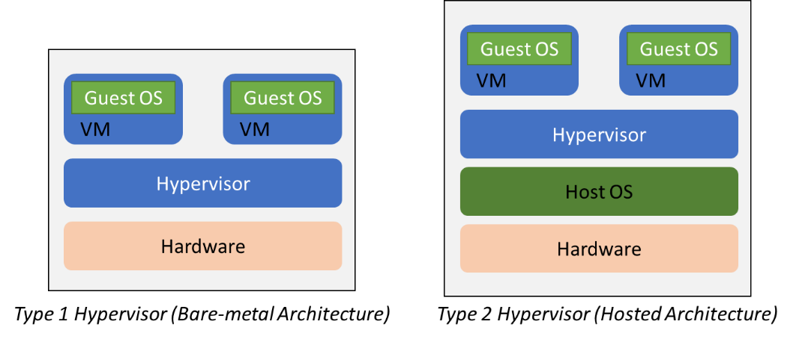

* Container: 개별 애플리케이션 실행에 필요한 실행환경을 모아 마치 별도의 서버인 것처럼 독립적으로 사용한다.
    * __호스트 OS의 리소스를 논리적으로 분리시키고, 여러개의 컨테이너가 공유하여 사용한다.__
    * 컨테이너는 오버헤드가 적기 때문에 가볍고 고속으로 작동한다. 게스트 OS가 없기 때문
    * 기존에 하나의 H/W, 하나의 OS를 가진 시스템과 비교했을 때, 컨테이너 기술은 OS나 디렉토리, IP주소 등과 같은 시스템 자원을 마치 각 애플리케이션이 점유하고 있는 것처럼 보이게 할 수 있다.
    * 즉, 컨테이너는 서로간의 간섭을 막고 실행환경의 독립성을 보장한다.
    * 애플리케이션 실행에 필요한 모듈을 모아 컨테이너를 만들기 때문에, 컨테이너를 조합하여 하나의 애플리케이션을 구축하는 MSA와도 친화성이 높다.

* 컨테이너 역사
```
FreeBSD Jail
    시스템을 Jail이라고 부르는 독립된 작은 구획에 가둬 분할한다.
    프로세스, 네트워크, 파일 시스템의 구획화가 특징.

Solaris Containerrs(Oracle)
    Solaris zone: 하나의 OS 공간(global zone)을 파티셔닝(여러 non-globalzone으로)하여 여러 OS가 동작하는 것처럼 행동한다.
    당연히 서로 다른 non-global zone에 있는 프로세스는 서로 액세스할 수 없다.
    Solaris 리소스 매니저 기능: non-global zone에 하드웨어 리소스를 배분하는기능.
```

## 2. Linux Container(LXC)
Namespace와 cgroup으로 만들어진 Container  
Docker는 Linux Container를 사용한다. 초기에는 LXC(Linux Container)를 기반으로구현.  
버전업하며 LXC를 대신하는 libcontainer를 개발하여 사용해왔다. 무엇을 사용할지는옵션으로 선택 가능.
* 동작 구조
### 1. namespace: Container를 구분하는 구조
    * 프로세스를 실행할 때, 시스템의 리소스를 분리해서 실행할 수 있다.
    * Container 분리 시 Linux 커널의 namespace 사용.
    * Linux Object에 이름을 부여하여 6가지의 독립된 환경을 구축한다.
        * __PID / Network / UID(+GID) / MOUNT / UTS / IPC namespace__  + (Cgroup Namespace / time Namespace)
            * MOUNT: 컴퓨터에 연결된 장치나 기억장치를 OS에 인식시켜 이용할 수 있게 만듬
                * MOUNT 네임 스페이스는 namespace 안에 격리된 파일시스템 트리를 만든다.
            * UTS: 호스트명이나 도메인명을 격리한다.
            * IPC: 프로세스 간 통신을 격리. IPC는 공유 메모리나 세마포어 메시지큐를 의미.
                * 세마포어: 프로세스가 요구하는 자원 관리에 이용되는 배타제어 장치
                * 메시지 큐: 여러 프로세스 간 비동기 통신을 할 때 사용되는 큐잉장치.

    > 프로세스가 사용중인 Namespace ID를 '/proc/[PID]/ns' 디렉터리에서 확인할 수 있다.
    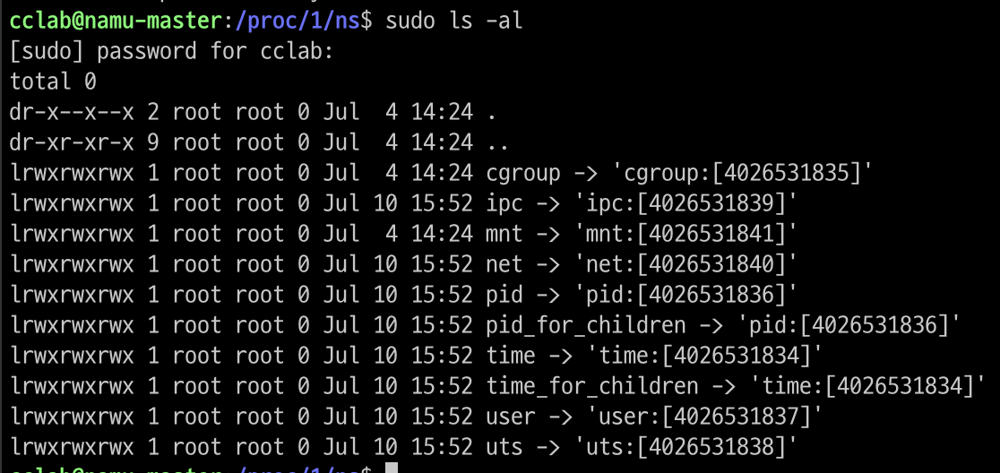
    
    >__리눅스에서 각 프로세스는 1번 프로세스의 네임스페이스를 공유해서실행된다.__  
     __아래는 PID가 263인 프로세스가 사용중인 네임스페이스를 확인할결과이다.__
    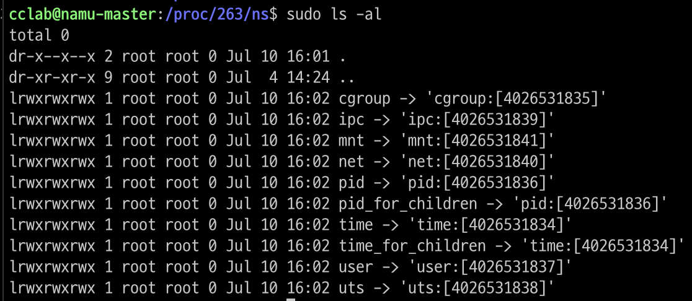
    * PID 네임스페이스
        * 프로세스 ID를 격리할 수 있다. 리눅스에서 PID는 init 프로세스 1로 시작하며 그 외 프로세스는 항상 1보다 큰 PID를 부여받는다.
        * __PID 네임스페이스를 분리하면 PID가 다시 1부터 시작한다.__
        * 단, 이 프로세스는 디폴트 네임스페이스와 분리된 PID 네임스페이스에 동시에 속하는 것이며, 분리된 곳에서는 PID가 1이지만 디폴트 네임스페이스에서는 1보다 큰 어떤 값을 PID로 갖게된다.
    * 네트워크 네임스페이스
        * 프로세스의 네트워크 환경을 분리할 수 있다.
        * 그렇게하면, 네임스페이스에 속한 프로세스들에 새로운 IP를 부여하거나 네트워크 인터페이스를 추가하는 것이 가능하다.
    * UTS 네임스페이스
        * 호스트 네임과 NIS(Network Information Service) 도메인 이름을 격리한다.
            * NIS?: 네트워크 상의 컴퓨터들 사이에 있는 사용자와 호스트 이름과 같은 구성 데이터를 제공하는 분산 데이터베이스.
        * 네트워크 네임스페이스와 함께 네트워크 격리를 위해 사용한다.

<br>

### 2. cgroup (control group):resource 관리구조, 릴리스 관리 장치
    * 프로세스들이 사용할 수 있는 컴퓨팅 자원을 제한하고 격리하는 커널의 기능
    * 사용자가 원하는 만큼의 리소스를 격리된 프로세스에 할당해주는것을 말한다.
    * 리눅스의 프로그램은 프로세스로서 실행. 프로세스는 하나 이상의스레드로 동작.
    * cgroups는 프로세스와 스레드를 그룹화하여 그 그룹 안에 존재하는프로세스와 스레드에 대해 관리한다. 
    * ex)호스트  OS의 CPU나 메모리와 같은 자원을 그룹별로 제한.
        1. cpu: CPU 사용량을 제한
        2. cpuacct: CPU 사용량 통계 정보 제공
        3. cpuset: CPU나 메모리 배치 제어
        4. memory: 메모리나 스왑 사용량을 제한
        5. devices: 디바이스에 대한 액세스 허가/거부
        6. freezer: 그룹에 속한 프로세스 정지/재개
        7. net_cls: 네트워크 제어 태그 부가, Linux 트래픽 컨트롤러(tc)가 특정 그룹에서 발생하는 네트워크 패킷에 식별자(classid) 지정
        8. blkio: 블록 디바이스(디스크, USB, SSD..) 입출력량 제어
    * cgroups는 계층구조를 사용하여 프로세스를 그룹화. 관리할 수 있다.자식은 부모의 제한을 물려받는다.

    * chroot: 데이터 영역에 대해서 특정 디렉토리를 루트 디렉토리로 변경하여 분리 환경을 구성한다.

<br>

## 3. Docker의 동작 구조
* LXC와 Docker의 차이
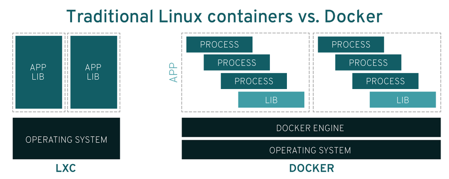
* LXC는 하나의 컨테이너에 여러 응용을 띄울 수 있는 반면, 도커는 1 컨테이너 1 응용을 권장한다.
* 도커의 방식에는 여러 장점이 있는데,,
    * 재사용이 쉽고 보안 및 격리 관점에서 더 많은 유연성을 가져올 수 있다.
    * 업데이트 시 서로 간섭을 받지 않으며, MSA를 구성하는 것이 효율적이다.
* LXC는 캡쳐기능이 없지만 Docker는 존재한다. 구축된 환경을 이미지 파일로 저장 후 언제든 공유/사용이 가능하다.

<br>

### Docker의 동작구조
* Namespace, cgroups
* 네트워크 구성(가상 브리지/가상 NIC)
    * Linux는 Docker를 설치하면 호스트 서버의 물리 NIC가 docker0이라는 가상 브리지 네트워크로 연결된다. (이는 docker를 실행시킨 후 디폴트로 만들어짐.)
    * Docker 컨테이너가 실행되면 컨테이너에는 172.17.0.0/16 서브넷마스크를 가진 사설 IP주소가 eth0으로 자동으로 할당된다. 
    * 컨테이너의 이 가상 NIC(eth0)는 이와 대응되는 NIC와 터널링 통신을 한다.
    * 즉, Docker는 NAPT 기능을 사용하여 외부망과 연결한다.
    * NAT, NAPT, 포트포워딩
        * NAT(Network Address Translation)
            * 사설IP와 공인 IP의 1대1 대응. (다대다 대응도 가능하지만, LAN 내에서 각 노드들을 구분할 방법이 없어서 외부->내부 통신이 불가능)
            * 사설 IP를 숨기고 보안을 얻을 수 있다. 다대다 대응을 사용하는 경우 공인 IP의 소모를 줄일 수 있다.
        * NAPT(Network Address Port Translation)
            * 사설IP + 포트번호를 합쳐 공인IP에 대응한다.
            * ex) 공인 IP : 8080포트를 사설IP :80포트에 대응시킬 수 있다.
            * 내부망에 노드들을 포트로 구분 가능하므로 외부->내부 통신도 문제없이 가능하다. 다만, 포트번호가 고정되어 있을 경우에 얘기.
        * 포트포워딩: LAN의 연결되는 노드에 대해 포트를 고정하여 할당한다. 즉, 특정 노드가 특정 포트를 고정적으로 부여받는다.
    * Docker는 NAPT에 Linux iptables를 사용하며, Linux에서 NAPT 기술을 구축하는 것을 __IP mascarade__라고 한다.

### Docker 이미지의 데이터 관리 장치
* 도커는 Copy on Write 방식으로 컨테이너 이미지를 관리한다.
    * Copy on Wirte란? 복사 요청시 바로 수행하지 않고 수정이 가해진 시점에 새로이 빈 영역을 확보하고 데이터를 복사한다.
* Docker의 이미지를 관리하는 스토리지 디바이스
    * AUFS: 다른 파일 시스템을 투과적으로 겹쳐서 하나의 파일 트리를 구성할 수 있는 파일 시스템, Linux 표준은 아니다.
    * Btrfs: 리눅스용 Copy on Write 파일 시스템. 롤백과 스냅샷 기능을 갖고있다.
    * Device Mapper: 리눅스 커널에 들어가 블록 디바이스 드라이버와 이를 지원하는 라이브러리들. 파일 시스템의 블록 I/O와 디바이스의 매핑 관계 관리.
        * Centos, Fedora 같은 레드햇, 우분투 OS 등에서 도커를 이용시 사용된다.
        * thin-provisioning 기능과 스냅샷 기능을 갖고있다.
        * 스토리지 프로비저닝과 thick/thin provisioning
            * 스토리지 프로비저닝이란 하드디스크나 SSD와 같은 물리적 스토리지 공간을 클라이언트에게 할당하는 작업을 말한다.
            * Thick provisioning: 고정된 스토리지 공간을 할당. 실제로 그 공간을 다 쓰던말던 스토리지는 그만큼 할당되어있다.
            * Thin provisioning: 유연하게 실제로 사용하는 만큼의 공간을 할당한다. 즉, 실제로 공간이 할당되는 것은 쓰기작업을 할 때이다.
    * OverlayFS: 파일 시스템에 다른 파일 시스템을 투과적으로 merging하는 장치.
    * ZFS: 오라클이 개발한 새로운 파일시스템으로 볼륨관리, 스냅샷, 체크섬 처리, replication등을 지원한다.

<br>

## 4. Docker의 기능
* Docker는 애플리케이션 실행에 필요한 환경을 하나의 이미지로 모아, 다양한 환경에서 실행환경을 구축하고 운용하기 위한 플랫폼.
* 내부적으로 컨테이너 기술 사용.
* __도커에서는 인프라(OS, 네트워크, H/W..) 환경을 컨테이너로 관리한다.__
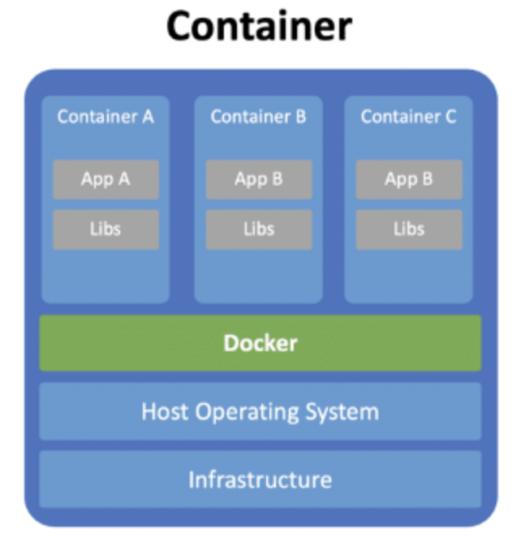

* Docker의 기능
    1. Build: 이미지를 만드는 기능
        * app. 실행에 필요한 프로그램 본체, 라이브러리, 미들웨어, OS, 네트워크 설정 등을 하나로 모아서 Docker 이미지를 만든다. 
        * __Docker이미지는 실행환경에서 움직이는 컨테이너의 바탕이 된다.__
        * __Docker에서는 하나의 이미지에는 하나의 애플리케이션만 넣고, 여러 컨테이너를 조합하여 서비스를 구축하는 방법을 권장한다.__

    2. Ship: 이미지를 공유
        * 이미지는 Docker Registry에서 공유할 수 있다. 대표적으로 'hub.docker.com' 
        * GitHub에 연동하여 Dockerfile을 관리하고, Docker 이미지를 자동으로 생성하여 도커 허브에 공개할 수도 있다. (Automated Build)
        > Docker Container Trust
        >> Docker 이미지 제공자를 검증하는 방법. 이미지 제공자는 레지스트리에 이미지를 송신하게 전에 개인키로 이미지에 서명하고, 이용자는 공개키로 이를 검증한다.
        
        > Security Scanning
        >> Docker 이미지를 직접 검사하여 이미 알려진 보안상의 취약점이 없음을 확인하는 방식이다.

    3. Run: 컨테이너를 작동시키는 기능
        * Docker는 리눅스 상에서 컨테이너 단위로 서버 기능을 작동시킨다. 
        * Dokcer 이미지와 Docker 런타임이 존재하면 어디서든 컨테이너를 작동시킬 수 있다.
        * 당연히 하나의 이미지로 여러 컨테이너를 만드는 것도 가능.
        * 도커는 하나의 linux 커널을 여러 컨테이너에서 공유. 컨테이너 안에서 작동하는 프로세스를 하나의 그룹으로 관리.
        * 그룹마다 각각 파일 시스템이나 호스트명, 네트워크 등을 할당하는 등 독립된 공간으로 관리한다.
        * 보통 여러 대의 호스트 머신에 도커 컨테이너를 분산하여 구축하고, 컨테이너 관리는 쿠버네티스와 같은 오케스트레이션 툴을 이용한다.


    * Docker 이미지
        * app. 실행에 필요한 파일들이 저장된 디렉토리.
        * 수동으로 만들수도 있으나, Dockerfile이라는 설정 파일로 자동으로 구성하는 것이 일반적(CI/CD)
        * Docker 이미지는 겹쳐서 사용할 수 있다. ex) OS용 이미지에 웹 app.용 이미지를 겹쳐서 다른 새로운 이미지를 만들 수 있음
            * 우분투 배포판과 같은 베이스 이미지에 미들웨어, 라이브러리, app 등을 넣은 이미지를 겹쳐 독자적인 이미지를 만드는 식..
        * __Docker에서는 구성에 변경이 있는 부분을 차분(이미지 레이어)로 관리한다.__

<br>

## 5. Docker 컴포넌트
* Docker는 몇 개의 컴포넌트로 구성되어 있다. 가장 핵심인 Docker Engine을 중심으로 컴포넌트를 조합하여 실행환경을 구축한다.
    * Docker Engine, 핵심기능
        * Docker 이미지 생성, 컨테이너 기동을 위한 핵심기능. Docker 명령 실행이나 Dockerfile에 의한 이미지 생성도 담당.
    * Docker Registry, 이미지 공개/공유
        * Docker 이미지: 컨테이너의 바탕이 됨
        * Docker 이미지를 공개/공유하기 위한 기능. 도커 허브도 이를 사용한다.
    * Docker Compose, 컨테이너 일원 관리
        * 여러 개의 컨테이너 구성 정보를 코드로 정의하여 컨테이너를 일원화된 방식으로 관리한다.
    * Docker Machine, Docker 실행환경 구축
        * 로컬 호스트용(Virtual Box), 클라우드 환경(EC2, Azure)와 같은 Docker의 실행환경을 명령으로 자동 생성한다.
    * Docker Swarm, 클러스터 관리
        * 여러 Docker 호스트를 클러스터화 하는 툴이다. 
        * Manager: 클러스터 관리, API 제공
        * Node: Docer 컨테이너 실행.
        * 대신 오픈소스인 Kubernetes를 이용하는 곳이 많다.

<br><br>
# 3장. Docker 설치, 튜토리얼

## 1. Docker 실습 환경 구성
>* Ubuntu 22.04.1 LTS
>* Kernel: 5.15.0-76-generic
>* Docker CE: 24.0.4

* Linux, Ubuntu 환경에 Docker를 설치한다.
* 다운받을 수 있는 패키지 목록을 업데이트한다.
    * update: 설치가능한 패키지 목록을 최신화
    * upgrade: 현재 설치할 수 있는 가장 최신 패키지로 업그레이드

### 설치 사전 준비
* 목록을 최신화한다.
    ```bash
    sudo apt-get update
    ```

* HTTPS를 경유하여 리포지토리를 사용할 수 있도록 필수 패키지를 설치한다.
    * apt-transport-https: 패키지 관리자가 https를 통해 데이터 및 패키지에 접근할 수 있도록 한다.
    * ca-certificates: certificate는 certificate authority에서 발행되는 디지털 서명. SSL(Secure Socket Layer)인증서의 PEM 파일이 포함되어 있어 SSL 기반 앱이 SSL 연결이 되어있는지 확인할 수 있다.
    * curl(client url): 프로토콜을 이용해 URL로 데이터를 전송하여 서버에 데이터를 보내거나 가져올 때 사용하는 CLI 도구 
    * software-properties-common: PPA를 추가하거나 제거할 때 사용한다.
        * PPA(Personal Package Archive): 개발자가 소스코드를 업로드하면 자동으로 패키지화하여 사용자가 다운로드 받아 설치할 수 있게 해주는 소프트웨어 저장소
    ```bash
    sudo apt-get install -y \
        apt-transport-https \
        ca-certificates \
        curl \
        software-properties-common
    ```

* 다음 명령으로 Docker의 공식 GPG 키를 추가한다.
    * GPG? GNU Privacy Guard는 개인간, 머신간, 또는 개인-머신간에 교환되는 메시지나 파일을 암호화하거나 서명을 추가하여 작성자를 확인하고 변조유무를 식별할 수 있게 해주는 도구다.
    * 기본적으로 공개 키 암호화 방식을 사용하여 종단간 파일이나 메시지를 암호화하거나 서명하는 기능을 제공한다.
    ```bash
    curl -fsSL https://download.docker.com/linux/ubuntu/gpg | sudo  apt-key add -
    ```
* 마지막으로 Docker의 리포지토리를 추가한다.
    ```bash
    sudo add-apt-repository \
        "deb [arch=amd64] https://download.docker.com/linux/ubuntu \
        $(lsb_release -cs) \
        stable"

    sudo apt-get update
    ```

### Docker 설치하기
* Docker 커뮤니티 에디션(ce)을 다운받는다. 설치가 끝나면 자동으로 docker가 시작된다.
    ```bash
    sudo apt-get install docker-ce
    ```
* Docker의 동작을 확인한다. 컨테이너를 작성하고 실행할 때에는 'docker container run' 명령을 사용한다.
    ```bash
    docker container run <Docker 이미지명> <실행할 명령>

    docker container run ubuntu:latest /bin/echo 'Hello world' 
    # Ubuntu 이미지를 바탕으로 Docker 컨테이너를 작성 및 실행한 후 작성한 컨테이너 안에서 Hello World를 출력한다.
    ```
1. docker container run: 컨테이너를 작성 및 실행
2. <Docker 이미지명>: 바탕이 되는 Docker 이미지
3. <실행할 명령>: 컨테이너 안에서 실행할 명령
    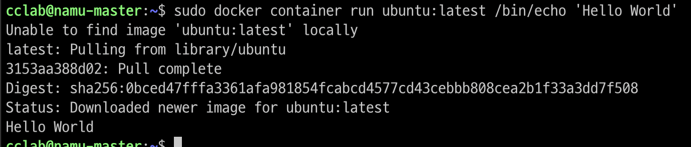
1. 먼저 명령을 실행하면 Docker 컨테이너의 바탕이 되는 Ubuntu의 Docker이미지가 로컬에 있는지 확인한다.
2. 만일 로컬에 없다면 Docker 리포지토리에서 Docker 이미지를 다운로드한다.
    * 'ubuntu:latest'는 Ubuntu의 최신버전 이미지를 취득한다는 뜻
3. 다운로드가 완료되면 컨테이너가 시작되고, Linux의 echo 명령이 실행된다.
4. 처음은 Docker 이미지를 다운로드 하는데 시간이 걸리지만, 두번째부터는 로컬에 이미지를 바탕으로 컨테이너를 시작한다.
    * __이렇게 로컬환경에 다운로드된 Docker 이미지를 로컬 캐시라고 한다.__

* 다음과 같은 방법으로 도커의 버전을 확인한다.
    ```
    docker version
    ```
    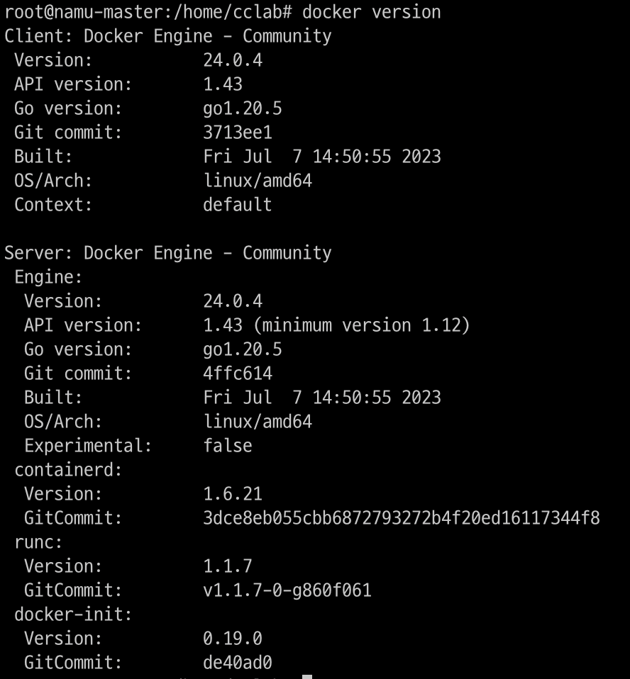
* Docker는 clent-server 구조를 채택하고 있어, client와 server는 remote API를 경유하여 연결된다. 따라서 docker 명령은 서버로 보내져 처리된다.

* Docker 실행환경을 확인한다.
    ```bash
    docker system info
    ```

* Docker 디스크 이용 상황을 확인한다.
    ```bash
    docker system df
    ```

* [Error] Got Permission denied while trying to connect to the Docker daemon socket at unix
* 에러 발생 시 해결방안
    ```bash
    sudo chmod 666 /var/run/docker.sock
    sudo groupadd docker
    sudo usermod -aG docker $USER
    newgrp docker
    ```

## 2. Docker 실습 - Nginx 
>* [실습]웹서버를 Docker를 통해 구축해보자
* Nginx 환경을 구축한다. Nginx는 대량의 요청을 처리하는 대규모 사이트에서 주로 이용된다.
* Docker 이미지를 다운로드한다. Nginx의 공식이미지는 DOcker의 공식 리포지토리, Docker Hub에 제공되어있다.
    ```bash
    # 이미지를 다운로드한다.
    docker pull nginx
    ```
* 클라이언트 PC에 다운로드 된 이미지는 아래 명령으로 확인할 수 있다.
    ```
    docker image ls
    ```
    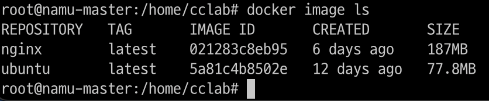

* 이미지를 사용하여 Nginx 서버를 가동한다.
    ```bash
    # 이미지 'nginx'를 사용하여 webserver라는 이름의 Docker 컨테이너를 기동시킨다.
    # -p 옵션을 붙여 브라우저에서 HTTP에 대한 액세스를 허가하고, 컨테이너가 보내는 전송을 허가한다.
    docker conatiner run --name webserver -d -p 80:80 nginx
    ```
    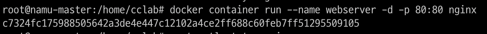
    * 여기서 __-d 옵션은 컨테이너를 일반 프로세스가 아닌 데몬 프로세스로, 백그라운드로 실행한다.__
    * -p 옵션은 포트를 지정하는데, 앞에 80은 호스트 컴퓨터에 포트, 뒤에 80은 컨테이너 내부에서 리스닝하고 있는 포트를 의미한다.
    * 영/숫자로 된 문자열은 컨테이너 ID로 Docker 컨테이너를 고유하게 식별한다.
    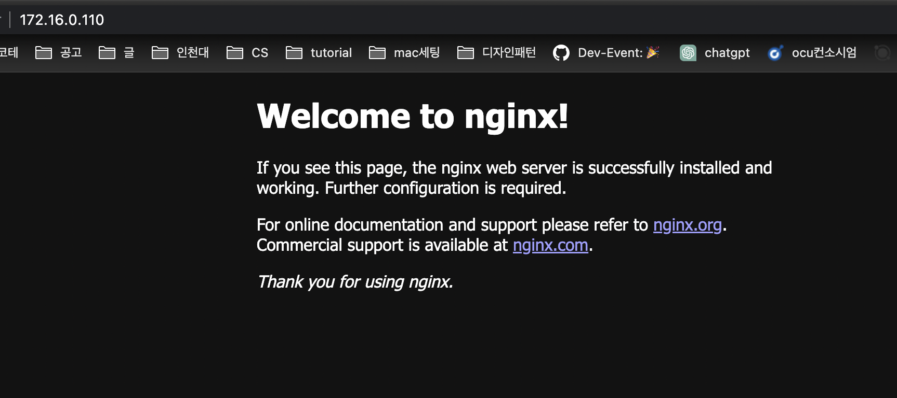
    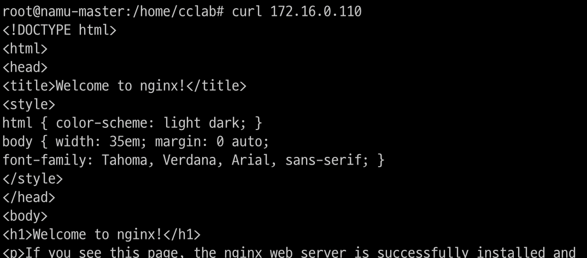
* Nginx 서버의 상태를 확인
    ```bash
    docker container ps
    ```
* 컨테이너 가동확인
    ```bash
    docker container stats webserver
    ```
* 컨테이너 정지
    ```bash
    docker stop webserver
    ```
* 컨테이너 가동
    ```bash
    docker start webserver
    ```

# 4장. Docker 실습

## 1. Docker 이미지
### Docker 이미지 조작
* __이미지 다운로드__
    ```bash
    # docker image pull [옵션] 이미지명[:태그명]
    # Centos의 버전 7 이미지를 취득한다. 태그명 생략 시 default=latest
    docker image pull centos:7

    # -a 옵션으로 모든 태그의 Docker 이미지를 취득할수도 있다.
    docker image pull -a centos

    # Docker 이미지명 대신 URL을 지정할 수 도 있다. URL은 프로토콜(https://)을 제외하고 지정한다.
    # 텐서플로우의 이미지를 URL로 취득
    docker image pull gcr.io.tensorflow/tensorflow
    ```

* __이미지 목록 표시__
    * 취득한 이미지의 목록을 표시한다.
    ```bash
    # docker image ls [옵션] [리포지토리명]
    # -all, -a 옵션은 모든 이미지를 표시
    # --digests 옵션은 다이제스트 표시여부
    # --no-trunc 결과를 모두 표시
    # --quiet, -q Docker 이미지 ID만 표시
    docker image ls
    ```
    * Docker 이미지를 작성하면 랜덤한 문자열의 고유한 이미지 ID가 부여된다.
    * Docker 레지스트리에 업로드한 이미지는 이미지를 고유하게 식별하기 위한 다이제스트가 부여된다.

* __이미지의 위장이나 변조를 방지하는 기법__
    * Docker Content Trust(DCT): DOcker 이미지의 위장이나 변조를 방지하고 이미지의 정당성을 확보하는 기능.
    * 이미지 작성자가 Docker 레지스트리에 업롣하기 전에 로컬환경에서 이미지 작성자의 비밀키로 서명.
    * 사용자가 서명이 된 이미지를 다운할 때, 이미지 작성자의 공개키를 사용해 진짜인지 확인한다. 이 공개키를 __Tagging Key__라고 한다.
    * DCT 기능을 사용하려면 다음과 같은 설정이 필요하다.
    ```bash
    # docker image pull 명령을 사용하여 이미지를 다운하기 전에, 이미지를 검증한다
    export DOCKER_CONTENT_TRUST=1
    # export DOCKER_CONTENT_TRUST=0 으로 DCT기능을 무효화한다.
    ```
    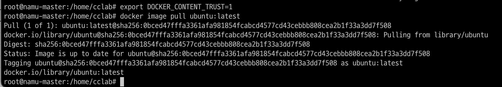
    * 다운로드 전에 검증이 일어나는 것을 확인할 수 있다.
    * 서명이 되어있지 않은 이미지를 사용하면 오류가 발생한다.

* __이미지 상세 정보 확인__
    ```bash
    # docker image inspect <Image_Name[:Tag_name]>
    docker image inspect centos:7
    ```
    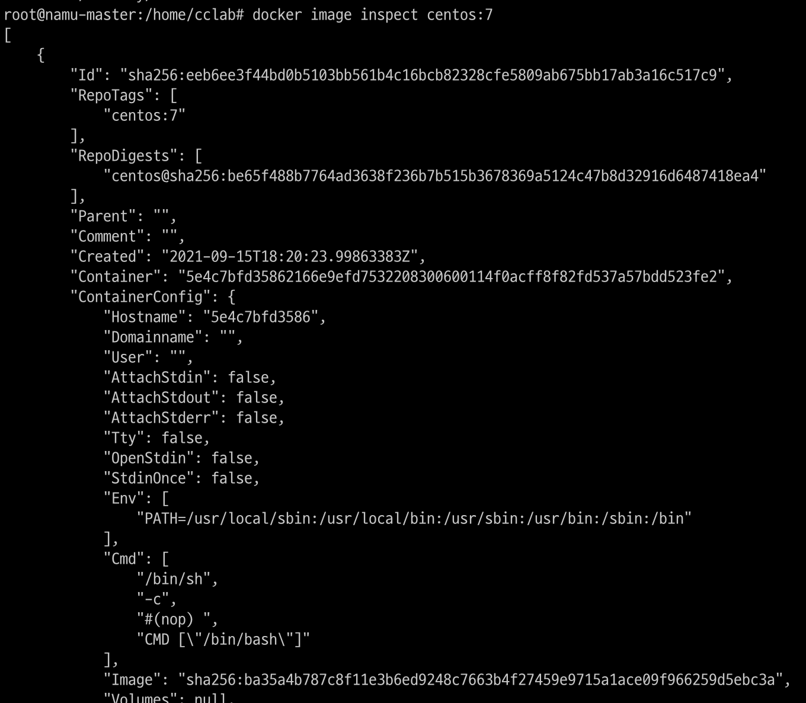
    * 결과는 JSON형식으로 반환된다. 이를 편집하여 원하는 정보를 얻을 수 있다.
    * 예를 들어 OS의 값을 취득하고 싶을 경우에는 --format 옵션에서 JSON 형식 데이터의 계층 구조를 지정한다. 다음과 같이 지정한다.
    ```bash
    # OS의 값은 루트 아래에 있는 "OS"안에 설정되어 있으므로 다음과 같이 지정한다.
    docker image inspect --format="{{ .Os}}" centos:7
    # 다음 명령은 ContainerConfig의 Image 값을 취득한다.
    docker image inspect --format="{{.ContainerConfig.Image}}" centos:7
    ```

* __이미지 태그 설정__
* 이미지 태그에는 식별하기 쉬운 버전명을 붙인다. 
* Docker Hub에 작성한 이미지를 등록하려면 다음과 같은 규칙으로 이미지에 사용자명을 붙여야한다.
* <Docker Hub 사용자명>/이미지명:[태그명]
    ```bash
    # docker image tag
    docker image ls
    # Nginx Docker 이미지에 대해 사용자명이 asashiho이고 컨테이너명이 webserver이며, 태그 버전정보가 1.0인 태그를 붙인다.
    docker image tag nginx asashiho/webserver:1.0
    ```
    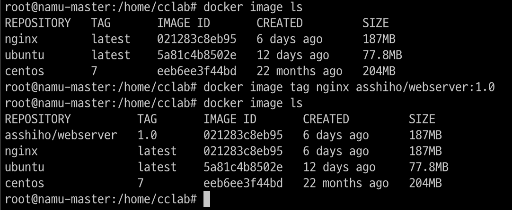
    * 유심히 보면 태그를 붙인 이미지(asshiho/webserver)와 원래 이미지인 nginx의 imageId가 같다.
    * 즉, 태그는 별명을 붙인 것이지 이를 복사하거나 이름을 바꾼 것이 아니다. 실체는 같다.

* __이미지 검색__
* Docker Hub에 공개되어 있는 이미지를 검색한다.
    ```bash
    # docker search [옵션] <검색 키워드>
    # --no-trunc
    # --limit: n건의 검색 결과 표시
    # --filter=stats=n: 즐겨찾기의 수 (n이상)를 지정
    docker search kubernetes
    docker search --filter=start=1000 centos
    ```
    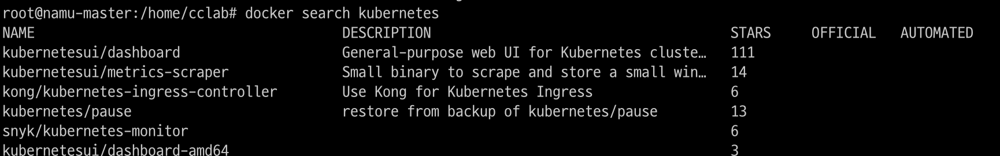
    * AUTOMATED: Dockerfile을 바탕으로 자동 생성된 이미지인지 아닌지를 나타낸다.
    * STARS: 즐겨찾기 수
    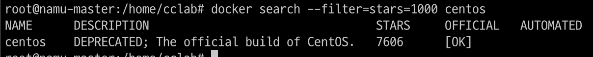
    * __명명 규칙, Official이 아닌 사용자가 임의로 작성해 공개하는 이미지의 이름은 '사용자명/이미지명' 형식으로 이름을 붙인다.__

* __이미지 삭제__
* 작성한 이미지를 삭제한다.
    ```bash
    # docker image rm [옵션] 이미지명 [이미지명]
    # --force, -f 이미지를 강제로 삭제
    # --no-prune 중간이미지를 삭제하지 않음
    docker image rm nginx

    # 사용하지 않은 Docker 이미지를 삭제할 때 사용한다.
    # docker image prune [옵션]
    # --all, -a 사용하지 않은 이미지를 모두 삭제
    # --force, -f
    ```
    * 이미지명은 [Repositary] 또는 [ImageID]를 지정한다. 

* __Docker Hub에 이미지 업로드__
* Docker 리포지토리에 업로드 하려면 먼저 로그인해야한다. 
    ```bash
    # docker login [옵션] [서버]
    # --password, -p 비밀번호
    # --username, -u 사용자명
    docker login 
    ```
    * 서버명을 지정하지 않을 시 default = Docker Hub

* Docker Hub에 이미지를 업로드한다
    ```bash
    # docker image push 이미지명[:태그명]
    # 업로드할 이미지는 '<Docker Hub 사용자명>/이미지명[:태그명]' 형식으로 지정한다.
    docker image push asshiho/webserver:1.0
    ```

* Docker Hub에서 로그아웃한다.
    ```bash
    # docker logout [서버명]
    docket logout hub.docker.com
    ```

## 2. Docker 컨테이너
### Docker 컨테이너 생성/시작/정지
* __Docker 컨테이너의 라이프 사이클__
* 컨테이너에는 다음과 같은 라이프사이클이 존재한다. 
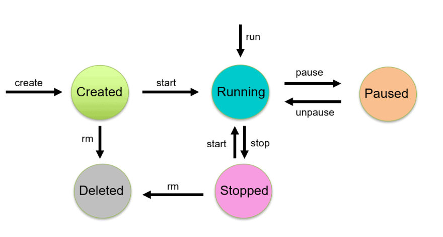

* 컨테이너 생성, docker container create
    * 이미지로부터 컨테이너를 생성한다. 이미지의 실체는 Docker에서 서버기능을 작동시키기 위해 필요한 디렉토리 및 파일들이다.
    * 구체적으로는 Linux 작동에 필요한 /etx나 /bin과 같은 디렉토리 및 파일들이다.
    * __docker container create 명령을 실행하면 이미지에 포함될 Linux의 디렉토리와 파일들의 스냅샷을 취한다__
    * 이는 컨테이너를 작성할 뿐, 실행하지는 않는다. 단지 시작할 준비가 된 상태로 봐야한다.

* 컨테이너 생성 및 시작, docker container run
    * 이미지로부터 컨테이너를 생성하고, 컨테이너 상에서 임의의 프로세스를 시작한다.
    * ex) Nginx 등의 서버 프로세스르르 백그라운드에서 항시 실행하거나 경우에 따라 종료하는 일도 가능하다.
    * 컨테이너 네트워크를 설정해서 외부에서 컨테이너의 프로세스에 액세스할 수 있다.(앞에서 시연한 웹서버와 같이)
    * 서버기능을 프로세스로서 작동시킨다.

* 컨테이너 시작, docker container start
    * 정지 중인 컨테이너를 시작한다. 컨테이너에 할당된 식별자를 지정하여 컨테이너를 시작한다.

* 컨테이너 정지, docker container stop
    * 실행 중 컨테이너를 정지시킨다. 컨테이너 식별자를 통해 지정한다.
    * __컨테이너 삭제 시 stop으로 우선 정지시켜둬야 한다. 재시작 시에는 restart를 사용한다.__

* 컨테이너 삭제, docker container rm
    * 컨테이너를 삭제한다. 컨테이너는 정지중이어야 한다.

* 컨테이너 일시정지, docker container pause
* 컨테이너 상태 확인, docker container ps
---

* __컨테이너 생성 및 시작__
    ```bash
    # docker conatiner run [옵션] 이미지명[:태그명] [인수]
    # --attach, -a 표준입력(STDIN), 출력(STDOUT), 오류출력(STDERR)에 attach한다.
    # --cidfile 컨테이너 ID를 파일로 출력한다.
    # --detach, -d 컨테이너를 생성하고 백그라운드에서 실행한다.
    # --interactive, -I 컨테이너의 표준 입력을 연다.
    # --tty,-t 단말기 디바이스를 사용한다.
    docker container run -it --name "test1" centos /bin/cal
    ```
    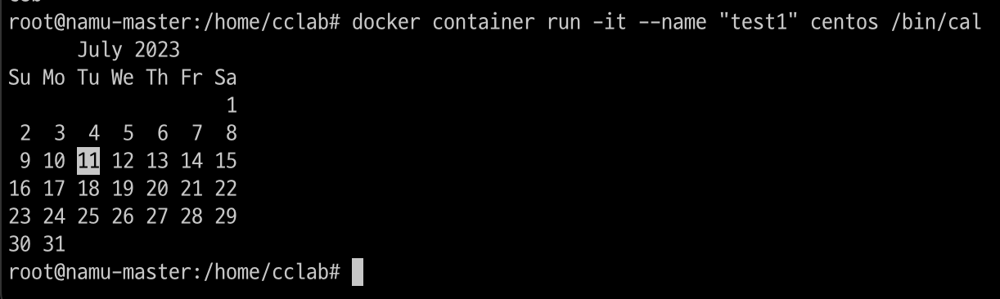
    * 위의 예시에서는 -it 옵션으로 콘솔에 결과를 출력했다
        * -i 는 컨테이너의 표준 출력을 연다
        * -t 는 tty(단말 디바이스)를 확보한다.
    * --name "test1": 컨테이너명을 지정한다. 옵션으로 이름을 지정하지 않으면 랜덤으로 설정된다.
    * container 안에서 /bin/cal 명령을 실행한다. 이는 Linux 표준 명령으로 달력을 콘솔에 표시하는 명령이다.

    * __컨테이너의 백그라운드 실행__
    * Docker를 이용하는 대부분의 경우는 컨테이너에 서버 기능을 가지게 해서 실행하는 경우이다.
    * 이를 위해서는 백그라운드에서 컨테이너를 실행해야 한다.
        ```bash
        # docker container run -d [실행옵션] 이미지명[:태그명] [인수]
        # --detach, -d 백그라운드에서 실행
        # --user, -u 사용자명을 지정
        # --restart=[no | on-failure | on-failure:횟수n | always | unless-stopped] 명령의 실행 결과에 따라 재시작을 지정
        # --rm 명령 실행 완료 후에 컨테이너를 자동으로 삭제
        docker container run -d centos /bin/ping localhost

        # 컨테이너의 로그를 확인한다. -t 옵션은 타임스탬프 표시.
        docker container logs -t [Container ID]
        ```
        * 백그라운드에서 실행하는 것은 detach모드라고 한다.
        * --restart= 옵션에 unless-stopped는 최근 컨테이너가 정지 상태가 아니라면 항상 재시작한다.

* __컨테이너 네트워크 설정__
    ```bash
    # docker container run [네트워크 옵셔] 이미지명[:태그명] [인수]
    # --add-host=[호스트명:IP 주소] 컨테이너의 /etc/hosts에 호스트명과 IP주소를 정의
    # --dns=[IP주소] 컨테이너용 DNS 서버의 IP 주소 지정
    # --expose 지정한 범위의 포트 번호를 할당
    # --mac-address=[MAC주소] 컨테이너의 MAC 주소를 지정
    # --net=[bridge | none | container:<name | id> | host | NETWORK] 컨테이너의 네트워크를 지정
    # --hostname, -h 컨테이너 자신의 호스트명을 지정
    # --publish, -p [호스트의 포트번호]:[컨테이너의 포트번호] 호스트와 컨테이너의 포트 매핑
    # --publish-all, -P 허스트의 임의의 포트를 컨테이너에 할당
    ```
    * 컨테이너를 시작할 때 네트워크에 대한 설정을 할 수 있다.

    * 컨테이너의 포트번호와 호스트 OS의 포트번호를 매핑한다.
    * 이 명령은 nginx라는 이름의 이미지를 바탕으로 컨테이너를 생성하고, 백그라운드에 실행한다.
    * 그리고 호스트의 포트번호 8080과 컨테이너의 포트번호 80을 매핑한다.
    * 이후 호스트의 8080 포트에 액세스하면 컨테이너에서 작동하고 있는 Nignx 서비스에 액세스할 수 있다.
    ```bash
    docker container run -d -p 8080:80 nginx
    ```
    * 지정한 범위로 포트 번호를 할당하고 싶을 때는 --expose 옵션을 사용하며, 임의로 할당할 때는 -P 옵션을 사용한다.

    * DNS 서버를 설정할 때는 다음과 같이 실행한다. DNS 서버는 IP주소로 지정한다.
    ```bash
    docker container run -d --dns 192.168.1.1 nginx
    ```

    * 컨테이너 MAC 주소도 설정할 수 있다.
    ```bash
    docker container run --mac-address="92:d0:c6:0a:29:33" centos

    docker container run inspect --format="{{.Config.MacAddress}}" <container id>
    ``` 
    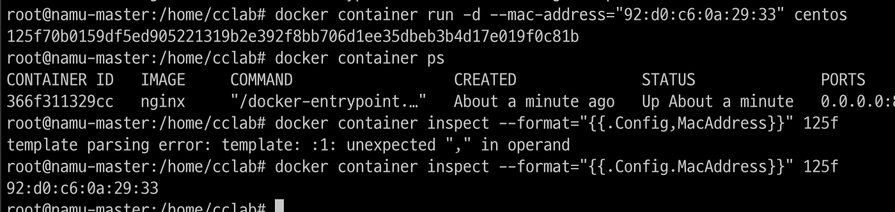

    * 호스트명과 IP주소 정의
    ```bash
    docker container run -it --add-host test.com:192.168.1.1 centos
    ```
    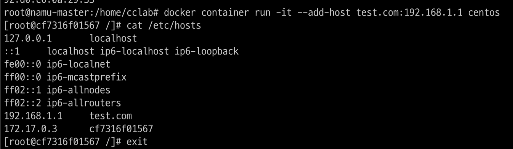

    * Docker는 기본적으로 호스트 OS와 브리지 연결을 하지만 --net 옵션을 사용하여 네트워크 설정가능
        * bridge : 기본값, 브리지 연결을 사용
        * none : 네트워크에 연결하지 않음
        * conatiner[:name | id] : 다른 컨테이너의 네트워크를 사용한다.
        * host : 컨테이너가 호스트 OS의 네트워크 사용
        * NETWORK : 사용자 정의 네트워크 사용
    * 사용자 정의 네트워크는 docker network create 명령으로 작성한다.
    * 이를 위해서는 Docker 네트워크 드라이버 또는 외부 네트워크 드라이버 플러그인을 사용해야 한다.
    * 같은 네트워크에 여러 컨테이너가 연결 가능하고, 사용자 정의 네트워크에 연결하면 컨테이너는 컨테이너의 이름이나 IP주소로 서로 통신할 수 있다.
    * 오버레이 네트워크나 특정 플러그인을 사용하면 멀티 호스트에 대한 연결도 가능하다. 이 경우 연결된 모든 네트워크를 통해 통신이 가능하다.
        * overlay network: 물리 네트워크 위에 성립되는 가상의 컴퓨터 네트워크.
    
    * 사용자 정의 네트워크 작성히고, 작성한 네트워크 상에서 컨테이너 실행
    ```bash
    docker network create -d bridge webap-net
    docker container run --net=weba;=net -it centos
    ```
    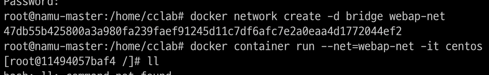

* __자원을 지정하여 컨테이너 생성 및 실행__
* CPU나 메모리와 같은 자원을 지정하여 컨테이너를 생성 및 실행할 수 있다.
    ```bash
    # docker container run [자원 옵션] 이미지명[:태그명] [인수]
    # --cpu-shares, -c cpu의 사용 배분(비율)
    # --memory, -m 사용할 메모리를 제한하여 실행 (단위는 b, k, m, g 중 하나)
    # --volume=[호스트이 디렉토리]:[컨테이너의 디렉토리], -v 호스트와 컨테이너의 디렉토리를 공유

    docker container run --cpu-shares=512 --memory=1g centos
    ```
    * cpu-shares는 기본값으로 1024가 들어간다. 예로, cpu시간을 그 절반으로 할당하고 싶을 때는 512로 설정한다.

    * 호스트 OS와 컨테이너 안의 디렉토리를 공유하고 싶을 때는 -v 옵션으로 지정한다.
        * ex) 호스트의 /Users/asa/webap 폴더를 컨테이너의 /user/share/nginx/html 디렉토리와 공유하고 싶은 경우
        ```bash
        docker container run -v /Users/asa/webap:/user/share/nginx/html nginx
        ```

* __컨테이너를 생성 및 시작하는 환경을 지정__
* 컨테이너의 환경변수나 컨테이너 안의 작업 디렉토리 등을 지정하여 컨테이너를 생성/실행시킬 수 있다.
    ```bash
    # docker container run [환경설정 옵션] 이미지명[:태그명] [인수]
    # --env=[환경변수], -e 환경변수를 설정한다.
    # --env-file=[파일명] 환경변수를 파일로부터 설정한다.
    # --read-only[true | false] 컨테이너의 파일 시스템을 읽기 전용으로 만든다
    # --workdir=[패스], -w 컨테이너의 작업 디렉토리를 지정한다.
    # -u, --user=[사용자명] 사용자명 또는 UID를 지정한다.

    docker container run -it -e foo=bar centos /bin/bash
    ```

    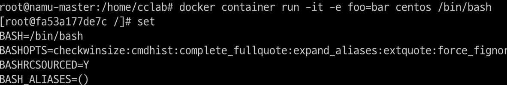
    </img>

* 환경변수를 정의한 파일을 읽어 일괄적으로 등록할 수 있다.
    ```bash
    echo "hoge=fuga" >> env_list
    echo "foo=bar" >> env_list
    docker container run -it --env-file=env_list centos /bin/bash
    ```

    </img>

* 컨테이너의 작업 디렉토리를 지정하여 실행
    ```bash
    # 컨테이너의 /tensorflow를 작업 디렉토리로 하여 실행한다.
    docker container run -it -w=\tensorflow centos /bin/bash
    ```

* __가동 컨테이너 목록 표시__
* Docker 상에서 작동하는 컨테이너의 가동 상태를 확인할 때 사용
    ```bash
    # docker container ls [옵션]
    # --all, -a 실행/정지 중인 것도 포함하여 모든 컨테이너 표시
    # --filter, -f 표시할 컨테이너 필터링
    # --format 표시 포맷지정
    # --last, -n 마지막으로 실행된 n건의 컨테이너만 표시
    # --latest, -l 마지막으로 실행된 컨테이너만 표시
    # -no-trunc 생략 x
    # --quier, -q 컨테이너 ID만 표시
    # --size, -s 파일크기 표시
    ```
    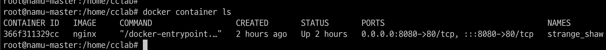
    * IMAGE: 컨테이너의 바탕이 된 이미지
    * COMMAND: 컨테이너 안에서 실행되고 있는 명령
    * CREATED: 컨테이너 작성 후 경과 시간
    * STATUS: 컨테이너 상태(restarting | running | paused | exited)
    * NAMES: 컨테이너 이름

    * -f 옵션으로 필터링. 조건은 key=value 형태로 지정한다.
    ```bash
    # 컨테이너명이 test1인 것을 조건으로 필터링.
    docker container ls -a -f name=test2
    ```
    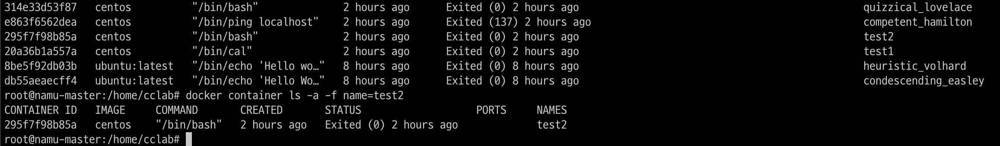

    * --format 옵션으로 출력 형식을 지정할 수 있다. 출력형식을 지정하기 위해 플레이스 홀더를 사용한다.
    </img>
    * 에를 들어 아래 명령어는 컨테이너 이름과 가동 상태(Status)를 콜론으로 구분하여 표시한다.
    ```bash
    docker container ls -a --format "{{.Names}}: {{.Status}}"
    ```
    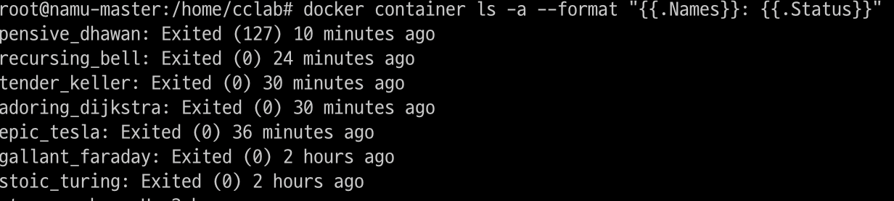

    * 출력 항목을 표 형식으로도 지정할수도 있다.
    ```bash
    docker container ls -a --format "table {{.Names}}\t{{.Status}}\t {{.Mounts}}"
    ```
    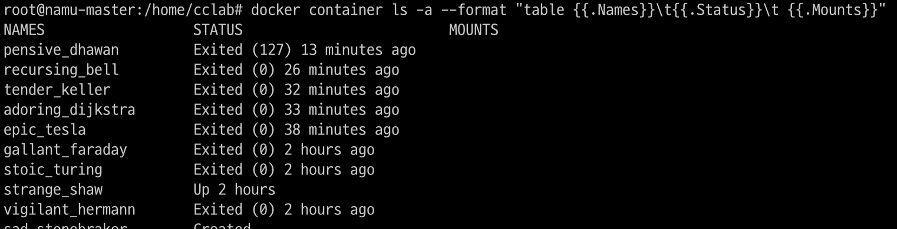

* __컨테이너 가동 확인__
* Docker 상에서 작동하는 컨테이너 가동 상태를 확인한다. 
    ```bash
    # docker container stats [컨테이너 식별자]
    ```
    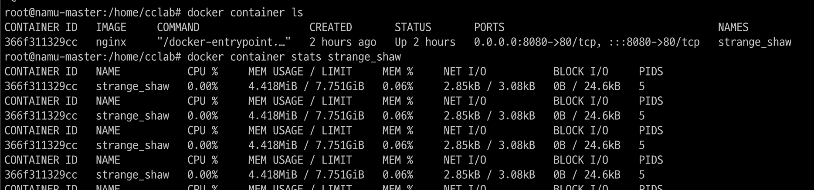

    * 컨테이너에서 실행 중인 프로세스를 확인한다.
    ```bash
    # docker container top [컨테이너 식별자]
    ```
    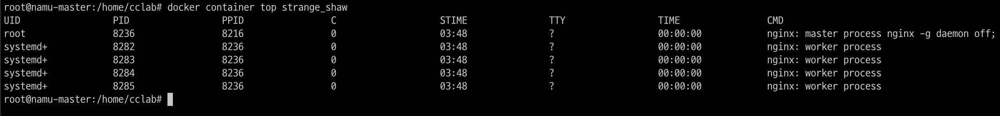

* __컨테이너 시작__
* 정지하고 있는 컨테이너를 시작한다.
    ```bash
    # docker container start [옵션] <컨테이너 식별자> [컨테이너 식별자]
    # --attach, -a 표준 출력, 표준 오류 출력을 연다.
    # --interactive, -I 컨테이너의 표준 입력을 연다.
    ```
    * 인수에 컨테이너 식별자를 여러 개 지정해서 한꺼번에 다수의 컨테이너를 시작할 수 있다.

* __컨테이너 정지__
    ```bash
    # docker container stop [옵션] <컨테이너 식별자> [컨테이너 식별자]
    # --time, -t 컨테이너의 정지 시간 지정(기본값=10초), n초 후에 정지된다.
    ```
    * 강제적으로 컨테이너를 정지시킬 때는 'docker container kill' 명령을 사용한다.

* __컨테이너 재시작__
    ```bash
    # docker container restart [옵션] <컨테이너 식별자> [컨테이너 식별자]
    # --time, -t 재시작 시간 설정, n초 후에 재시작
    ```

* __컨테이너 삭제__
* 삭제할 컨테이너는 먼저 정지상태여야 한다.
    ```
    # docker conatiner rm [옵션] <컨테이너 식별자> [컨테이너 식별자]
    # --force, -f 실행중 컨테이너를 강제 삭제
    # --volume, -v 할당한 볼륨을 삭제

    # 정지중인 모든 컨테이너를 삭제한다.
    docker container prune
    ```
* __컨테이너 중단/재개__
* 실행중인 컨테이너에서 작동중인 프로세스를 모두 중단시킨다.
    ```bash
    # docker container pause <컨테이너 식별자>
    docker conainer pause
    
    # docker container unpause <컨테이너 식별자>
    ```
    
    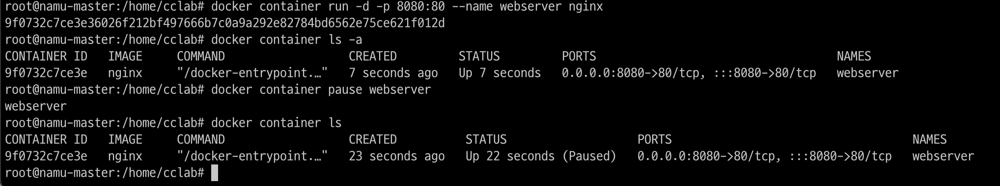
    * ls 명령으로 확인 시 STATUS가 (Paused)로 되어있음을 확인할 수 있다.

---

## 3. Docker 컨테이너 네트워크
* Docker 컨테이너 간 통신은 Docker 네트워크를 통해 수행한다.
* __네트워크 목록 표시__
* Docker 네트워크의 목록을 확인한다.
    ```bash
    # docker network ls [옵션]
    # --filter=[], -f 필터링 옵션
    # --no-trunc 상세정보 출력
    # -q, --quiet 네트워크 ID만 출력
    ```
    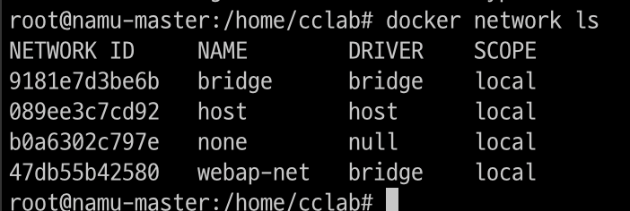
    * Docker는 기본값으로 bridge, host, none 세 개의 네트워크를 만든다.
    * 현재 webap-net으로 들어간 네트워크는 앞서 실습에서 만들었던 사용자정의 네트워크이다.(docker network create~)
    * 네트워크의 scope는 'swarm | global | local'이 존재한다.
    
    * -f 옵션으로 브리지 네트워크의 네트워크 ID만을 표시한다.
    ```bash
    docker network ls -q --filter driver=bridge
    ```
    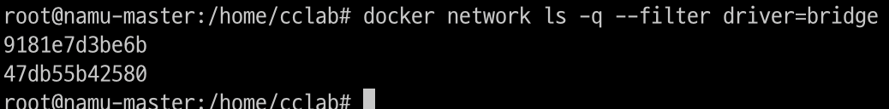
    
    * 네트워크를 명시적으로 지정하지 않고 컨테이너를 시작하면 기본값으로 bridge 네트워크를 사용한다.
    ```bash
    docker container run -itd --name=sample ubuntu:latest
    docker container inspect sample
    ```
    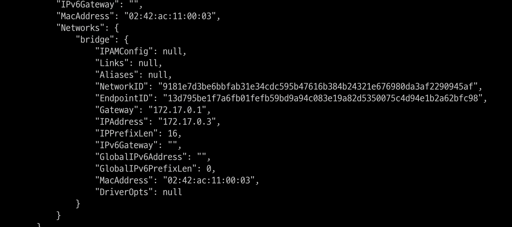
    
* __네트워크 작성__
* 새로운 네트워크를 작성한다.
    ```bash
    # docker network create [옵션] 네트워크
    # --driver, -d 네트워크 브리지 또는 오버레이(기본값=bridge)
    # --ip-range 컨테이너에 할당하는 IP주소 범위지정
    # --subnet 서브넷을 CIDR 형식으로 지정
    # --ipv6 ipv6네트워크를 유효화할지 말지 true|false
    # --label 네트워크에 설정하는 라벨
    docker network create --driver=bridge web-network
    ```
    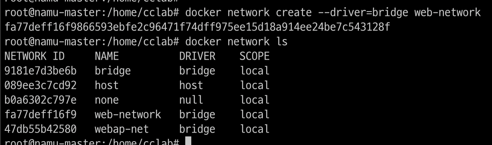
    * CIDR? Classless Inter-Domain Rounting
    * 도메인간의 라우팅에 사용되는 인터넷 주소를 원래 IP주소 클래스 체계를 쓰는 것보다 더 능동적으로 할당하여 지정하는 방식
---
* __Docker 컨테이너의 네트워크 이름해결__
* Docker의 기본 브리지 네트워크와 사용자 정의 네트워크에서의 이름 해결 구조가 다르다.
* 두 개 이상의 컨테이너를 기본 브리지 네트워크에서 시작한 경우, 자동으로 이름을 해결하지 못 한다.
    * 따라서 이 경우에는 컨테이너 생성 시에 미리 'docker container run' 명령으로 '--link' 옵션을 붙여 분명히 해야한다.
    * '--link' 옵션을 지정하면 /etc/hosts 파일에 컨테이너명과 컨테이너에 할당된 IP주소가 등록된다.
* 반면, 사용자 정의 네트워크는 docker 데몬에 내장된 내부 DNS 서버에 의존하여 이름을 해결한다.
    * 이를 통해 link 기능과 같이 /etc/hosts 파일에 의존하지 않고 이름을 해결할 수 있다.
    * 사용자 정의 네트워크를 사용하면 컨테이너 시작 시  --net-alias 옵션으로 지정한 별명으로 통신을 할 수 있기 때문에, 이 쪽 방법이 선호된다.

----
* __네트워크 연결__
    ```bash
    # docker network connect [옵션] [네트워크] [컨테이너]
    # --ip, --ip6   각각 IPv4, IPv6 주소
    # --alias, --link 별칭, 다른 컨테이너에 대한 링크 설정
    
    # webfront라는 이름의 컨테이너를 web-network 네트워크에 연결시킨다.
    docker network connect web-network webfront
    docker network disconnect web-network webfront
    ```

* __네트워크 상세 정보 확인__
    ```bash
    # docker network inspect [옵션] [네트워크]
    ```
    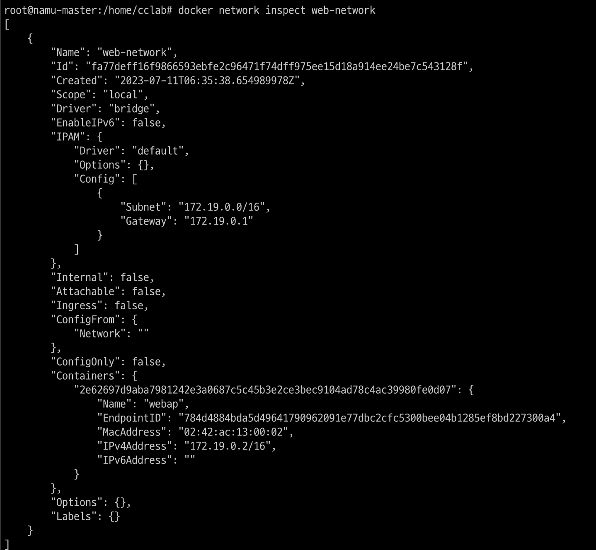

* __네트워크 삭제__
* 네트워크를 삭제하려면 'docker network disconnect'로 연결중인 모든 컨테이너와의 연결을 해제해야 한다.
    ```bash
    # docker network rm [옵션] 네트워크
    docker network rm web-network
    ```

## 4. 가동중인 Docker 컨테이너 조작


