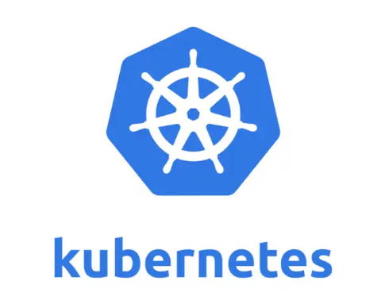
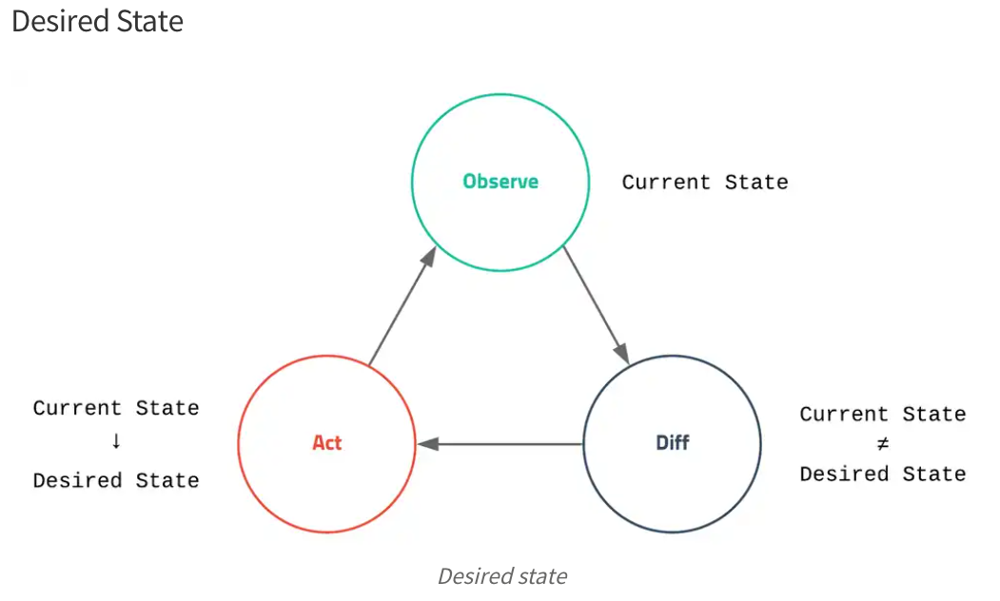
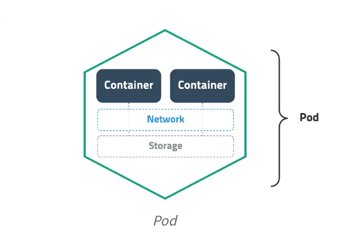
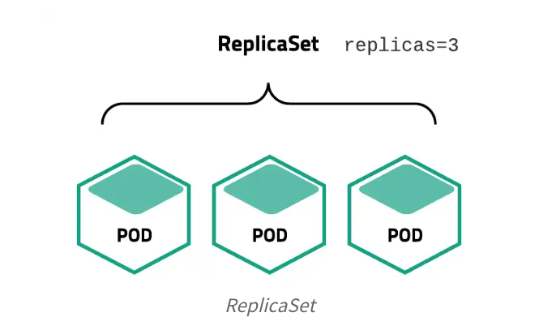
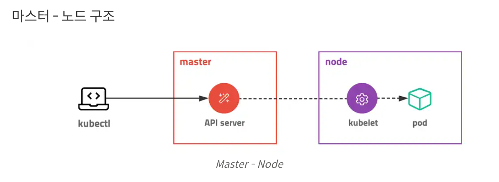
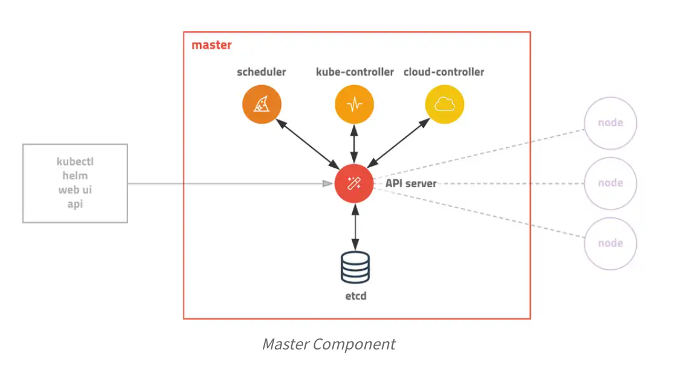
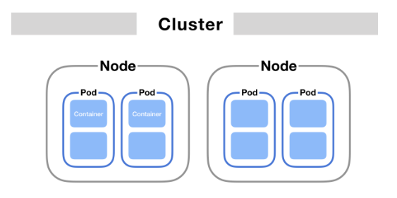
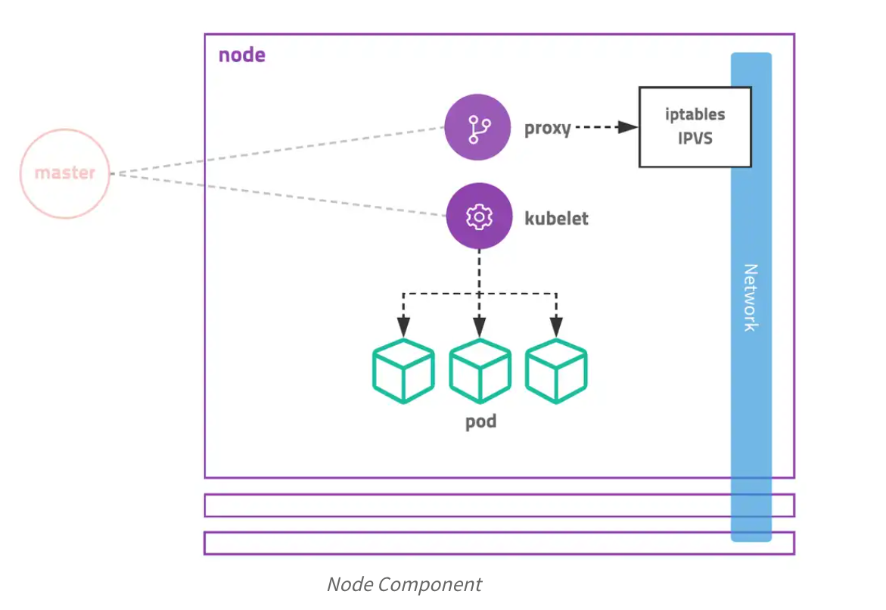

# Kubernetes

## 목차
* [1장. Kubernetes란?](#1장-kubernetes란)
    * [1.1 Kubernetes의 특징](#1-kubernetes의-특징)
    * [1.2 Kubernetes](#2-kubernetes)
    * [1.3 Kubernetes Object](#3-kubernetes-object)

    * [1.4 미들웨어 기초지식](#4-미들웨어-기초지식)
    * [1.5 인프라 구성관리 기초 지식](#5-인프라-구성-관리-기초-지식)
    * [1.6 CI/CD](#6-cicd)

# 1장. Kubernetes란?

||
|:-:|
|Kubernetes는 컨테이너를 쉽고 빠르게 배포/확장하고 관리를 자동화해주는 오픈소스 플랫폼|

## 1. Kubernetes의 특징
|번호|특징|설명|
|:-:|:-:|:-:|
|1|방대한 Ecosystem|CNCF, IBM, Google 등 세계적인 기업과 방대한 커뮤니티|
|2|다양한 배포방식|무중단 배포를 위한 Deployment, 실행 순서를 보장하는 StatefulSets, 로그나 모니터링을 위한 Daemon Set 등 다양한 배포방식 지원|
|3|Ingress 설정|다양한 웹 에플리케이션을 하나의 로드밸런서로 서비스. 애플리케이션을 내부망에 설치하고 외부에서 접근이 가능한 Apache, Nginx 등을 프록시 서버로 활용|
|4|클라우드 지원|부하에 따라 자동으로 서버를 늘리는 AutoScaling, IP를 할당받아 LoadBalancing 지원. 외부 스토리지를 내부 디렉토리에 마운트하여 사용하는 등은 흔하다. 클라우드 네이티브에 적합하며 많은 CSP에서 이를 위해 통일된 API 모듈을 제공|
|5|Namespace & Label|하나의 클러스트를 논리적으로 구분하여 사용.하나의 클러스터에 여러개의 네임스페이스를 두어 분리. 세부적인 설정은 라벨로 관리|
|6|RBAC(role-based access control)|접근권한 시스템으로 각가의 리소스에 대해 유저별로 CRUD와 같은 권한을 지정. 클러스터 전체나 특정 네임스페이스에 한정해 적용|
|7|CRD(Custom Resource Definition)|쿠버네티스 네이티브로 지원하지 않는 기능도 동일한 방식으로 적용할 수 있다|
|8|AutoScaling|CPU, memory, 현재 접속자 수 등 사용량과 상태에 따라 자동으로 컨테이너 개수(Horizontal Pod AutoScaler, HPA), 컨테이너 리소스 할당량(Vertical Pod AutoScaler, VPA), 서버 개수(Cluster AutoScaler, CA) 조정|
|9|Federation, Multi Cluster|클라우드와 자체 서버에 설치한 쿠버네티스 클러스터를 묶어 하나로 사용. 한 곳에서 여러 클라우드의 여러 클러스터를 관리(구글-Anthos 등)|

## 2. Kubernetes
쿠버네티스의 동작과 구성요소, 개념을 이해한다.

쿠버네티스에서 가장 중요한 것은 'desired state', 직역하면 '원하는 상태'라는 개념  
관리자가 바라는 환경, 서버가 몇 개 떠있고.. 몇 번 포트로 서비스해야 하고.. 등등  

쿠버네티스는 복잡해보이지만, 속으로는 단순한 실행 로직을 갖고있다.  
1. Current State의 모니터링   
2. Current State와 Desired State간 차이가 발생하면  
3. 다시 Desired State로 유지하기 위해 일련의 작업 수행

관리자는 배포 시 원하는 동작 대신, __'상태'를__ 선언해야 한다.  
쿠버네티스의 핵심은 __상태__ 에 있다.  

## 3. Kubernetes Object
쿠버네티스는 상태를 관리하기 위한 대상을 오브젝트로 정의  
기본적으로 수십가지 오브젝트를 제공하고 새로운 오브젝트 추가가 매우 쉬워 확장성이 높다.  

### 주요 오브젝트
#### Pod
쿠버네티스에서 배포할 수 있는 가장 작은 단위  
한 개 이상의 컨테이너와 스토리지, 네트워크를 가짐  
Pod에 속한 커네티어는 스토리지와 네트워크를 공유하고 서로 localhost로 접근할 수 있다.   
컨테이너를 하나만 사용하는 경우에도 반드시 Pod로 wrap해서 관리한다. 

#### ReplicaSet
Pod를 여러 개 복제하여 관리하는 오브젝트  
Pod를 새성하고 개수를 유지하기 위해 반드시 사용해야 한다.  
복제할 개수, 개수를 체크할 라벨 선택자, 생성할 Pod의 템플릿 등을 갖고있다.  
대부분 ReplicaSet을 직접 사용하는 것보다 Deployment 등 다른 오브젝트에 의해 사용한다.

#### Service
네트워크와 관련된 오브젝트.  
Pod를 외부 네트워크와 연결하거나 여러 개의 Pod를 바라보는 내부 로드 밸런서를 생성할 때 사용  
내부 DNS 서비스 이름을 도메인으로 등록. 디스커버리 역할도 수행한다.

#### Volume
저장소와 관련된 오브젝트.  
호스트 디렉토리를 그대로 사용하거나 스토리를 동적으로 생성하여 사용할 수 있다.

### 오브젝트 명세
쿠버네티스에서 오브젝트의 명세는 YAML파일로 작성하고, 여기에 오브젝트의 종류와 원하는 상태를 작성한다.  
이렇게 작성한 명세는 생성/조회/삭제로 관리가 가능하기 때문에 REST API로 쉽게 노출할 수 있다.  
접근 권한 설정도 같은 개념을 적용하여 누가 어떤 오브젝트에 어떤 어떤 요청을 할 수 있는지 정의할 수 있다.

### Kubernetes 배포방식
쿠버네티스는 애플리케이션 배포를 위해 desired state를 다양한 object에 label을 붙여 정의(YAML파일로 명세)하고 API 서버에 전달하는 방식을 사용  

쿠버네티스에서  
"컨테이너를 2개 배포하고 80 포트로 오픈해줘”라는 작업은 다음과 같이 작성해야 한다.

“컨테이너를 Pod으로 감싸고 type=app, app=web이라는 라벨을 달아줘. type=app, app=web이라는 라벨이 달린 Pod이 2개 있는지 체크하고 없으면 Deployment Spec에 정의된 템플릿을 참고해서 Pod을 생성해줘. 그리고 해당 라벨을 가진 Pod을 바라보는 가상의 서비스 IP를 만들고 외부의 80 포트를 방금 만든 서비스 IP랑 연결해줘.”

# 3. Kubernetes Architecture

쿠버네티스는 전체 클러스터를 관리하는 마스터와 컨테이너가 배포되는 노드로 구성  
모든 명령은 마스터의 API 서버를 호출하고 노드는 마스터와 통신하며 작업을 수행한다.  

 

## Master
마스터 서버는 기능별로 쪼개진 다양한 모듈들의 집합체로 이뤄져있다.  
운영 시 관리자만 접속할 수 있도록 보안 설정을 해야하고 마스터서버가 죽으면 클러스터를 관리할 수 없기 때문에 보통 3대를 구성하여 안정성을 높인다.  
AWS EKS는 마스터를 AWS에서 자체 관리하여 직접 접속을 막고 안정성을 높였다.

### Kube-apiserver, 요청을 처리하는 API 서버
API server는 모든 요청을 처리하는 마스터의 핵심 모듈  
kubectl 요청뿐 아니라 내부 다른 모듈의 요청도 처리하며 권한을 체크하여 요청을 거부할 수 있다.  
실제로는 원하는 상태를 key-value에 저장하고 저장된 상태를 조회하는 단순한 작업을 수행한다.  
Pod를 노드에 할당하고 상태를 체크하는 일은 또 다른 모듈이 수행한다.  
노드에서 실행 중인 컨테이너의 로그를 보여주고 명령을 보내는 등 디버거의 역할도 수행한다.

### etcd, 분산 데이터 저장소
key-value 저장소로 RAFT 알고리즘 이용. 여러개로 분산하여 복제할 수 있기 때문에 안정성이 높고 속도도 빠르다.  
단순히 값을 저장/읽는 기능뿐 아니라 watch 기능으로 상태 변경을 체크하여 정해진 로직을 실행할 수 있다.  
클러스터의 모든 설정과 상태 데이터가 저장되며 나머지 모듈은 stateless하게 동작하기 때문에 etcd의 백업만 유지해두면 언제든지 클러스터를 복구할 수 있다.  
k3s와 같은 초경량 쿠버네티스 배포판에서는 etcd 대신 sqlite를 사용하기도 함

### Scheduler, Controller
kube-apiserver는 요청을 받으면 etcd 저장소와 통신할 뿐이고 실제로 상태를 바꾸는 것은 스케줄러와 컨트롤러  
현재 상태를 모니터링하다 desired state와 다르면 각자 맡은 작업을 수행하고 상태를 갱신한다.  

### Kube-scheduler
할당되지 않은 Pod를 여러 조건(필요 자원, 라벨)에 따라 적절한 노드 서버에 할당해주는 모듈

### Kube-controller-manager
쿠버네티스에 존재하는 대부분의 오브젝트 상태를 관리. 오브젝트 별로 철저하게 분업화되어 Deployment는 ReplicaSet을 생성하고 ReplicaSet은 Pod를 생서하고 Pod는 스케줄러가 관리하는 등..

### cloud-controller-manager
AWS, GCE, Azure 등 클라우드에 특화된 모듈. 노드를 추가/삭제하고 로드밸런서를 연결하거나 볼륨을 붙일 수 있음  
각 클라우드 없체에서 인터페이스 맞춰 구현하여 제공한다.

 

## Node

노드 서버는 마스터와 통신하며 필요한 Pod를 생성하고 네트워크와 볼륨을 성정한다.  
실제 컨테이너들이 생성되는 곳으로 수천, 수백대로 확장 가능하고 각각 서버에 라벨을 붙여 사용목적을 정의할 수 있다.

### Kubelet, 큐블릿
노드에 할당된 Pod의 생명주기를 관리한다.  
Pod의 생성부터 컨테이너에 이상을 모니터링하며 주기적으로 마스터에 상태를 전달한다.  

### Kube-proxy
Pod로 연결되는 네트워크를 관리한다.  
TCP, UDP, SCTP 스트림을 포워딩하고 여러개의 Pod를 라운드로빈 형태로 묶어 서비스를 제공할 수 있다.  
초기에는 프록시 서버로 동작하며 각 Pod에 전달해 주었다면, 지금은 iptables를 설정하는 방식으로 변경되었다.

## Kubectl (큐브 컨트롤)
API 서버는 json 또는 protobuf 형식의 http 통신을 지원한다.  
이를 그대로 사용할 수 없어 인간친화적인 방법으로 커맨드라인 도구인 kubectl을 사용한다.  

  

# 2. 클러스터링 Clustering
>Clustering?  
여러 대의 서버를 네트워크로 연결하여 하나의 서버처럼 보이게 하는 기술

특징
* Load Balancing: 클러스터는 부하를 여러 노드에서 분담하여 병렬 처리하도록 구성하여 시스템의 전반적인 성능을 향상시킨다.
* HA(High Availability): 하나의 노드에 장애가 생겼을 때, 다른 노드가 이어받아(FailOver) 계속해서 서비스를 제공한다.

문제
* 작업 스케줄링: 복잡한 클러스터 구성에서 여러 사용자 클러스터가 매우 방대한 양의 데이터를 접근할 때, 리소스를 어떻게 배분할 것이냐
* 노드 장애관리: 노드간의 통신으로 작업을 처리하는 도중, 한 노드에 장애가 발생된 것으로 예상되는 경우. 어떻게 처리할 것인가.

클러스터링 구성은 스토리지 소유 방법에 따라 나뉜다.
1. 공유 스토리지 구성
    * 여러 대의 서버가 하나의 스토리지를 공유하여 사용
    * 시스템 장애 시 데이터의 무결성을 쉽게 확보할 수 있음  
2. 데이터 미러 구성
    * 로컬 디스크 볼륨의 복사본을 네트워크를 통해 전송하여 무결성 확보

[쿠버네티스 시작하기 - Kubernetes란 무엇인가? SERIES 1/2](https://subicura.com/2019/05/19/kubernetes-basic-1.html)