# Kubernetes

## 목차
* [1장. Kubernetes란?](#1장-kubernetes란)
    * [1.1 Kubernetes의 특징](#1-kubernetes의-특징)
    * [1.2 Kubernetes](#2-kubernetes)
    * [1.3 Kubernetes Object](#3-kubernetes-object)
    * [1.4 Kubernetes Architecture](#4-kubernetes-architecture)
    * [1.5 Pod 생성 과정](#5-pod-생성-과정)

# 1장. Kubernetes란?

||
|:-:|
|Kubernetes는 컨테이너를 쉽고 빠르게 배포/확장하고 관리를 자동화해주는 오픈소스 플랫폼|

## 1. Kubernetes의 특징
|번호|특징|설명|
|:-:|:-:|:-:|
|1|방대한 Ecosystem|CNCF, IBM, Google 등 세계적인 기업과 방대한 커뮤니티|
|2|다양한 배포방식|무중단 배포를 위한 Deployment, 실행 순서를 보장하는 StatefulSets, 로그나 모니터링을 위한 Daemon Set 등 다양한 배포방식 지원|
|3|Ingress 설정|다양한 웹 에플리케이션을 하나의 로드밸런서로 서비스. 애플리케이션을 내부망에 설치하고 외부에서 접근이 가능한 Apache, Nginx 등을 프록시 서버로 활용|
|4|클라우드 지원|부하에 따라 자동으로 서버를 늘리는 AutoScaling, IP를 할당받아 LoadBalancing 지원. 외부 스토리지를 내부 디렉토리에 마운트하여 사용하는 등은 흔하다. 클라우드 네이티브에 적합하며 많은 CSP에서 이를 위해 통일된 API 모듈을 제공|
|5|Namespace & Label|하나의 클러스터를 논리적으로 구분하여 사용.하나의 클러스터에 여러개의 네임스페이스를 두어 분리. 세부적인 설정은 라벨로 관리|
|6|RBAC(role-based access control)|접근권한 시스템으로 각가의 리소스에 대해 유저별로 CRUD와 같은 권한을 지정. 클러스터 전체나 특정 네임스페이스에 한정해 적용|
|7|CRD(Custom Resource Definition)|쿠버네티스 네이티브로 지원하지 않는 기능도 동일한 방식으로 적용할 수 있다|
|8|AutoScaling|CPU, memory, 현재 접속자 수 등 사용량과 상태에 따라 자동으로 컨테이너 개수(Horizontal Pod AutoScaler, HPA), 컨테이너 리소스 할당량(Vertical Pod AutoScaler, VPA), 서버 개수(Cluster AutoScaler, CA) 조정|
|9|Federation, Multi Cluster|클라우드와 자체 서버에 설치한 쿠버네티스 클러스터를 묶어 하나로 사용. 한 곳에서 여러 클라우드의 여러 클러스터를 관리(구글-Anthos 등)|

## 2. Kubernetes
쿠버네티스의 동작과 구성요소, 개념을 이해한다.


쿠버네티스에서 가장 중요한 것은 'desired state', 직역하면 '원하는 상태'라는 개념  
관리자가 바라는 환경, 서버가 몇 개 떠있고.. 몇 번 포트로 서비스해야 하고.. 등등  

쿠버네티스는 복잡해보이지만, 속으로는 단순한 실행 로직을 갖고있다.  
1. Current State의 모니터링   
2. Current State와 Desired State간 차이가 발생하면  
3. 다시 Desired State로 유지하기 위해 일련의 작업 수행

관리자는 배포 시 원하는 동작 대신, __'상태'를__ 선언해야 한다.  
쿠버네티스의 핵심은 __상태__ 에 있다.  

## 3. Kubernetes Object
쿠버네티스는 상태를 관리하기 위한 대상을 오브젝트로 정의  
기본적으로 수십가지 오브젝트를 제공하고 새로운 오브젝트 추가가 매우 쉬워 확장성이 높다.  

### 주요 오브젝트
#### Pod
쿠버네티스에서 배포할 수 있는 가장 작은 단위  
한 개 이상의 컨테이너와 스토리지, 네트워크를 가짐  
Pod에 속한 커네티어는 스토리지와 네트워크를 공유하고 서로 localhost로 접근할 수 있다.   
컨테이너를 하나만 사용하는 경우에도 반드시 Pod로 wrap해서 관리한다. 


#### ReplicaSet
Pod를 여러 개 복제하여 관리하는 오브젝트  
Pod를 새성하고 개수를 유지하기 위해 반드시 사용해야 한다.  
복제할 개수, 개수를 체크할 라벨 선택자, 생성할 Pod의 템플릿 등을 갖고있다.  
대부분 ReplicaSet을 직접 사용하는 것보다 Deployment 등 다른 오브젝트에 의해 사용한다.


#### Service
네트워크와 관련된 오브젝트.  
Pod를 외부 네트워크와 연결하거나 여러 개의 Pod를 바라보는 내부 로드 밸런서를 생성할 때 사용  
내부 DNS 서비스 이름을 도메인으로 등록. 디스커버리 역할도 수행한다.

#### Volume
저장소와 관련된 오브젝트.  
호스트 디렉토리를 그대로 사용하거나 스토리를 동적으로 생성하여 사용할 수 있다.

### 오브젝트 명세
쿠버네티스에서 오브젝트의 명세는 YAML파일로 작성하고, 여기에 오브젝트의 종류와 원하는 상태를 작성한다.  
이렇게 작성한 명세는 생성/조회/삭제로 관리가 가능하기 때문에 REST API로 쉽게 노출할 수 있다.  
접근 권한 설정도 같은 개념을 적용하여 누가 어떤 오브젝트에 어떤 어떤 요청을 할 수 있는지 정의할 수 있다.

### Kubernetes 배포방식
쿠버네티스는 애플리케이션 배포를 위해 desired state를 다양한 object에 label을 붙여 정의(YAML파일로 명세)하고 API 서버에 전달하는 방식을 사용  

쿠버네티스에서  
"컨테이너를 2개 배포하고 80 포트로 오픈해줘”라는 작업은 다음과 같이 작성해야 한다.

“컨테이너를 Pod으로 감싸고 type=app, app=web이라는 라벨을 달아줘. type=app, app=web이라는 라벨이 달린 Pod이 2개 있는지 체크하고 없으면 Deployment Spec에 정의된 템플릿을 참고해서 Pod을 생성해줘. 그리고 해당 라벨을 가진 Pod을 바라보는 가상의 서비스 IP를 만들고 외부의 80 포트를 방금 만든 서비스 IP랑 연결해줘.”

## 4. Kubernetes Architecture


쿠버네티스는 전체 클러스터를 관리하는 마스터와 컨테이너가 배포되는 노드로 구성  
모든 명령은 마스터의 API 서버를 호출하고 노드는 마스터와 통신하며 작업을 수행한다.  

<br>

## Master
마스터 서버는 기능별로 쪼개진 다양한 모듈들의 집합체로 이뤄져있다.  
운영 시 관리자만 접속할 수 있도록 보안 설정을 해야하고 마스터서버가 죽으면 클러스터를 관리할 수 없기 때문에 보통 3대를 구성하여 안정성을 높인다.  
AWS EKS는 마스터를 AWS에서 자체 관리하여 직접 접속을 막고 안정성을 높였다.


### Kube-apiserver, 요청을 처리하는 API 서버
API server는 모든 요청을 처리하는 마스터의 핵심 모듈  
kubectl 요청뿐 아니라 내부 다른 모듈의 요청도 처리하며 권한을 체크하여 요청을 거부할 수 있다.  
실제로는 원하는 상태를 key-value에 저장하고 저장된 상태를 조회하는 단순한 작업을 수행한다.  
Pod를 노드에 할당하고 상태를 체크하는 일은 또 다른 모듈이 수행한다.  
노드에서 실행 중인 컨테이너의 로그를 보여주고 명령을 보내는 등 디버거의 역할도 수행한다.

### etcd, 분산 데이터 저장소
key-value 저장소로 RAFT 알고리즘 이용. 여러개로 분산하여 복제할 수 있기 때문에 안정성이 높고 속도도 빠르다.  
단순히 값을 저장/읽는 기능뿐 아니라 watch 기능으로 상태 변경을 체크하여 정해진 로직을 실행할 수 있다.  
클러스터의 모든 설정과 상태 데이터가 저장되며 나머지 모듈은 stateless하게 동작하기 때문에 etcd의 백업만 유지해두면 언제든지 클러스터를 복구할 수 있다.  
k3s와 같은 초경량 쿠버네티스 배포판에서는 etcd 대신 sqlite를 사용하기도 함

>RAFT?  
정확히는 뗏목 합의 알고리즘, RAFT Consensus Algorithm.  
분산 시스템 환경에서 모든 노드가 동일한 상태를 유지하도록 하고,  
일부 노드에 결함이 생기더라도 전체 시스템이 문제 없이 동작하도록 하는 합의 알고리즘의 일종.  
>
> 동작원리  
>모든 노드는 아래 세 가지 중 하나의 상태를 가짐
>1. Leader  
클러스터를 대표하는 노드로, 모든 클라이언트의 명령의 수신 및 전파, 응답을 전담한다.  
또한 리더는 자신의 상태를 주기적으로 모든 팔로워에게 전달한다.(heartbeat)
>2. Follower  
리더가 존재하는 한 나머진 노드는 모두 팔로워로 동작한다.  
리더로부터 전파된 명령을 처리하는 역할만 담당한다. 
>3. Candidate  
리더가 없는 상황에서 새 리더를 정하기 위해 전환된 팔로워의 상태를 의미한다.  
리더로부터 일정 시간 이상 상태 메시지(heartbeat)를 받지 못한 팔로워는 후보자로 전환된다.  
>
>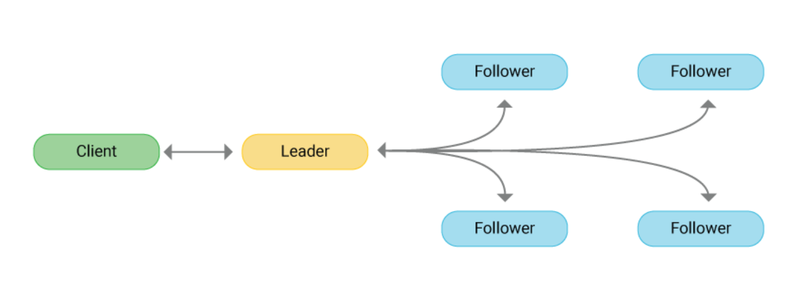
>
>클러스터 전체의 최신화 및 동기화는 다음과 같은 과정을 거친다.
>1. 리더는 수신된 명령으로 logs를 생성해서 로컬에 저장하고 복제본을 팔로워들에게 보낸다. 명령을 받은 팔로워들은 리더에게 응답을 보낸다.
>2. 리더가 클러스터 전체 노드 중 과반수의 정답응답을 수신하면, 로그를 통해 전파된 명령을 실행하도록 하고 그 결과를 클라이언트에게 반환한다. 
>3. 일시적인 장애나 네트워크 문제로 제때 명령을 처리하지 못한 노드가 있어도, 그 팔로워가 정상으로 복구된 뒤 클러스터에 다시 연결되면 리더로부터 그동안의 명령 처리 기록이 포함된 로그들을 다시 전달받아 순차 수행한다. 
> 
>리더 선출(leader election)은 다음과 같이 이뤄진다.  
>1. 리더의 heartbeat를 자신에게 주어진 election timeout 시간동안 받지 못한 팔로워는 후보자가 된다. 이 때 클러스터의 임기(Term) 번호가 1 증가한다.
>2. 후보자 노드는 즉시 자기자신에게 한표를 주고 다른 노드들에게 투표 요청 메세지를 보낸다
>3. 투표 요청을 수신한 노드가 해당 임기(새로운 선거임기)동안 투표한 적이 없다면, 요청 발신자에게 투표 메시지를 보내고 자신의 election timeout을 초기화한다. (현재 투표중인 후보자 외 다른 후보자의 출현을 방지)
>4. 클러스터 전체 노드 중 과반수에 해당하는 응답을 얻은 노드가 해당 임기(Term)의 새로운 리더가 된다.  
> 
>만일 이전 임기의 리더가 정상화되서 다시 클러스터에 연결된다 해도, 현재 클러스터의 임기번호보다 자신의 번호가 낮은 것을 확인하여 팔로워로 전환된다.

>정족수(Quorum)?  
클러스터 전체의 동기화 및 최신화와 같은 변화를 적용하고자 할 때에는 과반수의 승인이 이뤄져야 한다.  
즉, 전체 노드 수 N 가운데 자기 자신을 포함한 최소 과반수 (N+1)/2 이상의 응답을 얻어야 한다.  
이 (N+1)/2와 같거나 큰 자연수를 정족수(Quorum)이라 한다.  
Quorum은 내결함성(falut tolerance)에도 필요하다.  
Fault Tolerance는 시스템이 일부 구성 요소의 장애나 오류에도 계속해서 정상적으로 동작할 수 있는 능력을 말한다.  
과반수의 노드, 그러니까 정족수만큼의 노드가 정상상태를 유지한다면 클러스터 일부에 결함이 생겨도 클러스터 전체가 다운될 위험은 없어진다.  
반대로 정족수가 충족되지 않으면 클러스터가 정상 동작하지 못한다.  
>
>합의 알고리즘을 채택한 분산 시스템에서는 전체 노드를 가급적 3개 이상의 홀수로 유지하는 것을 권장한다.  
>* 최소 3개의 노드가 있어야 Fault Tolerance을 갖출 수 있다.
>* 홀수가 짝수보다 정족수 측면에서 유리하다.

### Scheduler, Controller
kube-apiserver는 요청을 받으면 etcd 저장소와 통신할 뿐이고 실제로 상태를 바꾸는 것은 스케줄러와 컨트롤러  
현재 상태를 모니터링하다 desired state와 다르면 각자 맡은 작업을 수행하고 상태를 갱신한다.  

### Kube-scheduler
할당되지 않은 Pod를 여러 조건(필요 자원, 라벨)에 따라 적절한 노드 서버에 할당해주는 모듈

### Kube-controller-manager
쿠버네티스에 존재하는 대부분의 오브젝트 상태를 관리. 오브젝트 별로 철저하게 분업화되어 Deployment는 ReplicaSet을 생성하고 ReplicaSet은 Pod를 생성하고 Pod는 스케줄러가 관리하는 등..

### cloud-controller-manager
AWS, GCE, Azure 등 클라우드에 특화된 모듈. 노드를 추가/삭제하고 로드밸런서를 연결하거나 볼륨을 붙일 수 있음  
각 클라우드 없체에서 인터페이스 맞춰 구현하여 제공한다.

<br>

## Node


노드 서버는 마스터와 통신하며 필요한 Pod를 생성하고 네트워크와 볼륨을 성정한다.  
실제 컨테이너들이 생성되는 곳으로 수천, 수백대로 확장 가능하고 각각 서버에 라벨을 붙여 사용목적을 정의할 수 있다.


### Kubelet, 큐블릿
노드에 할당된 Pod의 생명주기를 관리한다.  
Pod의 생성부터 컨테이너에 이상을 모니터링하며 주기적으로 마스터에 상태를 전달한다.  

### Kube-proxy
Pod로 연결되는 네트워크를 관리한다.  
TCP, UDP, SCTP 스트림을 포워딩하고 여러개의 Pod를 라운드로빈 형태로 묶어 서비스를 제공할 수 있다.  
초기에는 프록시 서버로 동작하며 각 Pod에 전달해 주었다면, 지금은 iptables를 설정하는 방식으로 변경되었다.

### Kubectl (큐브 컨트롤)
API 서버는 json 또는 protobuf 형식의 http 통신을 지원한다.  
이를 그대로 사용할 수 없어 인간친화적인 방법으로 커맨드라인 도구인 kubectl을 사용한다.  

<br>

## 5. Pod 생성 과정

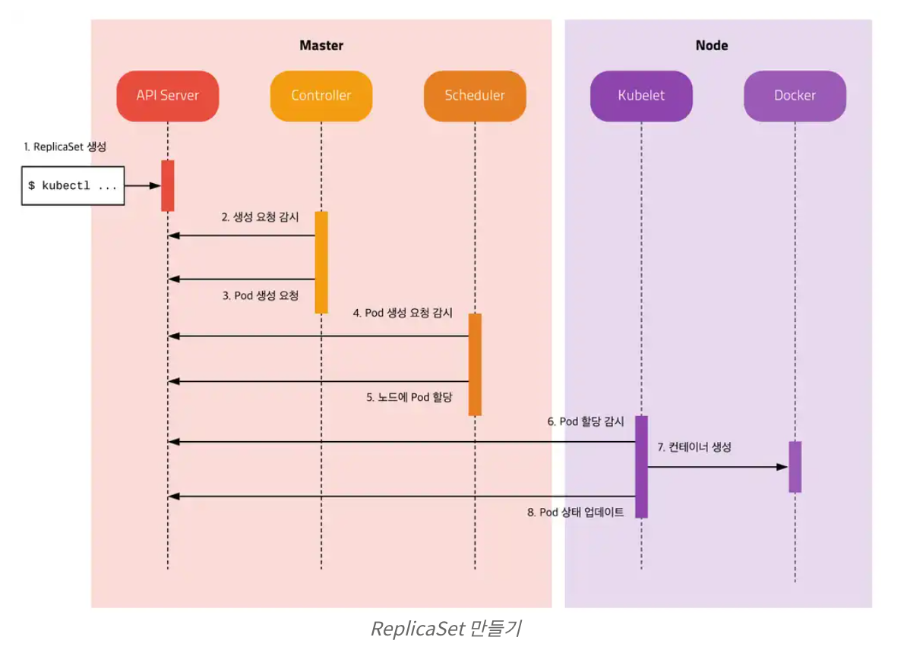

관리자가 애플리케이션 배포를 위해 ReplicaSet을 생성하면 위와 같은 과정을 거쳐 Pod를 생성한다.

>각 모듈은 서로 통신하지 않고 오직 API Server와 통신한다.  
API Server를 통해 etcd에 저장된 상태를 체크하고 현재 상태와 원하는 상태가 다르면 필요한 작업을 수행한다.

### kubectl
ReplicaSet 명세를 yml파일로 정의하고 kubectl 도구를 이용하여 API Server에 명령 전달  
API Server는 새로운 ReplicaSet Object를 etcd에 저장

### kube controller
Kube Controller에 포함된 ReplicaSet Controller가 ReplicaSet을 감시하다가 ReplicaSet에 정의된 Label Selector 조건을 만족하는 Pod가 존재하는 체크  
해당하는 Label의 Pod가 없으면 ReplicaSet의 Pod 템플릿을 보고 새로운 Pod(no assign) 생성  
(생성은 API Server에 전달하고 API Server는 etcd에 저장)

### scheduler
Scheduler는 할당되지 않은 Pod(no assign)가 있는지 체크  
할당되지 않은 Pod를 찾으면 조건에 맞는 Node를 찾아 해당 Pod 할당

### kublet
Kublet은 자신의 Node에 할당되었지만 아직 생성되지 않은 Pod가 있는지 체크  
생성되지 않은 Pod가 있으면 명세를 보고 Pod 생성  
Pod의 상태를 주기적으로 API Server에 전달


<br><br>

# 2. 클러스터링 Clustering
>Clustering?  
여러 대의 서버를 네트워크로 연결하여 하나의 서버처럼 보이게 하는 기술

특징
* Load Balancing: 클러스터는 부하를 여러 노드에서 분담하여 병렬 처리하도록 구성하여 시스템의 전반적인 성능을 향상시킨다.
* HA(High Availability): 하나의 노드에 장애가 생겼을 때, 다른 노드가 이어받아(FailOver) 계속해서 서비스를 제공한다.

문제
* 작업 스케줄링: 복잡한 클러스터 구성에서 여러 사용자 클러스터가 매우 방대한 양의 데이터를 접근할 때, 리소스를 어떻게 배분할 것이냐
* 노드 장애관리: 노드간의 통신으로 작업을 처리하는 도중, 한 노드에 장애가 발생된 것으로 예상되는 경우. 어떻게 처리할 것인가.

클러스터링 구성은 스토리지 소유 방법에 따라 나뉜다.
1. 공유 스토리지 구성
    * 여러 대의 서버가 하나의 스토리지를 공유하여 사용
    * 시스템 장애 시 데이터의 무결성을 쉽게 확보할 수 있음  
2. 데이터 미러 구성
    * 로컬 디스크 볼륨의 복사본을 네트워크를 통해 전송하여 무결성 확보


[쿠버네티스 시작하기 - Kubernetes란 무엇인가? SERIES 1/2](https://subicura.com/2019/05/19/kubernetes-basic-1.html)

<br><br>

# 2장. 쿠버네티스 소개
컨테이너 오케스트레이션 시스템의 사실상 표준.

## 1. 컨테이너
```
리눅스 커널의 기능 cgroups + namespace -> 격리 환경 구성  
                            + 
디스크 파일 변경사항을 레이어 형태로 저장하는 파일 시스템
```
Docker: 컨테이너를 다루는 기술

<br>

## 2. 컨테이너 오케스트레이션 시스템
Docker는 개발환경과 운영환경의 차이로 일어나는 많은 장애를 막음.  
but, Docker만으로는 여전히 사용 서비스하기에는 부족.  

사용 서비스는 같은 기능을 하는 서버도 여러 대 서버를 이용해서 하나의 서비스로 구성.  
Docker는 단일 컨테이너를 다루는데 특화된 기술이기 때문에, 여러 서버에 대한 설정, 배포 등을 한번에 하기위한 방법이 필요함.  

컨테이너 오케스트레이션 시스템은 수동 제어부분 모두를 자동화시킬 수 있다.  

상용 서비스는 한데 묶어 클러스터로 구성하고 쿠버네티스를 통해 모든 서버에 한 번에 명령으로 자동 배포하도록 구성한다.   
사용중인 클러스터 일부에 장애 발생 시, 오케스트레이션 시스템이 알아서 장애 서버의 컨테이너와 트래픽을 정상 운영 중인 다른 서버로 옮긴다.

<br>

## 3. 쿠버네티스 = k8s
>k8s
kubernetes의 k와 s 사이 글자가 8개여서 k8s라고도 한다.  
kubernetes는 배의 조타수라는 의미

쿠버네티스는 구글에서 사용하던 컨테이너 오케스트레이션 시스템인 borg를 기반으로 만들어졌다.  

>2015년, 구글과 Linux Foundation이 협업하여 CNCF, Cloud Native Computing Foundationd을 설립하고 쿠버네티스를 기부했다.

## 4. 쿠버네티스의 특징
1. 선언적 API, __declarative API__  
컨테이너가 어떤 상태이길 원하는지 선언, Desired State  
Desired State를 선언하면, 지속적으로 컨테이너의 상태를 확인하고  
설정한 상태와 다르면 Desired State로 돌려놓기 위해 맞춰간다.

2. SPOF, Single Point of Failure (단일 장애점) 회피  
클러스터를 구성하는 컴포넌트를 여러 개 실행해둘 수 있으므로 특정 요소가 동작하지 않으면, 전체 시스템이 중단되는 SPOF 문제를 해결할 수 있다.

3. 워크로드 분리  
분산시스템을 개발할 때, 분산된 프로세스의 실행 상태, 장애 발생시 처리방벙과 같은 시스템 안정성에 대한 고민이 생긴다.   
쿠버네티스는 마치 운영체제처럼 분산 프로세스의 관리를 추상화하는 레이어로 동작. 시스템 운영에 대한 고민을 덜어준다.  
이 같은 특징으로 쿠버네티스를 클라우드의 리눅스라고 말하기도 한다.

4. 어디서나 실행 가능  
개인 컴퓨터, 여러 대의 서버, 퍼블릭 클라우드, 심지어는 웹 환경에서도 실행가능하다. 

5. 커뮤니티가 활성화되어 있다.

<br><br>

# 3장. 쿠버네티스 설치

## 1. CSP 제공 쿠버네티스 도구
각 CSP에서는 관리형 쿠버네티스 도구를 제공한다.

1. Google GKE (Google Kloud Engine)  
쿠버네티스를 처음 개발해서 오픈소스로 만든 만큼 k8s와의 호환이 가장 잘 된다.  
2. Amazone EKS (Elastic Kubernetes Service)  
3. MS AKS (Azure Kubernetes Service)  

## 2. 쿠버네티스 클러스터를 직접 구성하는 도구

###  Kubeadm
---
쿠버네티스에서 공식 제공하는 클러스터 생성/관리 도구  
여러 대 서버를 손쉽게 k8s 클러스터로 구성할 수 있다.  
초기에는 HA를 갖춘 클러스터 구성이 어려워 테스트용 클러스터 구성에 주로 사용했으나, 최근에는 HA를 제공하는 클러스터까지 구성 가능.

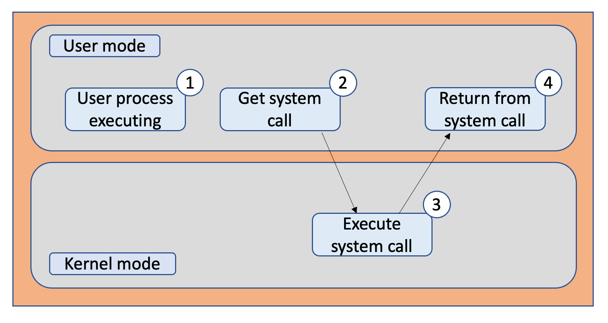

kubeadm에서 제공하는 클러스터 고가용성 구조는 위와 같다.  
여러 대의 마스터 노드를 구성하고 그 앞에 로드밸런서를 배치했다.  
워커 노드들이 마스터 노드에 접근할 때는 로드밸런서를 거쳐 접근하고, 마스터 노드 1대에 장애가 발생해도 로드밸런서에서 다른 마스터 노드로 접근할 수 잇게 해서 클러스터의 신뢰성을 유지한다.  
위 그림은 etcd(쿠버네티스 클러스터의 데이터 저장소) 클러스터를 마스터 노드에 함께 설치해서 운용하는 방법(stacked etcd)
필요에 따라 etcd 클러스터를 마스터 노드가 아닌 다른 곳에 구성해서 사용할 수 있다.  
init, join, upgrade, config, reset, token version 등의 명령어를 지원한다.  

이 방식은 etcd가 컨트롤 플레인 노드에 포함되므로 네트워크를 통항 통신이 필요없어 빠른 통신이 가능하다.  
다만, etcd와 마스터가 동일한 노드에서 실행되므로 하나의 노드에 장애가 발생하면 전체 클러스터에 영향을 미친다.(즉, 컨트롤 플레인과 etcd 멤버 모두를 잃어버리게 된다.)  
이 위험은 더 많은 컨트롤 플레인 노드를 추가함으로써 완화시키는데, 이를 위해 HA 클러스터는 최소 3개의 Stacked 컨트롤 플레인 노드를 운영해야한다.


<br>

다른 방법도 있다. etcd 클러스터를 컨트롤 플레인과 분리하는 것이다.

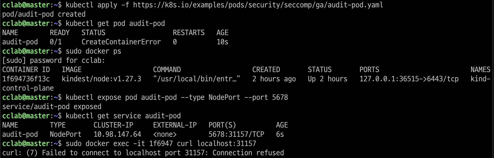

이 경우, 클러스터의 중복성 문제에 있어 Stacked etcd 토폴로지만큼 영향을 미치지 않는다.   
또한, 컨트롤 플레인과 etcd를 독립적으로 확장할 수 있으며 마스터와 etcd는 완전히 분리되어 있어 마스터 노드에 장애가 발생해도 etcd 클러스터는 계속 작동한다. 
하지만, 이 경우 Stacked etcd에 비해 호스트 수가 두배 증가한다.  
이 토폴로지로 HA 클러스터를 구성하기 위해선 최소 3개의 컨트롤 플레인과 3개의 etcd 노드가 필요하다. 

>클러스터 중복성?
쿠버네티스 클러스터에서 발생하는 하나의 노드 또는 서비스가 여러 번 복제되는 현상을 말한다.  
일반적으로 중복성은 쿠버네티스 클러스터를 안정적이고 고가용성으로 유지하는 데 도움이 되지만,  
불필요한 중복성은 클러스터의 자원 낭비를 초래하며 관리에 어려움을 추가한다.

<br>

### Kubespray
---
상용에 적합한 보안과 고가용성이 있는 쿠버네티스 클러스터를 배포하는 오픈 소스 프로젝트  

* 설정에 따라 사용자에게 맞는 형식으로 쿠버네티스 클러스터 구성  
* 온프레미스 환경에서 상용 서비스의 쿠버네티스 클러스터 구성시 사용

ingress-nginx 컨트롤러, 헬름, 볼륨 플러그인 erphfs를 프로비저닝하는 cephfs-provisioner, ssl 인증서를 관리하는 cert-manager 등의 추가 구성 요소를 클러스터에 실행하는 역할도 한다.  

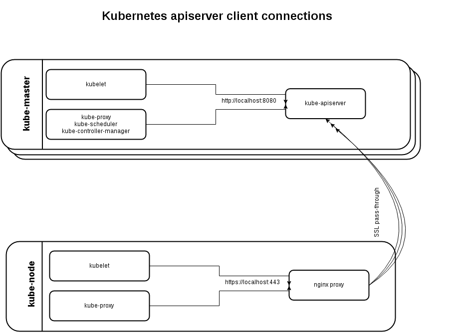

kubespray가 제공하는 클러스터 고가용성 구조는 위와 같다.  

kubeadm처럼 별도의 로드밸런서를 두지않고 노드 각각의 __Nginx__ 가 __리버스 프록시로__ 실행된다.  
이 Nginx-proxy가 전체 마스터 노드를 바라보는 구조로 되어있다.  
쿠버네티스 컴포넌트들은 직접 마스터 노드와 통신하지 않고 자신의 서버 안 Nginx와 통신한다.  
마스터 노드의 장애 감지는 health check를 이용해 Nginx가 알아서 처리한다.  

헬스체크는 일정 간격으로 서버에 신호를 보내고 응답을 확인하여 서버의 상태를 확인하는 방법.

>nginx? 리버스 프록시?  
프록시: 서버의 앞단에서 클라이언트의 요청을 수주해 원격 서버에 요청을 전달한다.  
요청은 프록시를 전달되므로, 서버 입장에서 실제 클라이언트를 알 수 없게한다.  
>
>리버스 프록시: 원격 서버의 내부 구조를 숨기는 역할을 하며, 보안 강화, 로드 밸런싱, 캐싱 등의 기능을 수행한다.  
로드 밸런싱은 주로 리버스 프록시를 사용하여 구현한다.    
로드 밸런서 기능을 가진 리버스 프록시를 사용하여 여러 대의 서버로 들어오는 트래픽을 분산시키는 방법이 많이 사용된다.  
>
>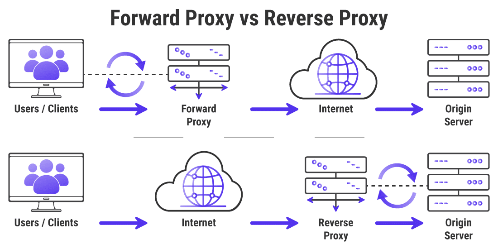
>
>Nginx: 리버스 프록시 기능을 가진 웹서버로 주로 웹 서버로의 요청을 받아 웹 애플리케이션 서버로 전달하는 역할을 수행한다.  
이외에도 정적파일 서비스, SSL/TLS 지원, 가상 호스팅, 압축, 보안 기능 등 다양한 기능을 제공하는 웹서버로 널리 사용된다.  
>[10분 테코톡, Nginx](https://www.youtube.com/watch?v=6FAwAXXj5N0&t=18s)


### Kubespray 설치 및 환경설정

#### ssh 키 생성과 배포  
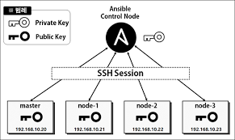
1. 우선 다른 서버에 SSH로 접속하도록 설정한다.  
master에서 ssh key를 생성하고 다른 노드들에 pub 키를 배포한다.  

```bash
ssh-keygen -t rsa
```
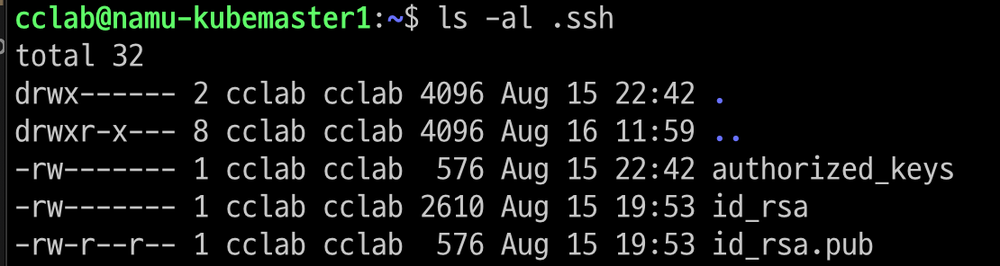  

ssh 공개키를 배포한다.
```bash
ssh-copy-id [계정이름]@[서버IP]
```
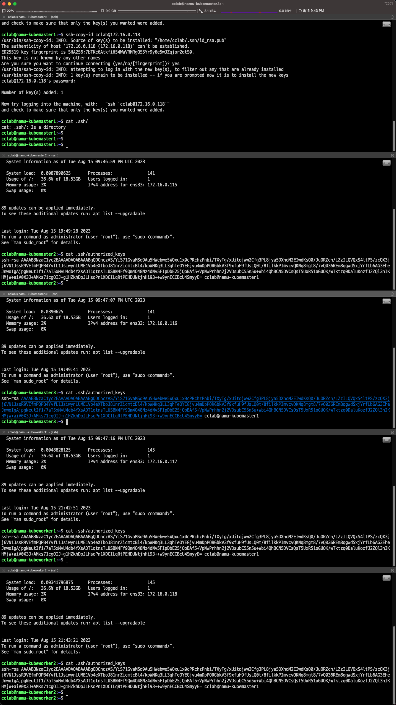  

각 서버에 authorized-keys가 생성된 것을 확인한다.  
```bash
cat .ssh/authorized_keys
```
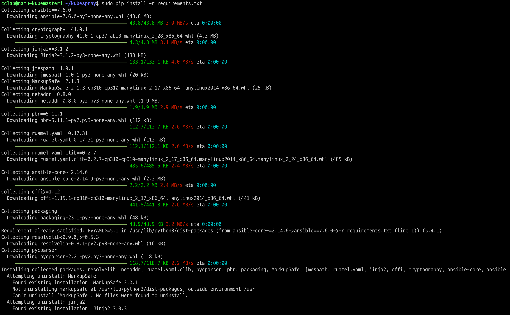  

#### kubespray 설치
Kubespray를 깃허브에서 클론해온다.   
```bash
git clone https://github.com/kubernetes-sigs/kubespray.git
cd kubespray
#git checkout -b [버전태그]
git checkout -b v2.22.1
git status
```
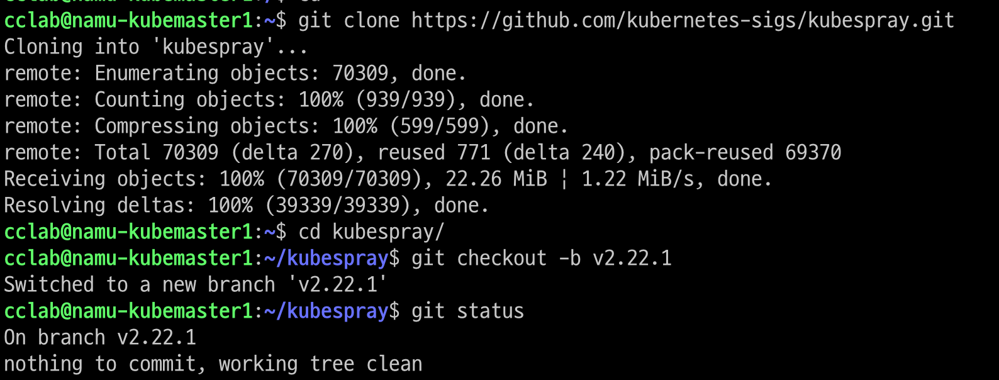  

requirements.txt는 pip로 설치할 패키지 정보가 담겨있다.  
이는 kubespray가 필요로 하는 파이썬 패키지들이다.  
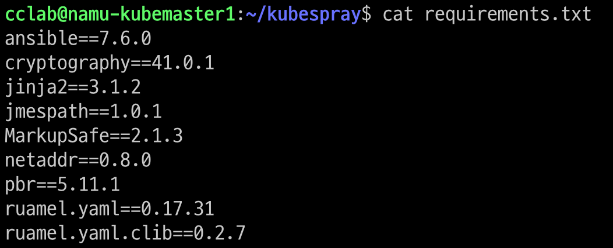

pip를 통해 패키지 설치  
```bash
sudo pip install -r requirements.txt
```
>pip2는 ansible 7.6.0을 지원하지 않는다.  
>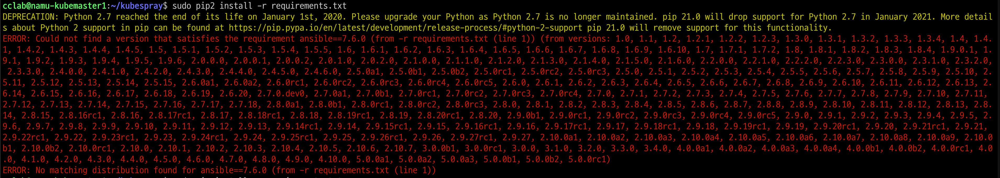    
>python3 pip를 설치한다.  
>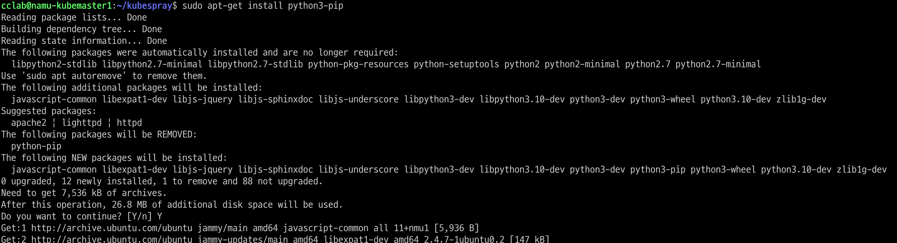    

ansible 설치 확인  
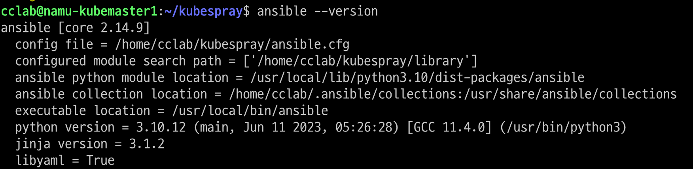  

#### kubespray 설정 
마스터 노드를 포함, 클러스터로 구성할 모든 서버의 정보와 설치 옵션을 설정한다.  
여기서는 inventory/sample 디렉터리에 설정 기본 템플릿을 수정해서 사용한다.  

기본 템플릿을 namucluster(새로 만든 디렉터리)로 복사해서 사용한다.  
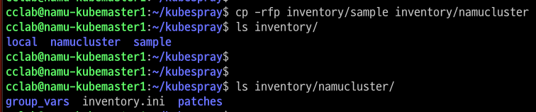  

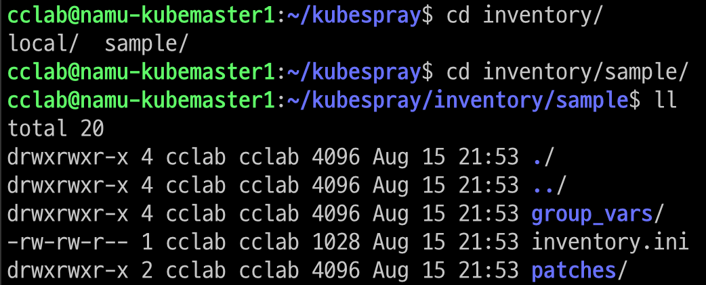  

>group_vars: 클러스터 설치에 필요한 설정 내용  
>inventory.ini: 설치 대상 서버들의 정보를 설정

>tree 명령어로 디렉토리 구조 확인    
>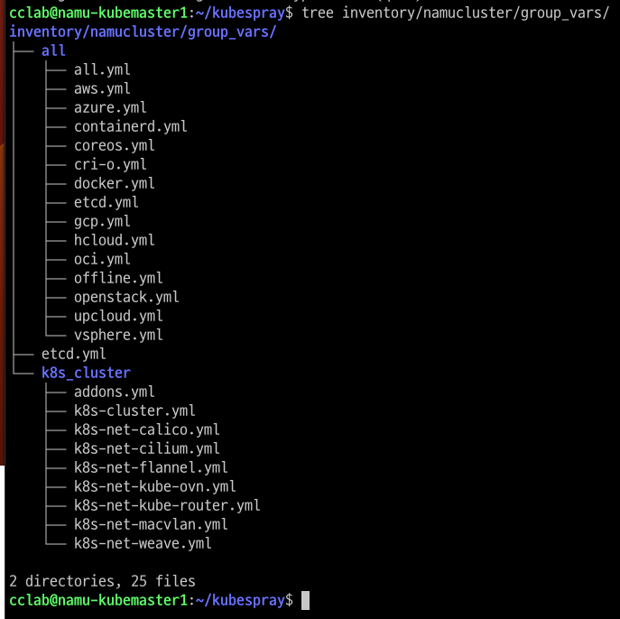  
all: 설치 환경 및 방법에 관한 설정  
all.yml: kubespray의 설치 및 설정  
aws.yml: AWS 환경에 설치할 때 적용할 설정  
>
>etcd.yml: etcd 설치에 필요한 상세 설정 내용  
>
> k8s-cluster: 쿠버네티스 관련 설정 존재  
k8s-cluster.yml: 쿠버네티스 클러스터를 설치할 때 적용할 설정  
addons.yml: 클러스터 설치 후 추가로 설치할 구성요소 설정
k8s-net-*.yml: 클러스터 네트워크 플러그인 별 상세 설정,   
네트워크 플로그인은 k8s-cluster.yml 파일의 kube-network_plugin 변수에 설정한 내용을 적용하고, 상세 설정은 k8s-net-*.yml 파일의 설정에 따른다.

```bash
vi inventory/[mycluster]/inventory.ini
```
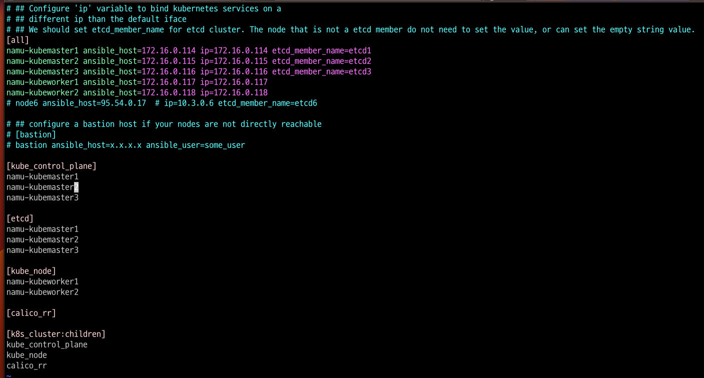  
>kube_node: 워커 노드로 사용할 서버의 호스트네임 설정

>ansible을 통해 각 노드들과의 통신을 확인한다.  
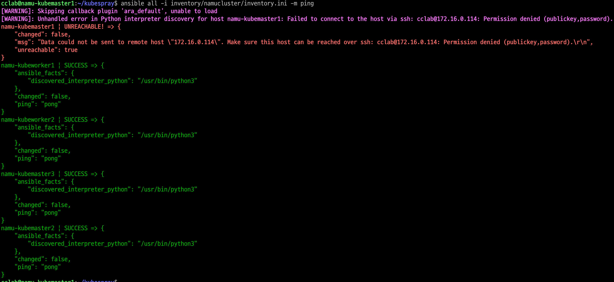  
현재 호스트에도 ssh 키를 부여하고 다시 확인해보면 정상적으로 연결된다.  
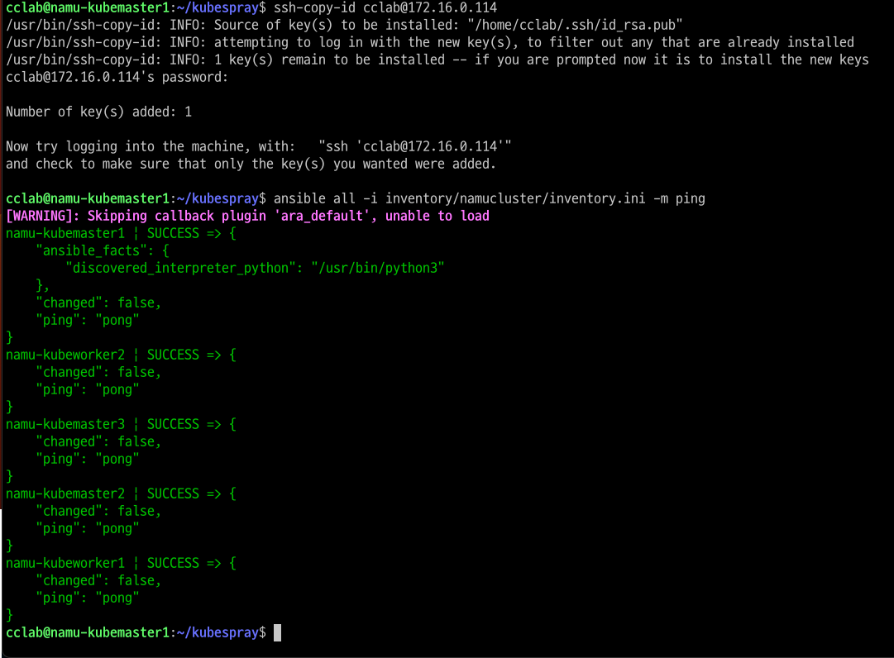  

모든 노드 apt 캐시 업데이트
```bash
# permission denied를 해결하기 위해 인수로 비밀번호를 넘겨준다.(--extra-vars "ansible_sudo_pass=~")
ansible all -i inventory/mycluster/inventory.ini -m apt -a 'update_cache=yes' --become --extra-vars "ansible_sudo_pass=[password]"
```
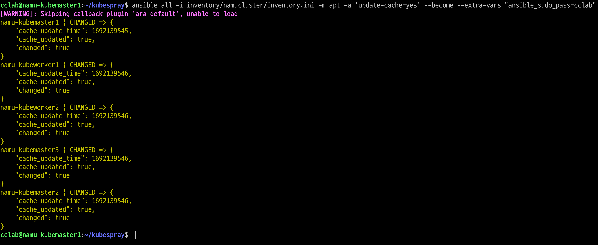  

```bash
# 쿠버네티스 클러스터를 구성한다.  
# ansible-playbook ~ 명령으로 cluster.yml 스크립트를 실행한다.  
# 구성시간 20분 이상 소요
ansible-playbook -i inventory/mycluster/inventory.ini -v --become --become-user=root --extra-vars "ansible_sudo_pass=[password] cluster.yml"
```

마지막으로 각 호스트네임 옆에 'failed=0'을 확인하면 정상적으로 설치되었음을 알 수 있다.  
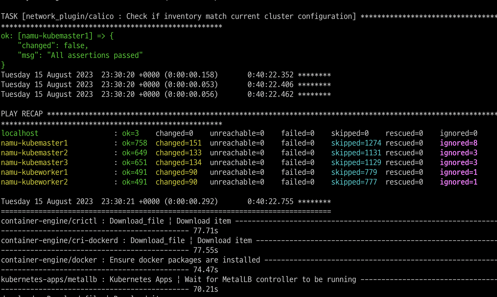  

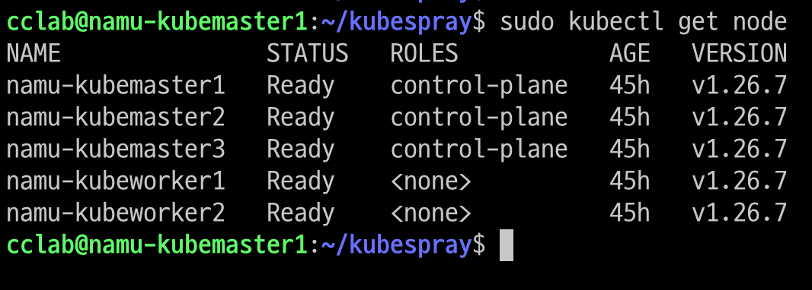


