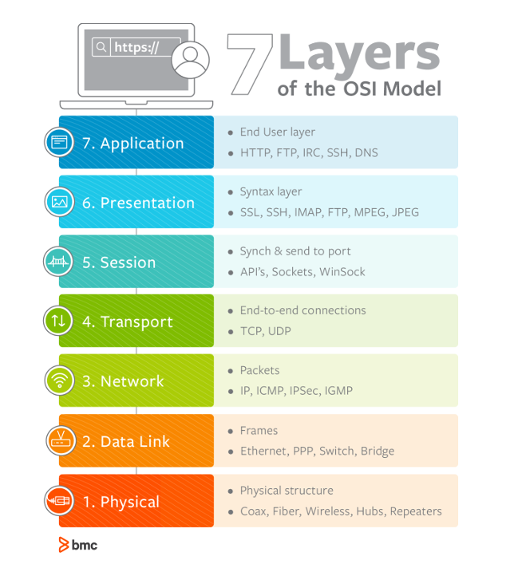
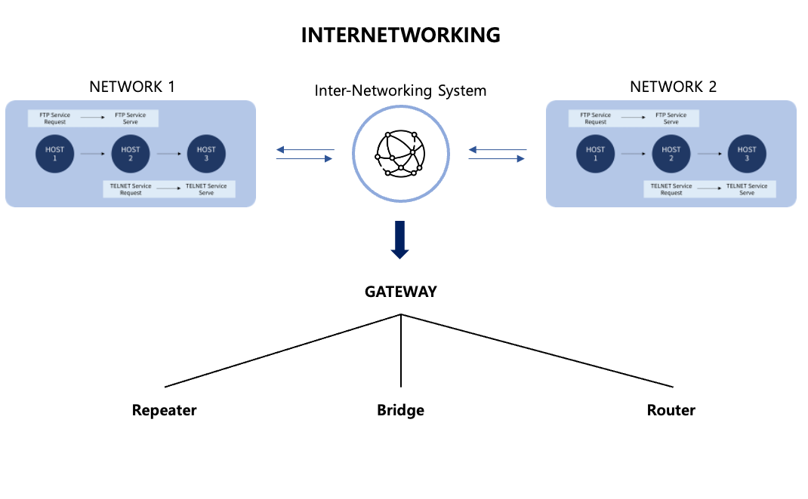
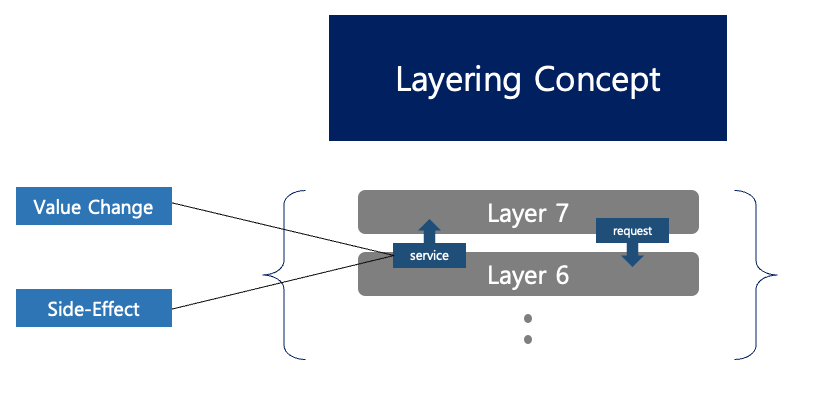
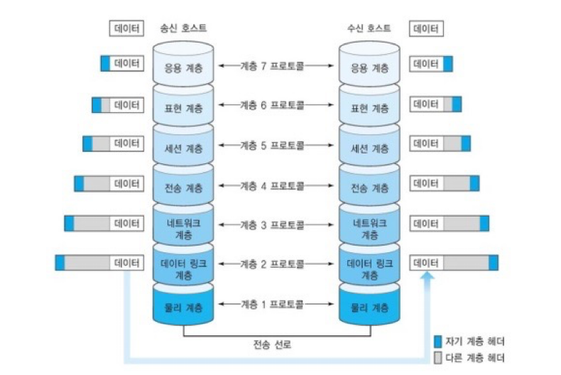

# Network

## 목차
* [1장. Kubernetes란?](#1장-kubernetes란)
    * [1.1 Kubernetes의 특징](#1-kubernetes의-특징)
    * [1.2 Kubernetes](#2-kubernetes)
    * [1.3 Kubernetes Object](#3-kubernetes-object)
    * [1.4 Kubernetes Architecture](#4-kubernetes-architecture)
    * [1.5 Pod 생성 과정](#5-pod-생성-과정)

# 1장. 네트워크 기초(1)
네트워크: 전송매체를 매개로 서로 연결되어 데이터를 교환하는 시스템의 모음

|용어|의미|
|:-:|:-:|
|System|내부 규칙에 따라 능동적으로 동작하는 대상임과 동시에 논리적인 대상들을 뜻함|
|Interface|시스템과 시스템을 연결하기 위한 표준화된 접근 방법|
|Transmission Media|시스템끼리 정해진 인터페이스를 연동해 데이터를 전달할 때 필요한 물리적인 전송 수단(광케이블, 꼬임선, 무선..)|
|Protocol|전송 매체를 통해 데이터를 교환하는 표준화된 규칙|
|Network|통신 매체를 공유할 때 사용하는 하나의 단위|
|Internet|모든 네트워크가 유기적으로 연결되어 동작하는 통합 네트워크|
|Standardization|서로 다른 시스템이 상호 연동해 동작하기 위한 방식|
|Node|인터넷에 연결된 시스템 단위|
|Host|컴퓨팅 기능이 있는 시스템 단위|
|Client|서비스를 이용하는 시스템|
|Server|서비스를 제공하는 시스템|

|OSI 7 계층|
|:-:|
||

1. Physical  
노드와 노드는 반드시 전송 매체로 연결되야 함  
호스트를 전송 매체와 연결하기 위한 인터페이스 규칙과 전송 매체의 특성을 다룸

2. Data Link  
물리적 전송 오류를 감지하는 기능 제공, 송수신 호스트가 오류를 인지할 수 있도록 함  
ex) 전송 도중 데이터 분실이나 왜곡 등

3. Network  
데이터가 올바른 경로를 선택할 수 있도록 라우팅  
네트워크의 부하를 막기 위해 혼잡 제어의 기능 수행

4. Transport  
송신 프로세스와 수신 __'프로세스 간 연결'__ 기능 제공  
데이터가 전송되는 최종적인 경로상의 양 끝단 사이 연결이 완성되는 곳

5. Session  
전송 계층과 유사한 메커니즘, but 논리적인 영역에 가까운 연결  
응용 환경에서 사용자 간 대화 개념의 연결로 사용됨

6. Presentation  
전송되는 데이터의 의미가 소실되지 않도록 올바르게 표현  
압축 및 암호화 기능을 다룸

7. Application  
최종 사용자를 위한 네트워크 응용 환경을 지원  

* IP Addresss  
IP 프로토콜이 호스트를 구분하기 위해 사용하는 주소체계  
호스트를 인터넷에 연결하려면 반드시 IP 주소를 할당 받아야 함  
32비트의 이진숫자로 구성, 8비트씩 네 부분으로 나누어 십진수로 표현

* DNS  
주소와 이름 정보를 자동으로 유지하고 관리하는 분산 데이터베이스 시스템  
호스트 주소와 이름 정보를 네임 서버가 관리함  
주소 변환이 필요한 클라이언트는 네임 서버에 요청해서 IP 주소를 얻는다.

# 2장. Network 기초(2)

## 2-1. Network Models

네트워크는 Layer structure가 기본이다.  
계층 구조를 살펴보면 각 계층별로 독립적인 고유 기능을 담당하고 있다.  
하위 계층을 

