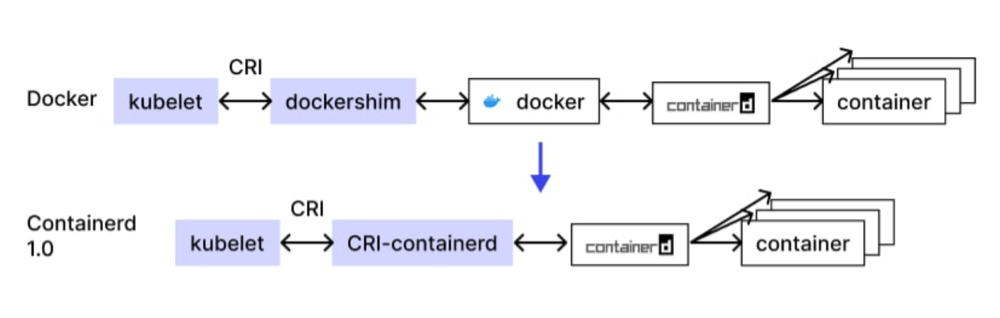

# Containerd
container + d(daemon)
* https://containerd.io
* containerd는 표준 컨테이너 런타임이다. 
* Linux, 윈도우 환경에서 컨테이너 생명주기 전반을 관리하는 데몬으로써 사용가능하다.
* 이미지의 전송/보관, 컨테이너 실행/감독, low-level storage, 네트워크 attachments 등을 제공한다.
    * Network Attachments? 
    * 가상 또는 클라우드 환경에서 네트워크 연결은 가상 머신 또는 컨테이너를 가상 네트워크에 연결하는 프로세스를 의미한다.

Containerd는 최초 Docker Engine과 함께 개발되었으나 후에 분리됐다.  
초기에는 주로 runC를 수행하기 위한 OCI(Open Container Initiative) 런타입 통합을 위해 제공되었으나 현재는 많은 기능이 추가되며 Docker를 뛰어넘었다.
>runC?  
OCI 런타임 표준을 준수하는 컨테이너를 생성 및 실행하기 위한 CLI 툴  
Docker는 과거 리눅스 커널이 제공하는 LXC 외부 드라이버에 의존하여 namespace와 cgroups를 사용했다.  
외부에 의존하지 않기 위해 libcontainer라는 별도의 구현체를 개발하였고, runC는 libcontainer의 clinet wrapper로 Go언어로 개발되었으며, 현재 Docker에서 저수준 컨테이너 런타임으로 사용되고 있다.  
이제 Docker는 host kernel의 namespace, cgroups에 의존하지 않고 OS에서 독립되어 동작할 수 있게 되었다.  

  

Containerd는 이제 컨테이너의 표준으로 자리잡았다.  
runC가 필요한 시점은 호스트 OS와의 통신과 같은 저수준 런타임이 필요한 경우이다.

  

 

## docker is deprecated
2020년 Kubernetes가 컨테이너 런타임으로써 Docker의 지원을 중단했다.   
정확히는 __도커 컨테이너 런타임, Dockershim의__ 네이티브 지원을 중단했다.  

 

  

기존에 docker image ps, docker build~ 등 Docker 명령들은 Docker CLI를 이용했다.  
dockerd는 이러한 docker CLI로부터의 RESTful API 요청을 수신하여 처리한다.  
dockerd는 docker engine이라고도 하며, containerd에 의존하여 containerd 없이 단독으로 실행할 수 없다.  

 

네트워크, volume과 같은 기능은 dockerd에게 위임하고 containerd는 컨테이너에 대한 기능을 갖는다.  
containerd는 ctrcli라고 불리는 전용 Client CLI를 제공하며 namespace를 제공하여 docker를 통해 실행되는  
containerd는 'moby'라는 이름의 네임스페이스에 모든 컨테이너를 생성한다.

 

containerd의 기능
1. container 생성  
엄격하게 말하면 containerd 자체가 container를 구동하지는 않는다.  
containerd는 containerd-shim, runC를 이용하여 컨테이너를 생성하는 역할을 수행한다.
2. image pull  
containerd는 컨테이너 구동에 필요한 이미지가 존재하지 않으면,  
OCI Spec을 기반으로 Image register Server로부터 컨테이너 이미지를 가져온다.
3. container lifecycle 관리  
컨테이너의 상태를 관리한다.

이와같이 containerd는 __독립 실행 가능한__ __high-level의 컨테이너 런타임이다.__
>high-level 컨테이너 런타임  
High Level Container Runtime은 이미지 관리, 압축/해제, 저수준 Container Runtime으로의 위임하는 역할을 맡는다.  
일반적으로 데몬 방식으로 동작하며, 외부에서 컨테이너를 실행/모니터링 할 수 있도록 Remote API를 제공한다

 

## containerd-shim
실제 컨테이너의 생성은 containerd-shime과 runC가 수행한다.  
더 정확히, '생성은' runC가 담당한다. runC는 컨테이너를 생성한 후 exit된다.  
runC가 종료되도 컨테이너를 관리하도록 해주는 것이 containerd-shim이다.  

* containerd가 containerd-shim 호출 -> containerd-shim가 runC 호출, (컨테이너 생성 후 종료됨)
* 그 후 컨테이너는 containerd-shim 프로세스가 담당, 컨테이너와 containerd의 통신은 모두 containerd-shim을 통해 이뤄진다.

## runC = libcontainer
컨테이너를 실제 생성하는 역할. containerd-shim으로 부터 호출되고 컨테이너 생성 후 종료됨  
runC는 OCI(Open Container Initiative) 런타임 스펙을 준수하는 __저수준 컨테이너 런타임__  
최초 이름은 libcontainer였지만, 도커 프로젝트에서 OCI에 기부되었고 이후 runC로 개명  
즉, runC는 libcontaienr을 리팩토링하여 만든 구현체  
libcontainer에서 cgroups 관리 모듈로는 cgroupfs 또는 systemd 둘 중 하나를 사용,  
 이제는 모든 모듈이 systemd를사용하는 쪽으로 업데이트되고 있다.  
>Row-level 컨테이너 런타임  
OCI(Open Container Initiative) Runtime으로도 불리며, 오로지 컨테이너를 실행하는 기능만 제공한다.  
컨테이너는 리눅스의 네임스페이스와 cgroups를 통해 구현되는데,  
namepsace는 시스템 리소스(파일시스템, 네트워크 등)를 가상화하고  
cgroups은 컨테이너 안에서 사용할 수 있는 리소스의 양을 제한한다.  
저수준 컨테이너 런타임은 네임스페이스와 cgroups을 설정한 후 그 안에서 명령을 실행한다.  
OCI 표준 스펙을 준수하는 동시에 가장 널리 쓰이는 것이 runC.  

## docker-shim  
  

docker-shim은 Docker 내부 컴포넌트 x, 쿠버네티스의 kubelet과 Docker간 통신을 위해 구현된 프로젝트  
쿠버네티스는 CRI(Container Runtime Interface)를 지원하는 모든 컨테이너 런타임을 통한 컨테이너 실행을 지원한다.
>CRI(Container Runtime Interface)  
새로운 컨테이너 런타임이 우후죽순 생겨남에 따라, 이와 관련된 프로젝트인 쿠버네티스에도 이들을 지원해야 할 부담이 생김  
이를 위해선 컨테이너 런타임 툴마다 kubelet을 매번 수정해야하는데 이를 피하기 위해  
kubelet과 컨테이너 런타임 간 인터페이스를 통일한 CRI가 등장.  
이제 컨테이너 런타임 툴이 CRI 스펙에 맞춰 CRI 컴포넌트를 구현하면 쉽게 kubelet과 호환이 가능해졌음

Docker는 쿠버네티스 등장 이전에 개발되었으므로 당연히 CRI를 준수하지 않았고  
그래서 kubelet과 Docker 간 CRI를 이용하기 위해 docker-shim을 사용했다.

한동안 docker와 docker-shime은 업데이트 되지 않았고, 이는 쿠버네티스 생태계의 발목을 잡게되었다.  
또한 Docker의 모든 명령은 root 권한을 필요로 했으므로 보안문제에 취약하다.  
데몬형태로 실행되는 docker는 너무 많은 기능을 담당함과 동시에 데몬 하위에 모든 컨테이너를 자식 프로세스로 가져  
너무 무겁고 장애가 모든 자식 프로세스에 영향을 끼치게 된다는 취약점을 지녔다.  
즉, Docker 데몬의 중지가 쿠버네티스 전체에 악영향을 끼치게 된다.

 

위와 같은 몇몇 이유들로 결국 쿠버네티스는 Docker-shim 지원을 중단하기로 결정한다.  
쿠버네티스는 CRI를 준수하는 containerd 또는 CRI-O의 사용을 권장한다. 

  

[흔들리는 도커(Docker)의 위상 - OCI와 CRI 중심으로 재편되는 컨테이너 생태계](https://www.samsungsds.com/kr/insights/docker.html)  
[당황하지 마세요. 쿠버네티스와 도커](https://kubernetes.io/ko/blog/2020/12/02/dont-panic-kubernetes-and-docker/)  
[Kubernetes docker 지원 중단 관련 설명](https://ikcoo.tistory.com/189)