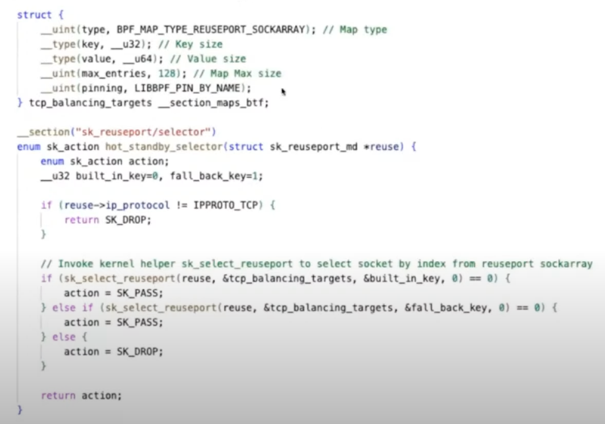

# Hot standby load balancing with SO_REUSERPORT and eBPF
SO_REUSERORT와 eBPF를 통한 커스텀 로드밸런싱 전략  

SO_REUSERPORT란?  
동일한 포트를 통해 하나 이상의 socket이 listen하도록 하는 커널의 기능  
전통적인 방법은 멀티 쓰레드/프로세스 환경에서 하나의 포트에는 하나의 소켓이 존재하고, 하나의 소켓이 들어오는 모든 커넥션을 처리(알맞은 프로세스/쓰레드로 라우팅) -> 트래픽이 높아질수록 병목지점이 된다.  
SO_REUSEPORT를 이용하면 하나의 포트에 각 프로세스/쓰레드마다 자신만의 소켓을 두어 이러한 문제를 해소할 수 있다.  

SO_REUSEPORT를 이용하면 zero-downtime rolling update나 CPU/프로토콜 인지 로드밸런싱과 같은 성능향상을 구현할 수 있다.  

## Default behavior
소켓은 source IP/PORT, destination IP/PORT 4개의 튜플을 통해 해시값이 결정된다.
하지만, 이 해시를 소켓에 매핑하는 실제 프로세스에는 listening sockets의 총 갯수가 포함된다.  
이 때문에, 사용자가 rollout을 함으로써 리스닝 소켓의 수가 변경되면 선택중인 소켓이 변경되고 3-way 핸드셰이크에 영향을 미칠 수 있다.  
그러나 5.14 부터는 TCP Migrate Request라고하는 새로운 CTL 플래그가 있어서 이를 대신 처리할 수 있다.  

>__tcp_migrate_req__ - BOOLEAN
>The incoming connection is tied to a specific listening socket when
>the initial SYN packet is received during the three-way handshake.
>When a listener is closed, in-flight request sockets during the
>handshake and established sockets in the accept queue are aborted.
>
>If the listener has SO_REUSEPORT enabled, other listeners on the
>same port should have been able to accept such connections. This
>option makes it possible to migrate such child sockets to another
>listener after close() or shutdown().
>
>The BPF_SK_REUSEPORT_SELECT_OR_MIGRATE type of eBPF program should
>usually be used to define the policy to pick an alive listener.
>Otherwise, the kernel will randomly pick an alive listener only if
>this option is enabled.
>
>Note that migration between listeners with different settings may
>crash applications. Let's say migration happens from listener A to
>B, and only B has TCP_SAVE_SYN enabled. B cannot read SYN data from
>the requests migrated from A. To avoid such a situation, cancel
>migration by returning SK_DROP in the type of eBPF program, or
>disable this option.
>
>Default: 0
>
>initial SYN packet이 3-way 핸드셰이크동안 수신되면 incoming 커넥션은 특정 리스닝 소켓에 연결된다.  
>리스너가 닫히면, 핸드셰이크 중 in-flight(도착하지 않은) 요청 소켓과 accept queue에 위치한 (이미 확립된) 소켓이 중단된다.  
>
>리스너의 SO_REUSEPORT가 활성되면 같은 포트의 다른 리스너가 이런 커넥션에 대해 수락할 수 있어야 한다.  
>이 옵션(SO_REUSEPORT)은 close()나 shutdown()을 한 후에 다른 리스너에 위와 같은 child 소켓들을 마이그레이션 할 수 있게 해준다.  
>
>일반적으로 alive 상태의 리스너를 선택하는 정책은 >BPF_SK_REUSEPORT_SELECT_OR_MIGRATE 타입의 프로그램을 통해 정의된다.  
>그렇지않으면, 커널은 alive 리스너를 무작위로 선택한다.(옵션이 활성화된 경우에만) 
>
>다른 설정을 가진 리스너 간 마이그레이션은 충돌을 일으킬 수 있다.  
>예를들어, 두 개의 리스너(A, B) 중 B만 TCP_SAVE_SYN이 활성화 되어 있고 리스너 A에서 B로의 마이그레이션이 일어난다고 하자.  
> B는 A로부터 마이그레이션되어온 요청에서 SYN 데이터를 읽지 못한다.  
>이러한 상황을 방지하려면, eBPF 프로그램에서 SK_DROP을 반환하여 마이그레이션을 취소하거나, 이 옵션을 사용하지 않도록 설정해야한다.  
>[Linux Kernel Docs](https://mjmwired.net/kernel/Documentation/networking/ip-sysctl.rst)

>SYN = 연결 요청 플래그   
> 
>  
>
>[PATCH: Allow TCP connections to cache SYN packet for userspace inspection](https://lore.kernel.org/all/20150501201417.GB6113@akamai.com/T/)


커스텀 로드밸런싱 전략을 어떻게 구현해야할까?  
가중(weighted) 로드 밸런싱이나 hot-standby 로드밸런싱을 어떻게 수행해야 할까?  
여기서 eBPF가 출현, skrusport 유형의 eBPF 프로그램을 통해 해결할 수 있다.  

## How?
__SK_REUSERPORT 타입의 eBPF 프로그램__ 과 __REUESRPORT_SOCKARRAY 타입의 eBPF 맵__ 을 사용  

## Demo
왼쪽창: 프라이머리 모드로 실행중인 서버, listening 8080 port  
소켓이 listen 상태가 되면 소켓 정보를 tcp_balancing_targets이라고 하는 BPF 맵에 업데이트한다.  

왼쪽 창에서 server.go를 primary로 실행 시, 소켓이 listen 상태가 되면 tcp_balancing_targets이라고 하는 BPF 맵에 소켓 정보가 업데이트 된다.(primary = 0으로 초기화)  

오른쪽 창에서 같은 server.go를 standby 모드로 실행하면(같은 포트번호를 사용) 마찬가지로 tcp_balancing_targets이라고 하는 BPF 맵에 소켓정보를 업데이트한다.(standby = 1로 초기화)  

왼쪽과 오른쪽의 소켓정보는 다르다.  

이 상태로 server.go에 curl 명령을 보내면 primary가 응답한다.  
primary의 서비스를 중단시키고 curl 명령을 보내면 standby가 응답한다.  
primary의 서비스를 다시 살리고 curl 명령을 다시 보내면 primary가 다시 응답한다.  

```bash
bpftool prog list | grep -A4 reuseport | head -4
bpftool map list
``` 

  
 
hot_stadnby_selector라는 이름의 sk_reuserport 타입의 eBPF 프로그램이 적재되어 있고  
tcp_balacing_t라고하는 reuseport_sockarray 타입의 eBPF 맵이 사용중에 있음을 보여준다.  

## Code
tcp_balancing_targets 맵과 hot_standby_selecotr eBPF 프로그램의 코드를 보여준다.  

  

'LIBBPF_PIN_BY_NAME'을 통해 현재 PIN MAP을 사용중임을 알 수 있다.  
>pin map  
>영속성을 위해 로컬 파일시스템에 맵을 저장하는 것.  
>libbpf에서는 자동으로 /sys/fs/bpf/<map_name> 경로에 저장된다.  
[libbpf map example](https://mozillazg.com/2022/05/ebpf-libbpfgo-use-map-example-en.html)  

아래에서는 sk_reuseport 타입의 셀렉터임음 명시('__section("sk_reuseprot/selector")'하고  
내부에 서버 인스턴스들이 사용할 키(eBPF 맵의 키)를 미리 선언해두었다.  
앞서 서버가 실행될 때, eBPF 맵을 업데이트 한 키값과 같다.  

이제 커널 헬퍼인 sk_select_reuseport()를 호출하여 reuseport_sockarray에 저장된 데이터를 통해 소켓을 선택한다.  

  

이 bpf-헬퍼 함수는 REUSEPORT_SOCKARRAY 타입의 BPF 맵에서 SO_REUSEPORT 소켓을 선택, 선택된 소켓이 소켓버퍼에 들어오는 요청과 일치하는지 확인한다. (0 = succcess, 음수 = 에러(실패))

순서대로 primary -> standby 순으로 확인하며 일치하면 SK_PASS, 둘 다 불일치 시 SK_DROP을 반환한다.  

## 서버 설정
서버에서 유일하게 중요한 부분  
__소켓옵션을 어떻게 설정하냐__  
커스텀 listner config을 생성한다. 커스텀 listner config를 사용하면 raw connection, raw underlying connection에 액세스 할 수 있다.  
해당 소켓에서 SO_REUSEPORT라고하는 플래그를 설정할 수 있다. (eBPF 프로그램 SO_REUSERPORT에 연결한다)

```go
// go 언어로 작성됐다.  
func getListenConfig(prog *ebpf.Program, mode string, otherInstancesRunning bool) net.ListenConfig {
	lc := net.ListenConfig{Control: func(network, address string, c syscall.RawConn) error {
		var opErr error
		err := c.Control(func(fd uintptr) {
			// Set SO_REUSEPORT on the socket
			opErr = unix.SetsockoptInt(int(fd), unix.SOL_SOCKET, unix.SO_REUSEPORT, 1)
			// Set eBPF program to be invoked for socket selection
			if prog != nil && mode == "primary" && !otherInstancesRunning {
				err := unix.SetsockoptInt(int(fd), unix.SOL_SOCKET, unix.SO_ATTACH_REUSEPORT_EBPF, prog.FD())
				if err != nil {
					opErr = fmt.Errorf("setsockopt(SO_ATTACH_REUSEPORT_EBPF) failed: %w", err)
				} else {
					zap.S().Info("SO_REUSEPORT bpf prog attach completed successfully")
				}
			}
		})
		if err != nil {
			return err
		}
		return opErr
	}}
	return lc
}
```

네트워크 리스너를 생성할 때 리스너의 동작을 커스텀 정의한다.  
'lc := net.ListenConfig{...}' : net.ListenConfig 구조체를 초기화, 이를 통해 나중에 네트워크 리스너 생성  

'Control: func(network, address string, c syscall.RawConn) error { ... }': ListenConfig 구조체의 Control 필드. Control 필드는 네트워크 리스너의 동작을 사용자 정의하기 위한 함수

'err := c.Control(func(fd uintptr) { ... })': RawConn(시스템콜을 수행하기 위한)의 Control 메소드 호출.  
이 메소드는 소켓 파일 디스크립터(fd)를 사용하여 소켓의 동작을 제어  
인자로 소켓 파일 디스크립터를 처리하는 작업의 함수를 받는다.  

'opErr = unix.SetsockoptInt(int(fd), unix.SOL_SOCKET, unix.SO_REUSEPORT, 1)': 소켓 옵션 설정. 
>SO_REUSEPORT 옵션은 소켓을 다중 프로세스 또는 스레드에서 공유하여 연결 요청을 분산 처리하는 데 사용한다.  

'if prog != nil && mode == "primary" && !otherInstancesRunning { ... }': 조건문을 사용하여 특정 조건을 검사합니다. prog가 nil이 아니고 mode가 "primary"이며 otherInstancesRunning이 false인 경우 수행

'err := unix.SetsockoptInt(int(fd), unix.SOL_SOCKET, unix.SO_ATTACH_REUSEPORT_EBPF, prog.FD())': 소켓에 eBPF 프로그램을 적재. 

zap.S().Info("SO_REUSEPORT bpf prog attach completed successfully"): eBPF 프로그램을 소켓에 성공적으로 첨부한 경우, 로깅 메시지를 출력  

[전체 코드](https://github.com/hemanthmalla/reuseport_ebpf)  

<br>
<br>
<br>

# State synchronization of eBPF Maps for high-availability application
각각의 애플리케이션에서 eBPF 맵의 상태 동기화  

eBPF는 필터링이나 로드밸런싱과 같은 많은 stateful 네트워크 애플리케이션에 사용되고 있다.  
이와같은 서비스는 단일 장애점을 회피하기 위해 HA pairs/clustes로 deploy되어야 함. 이러한 상황에서 노드/파드 간 상태 동기화가 필수적  
eBPF 프로그램의 상태 = eBPF maps

## 현존하는 시스템
전통적으로 netfilter/iptables 인프라는 리눅스 stateful filtering을 위해 사용되어왔다.  
Contrackd(contract daemon) - iptables의 contract entries(계약 항목)을 동기화하기 위해 사용되고 있음

## eBPF를 통한 improve
가장 간단한 방법 : map의 모든 요소를 주기적으로 넘기는 것.  
-> 비용이 너무 크고 리눅스 커널 내부의 맵에서 일어나는 정호가한 변화를 추적하는 것도 어려움  

선호되는 방법: map에 변화가 생겼을 때 async(비동기) 알람(notifications - for add/delete/updates)을 발생시킨다.  
여기서 eBPF가 등장하는데,  
커널의 eBPF 테이블 수정 함수에 적용되는 kprobe 알림을 사용.  
더 나아가 eBPF perf나 ring buffer를 통해 이러한 이벤트를 user space에 알린다.  
user space에서는 gRPC와 같은 잘 알려진 신뢰성있는 메시징 프레임워크와 이벤트를 연결하여 전체를 동작시킬 수 있다.  

kprobes는 보통 시스템 내부의 모든 eBPF 맵과 관련된 모든 이벤트를 캡처하고, 이로인해 많은 변경사항이 생긴다.  
변경을 줄이기위해 kprobe 커널 사이트 프로그램은 맵 이름을 기반으로 이벤트를 더 필터링한다.  

  

맵 이름은 다른 eBPF 맵 집합을 사용하여 커널 사이트 프로그램에 전달할 수 있다.  
그러나 아직 우리는 kprobes를 해시 엔트리포인트에 대해서만 사용하고 있다.  
물론 필요에 따라 변경할 수 있다.  
구현의 훌륭한점은 맵의 세부정보나 의미론을 전혀 알지 못한단는 것이다.  
그러므로 다른 애플리케이션에 이를 재사용할 수 있다.  

좀 더 큰 사용 사례로, 현재 k8s용 eBPF 기반 서비스 LB인 loxilb 프로젝트에 사용중인데, 여기서는 eBPF맵을 온디맨드로 동기화하기 위한 일종의 사이드카로 사용된다.  

  

단일 노드 클러스터에 구축된 loxilb는 초당 232k 연결을 보였지만, 동기화 인프라와 통합했을 때 5%의 감소율.. 

[github: loxlib](https://github.com/loxilb-io/loxilib)


