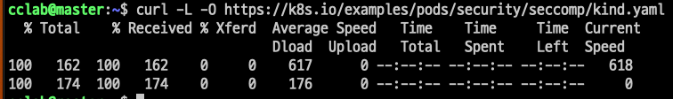
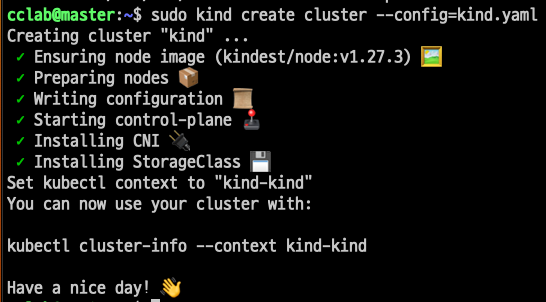
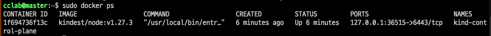
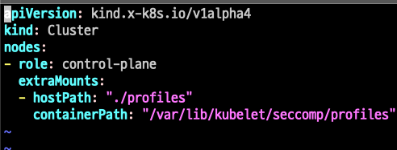
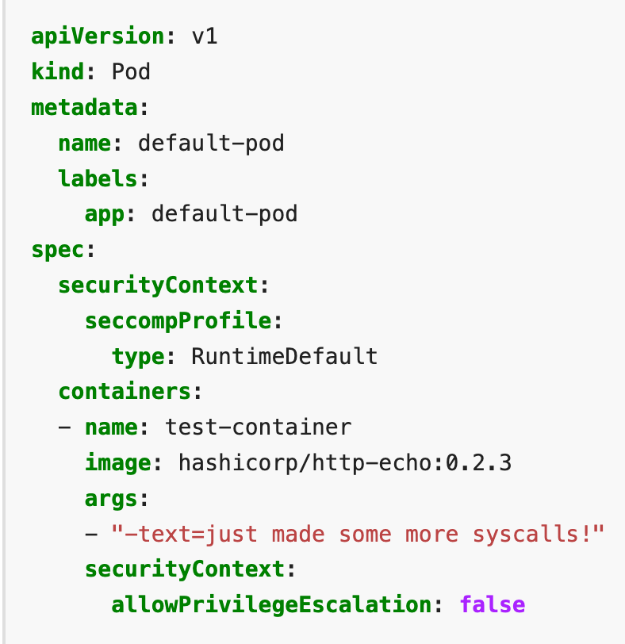
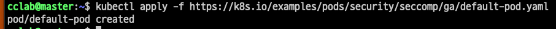
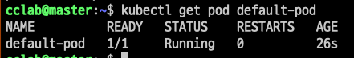
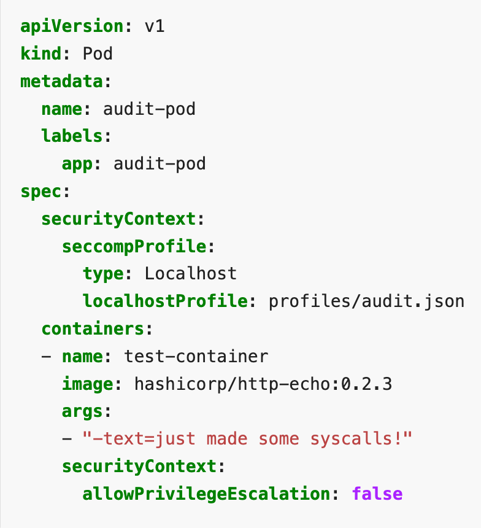
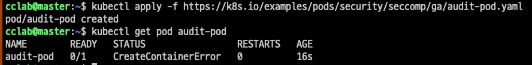

# seccomp

## 목차
* [1장. seccomp](#1-seccomp)
    * [1.1 sandbox](#11-sandbox)
    * [1.2 seccomp](#12-seccomp)
    * [1.3 seccomp-bpf](#13-seccomp-bpf)
    * [1.4 ebpf](#14-ebpf)
    * [1.5 seccomp 모드](#15-seccomp-모드)
* [2장. seccomp 실습](#2-seccomp-실습)


# 1. seccomp
컨테이너들이 같은 호스트에서 실행되어도 해당 워크로드들은 서로 분리된다.  
seccomp는 그러한 워크로드들의 격리를 강화하는 데 사용할 수 있는 도구 중 하나이다.

## 1.1 Sandbox
두 가지 방법이 있다.
1. 각각의 워크로드가 서로의 존재를 알지 못하도록 격리  
컨테이너와 VM이 이를 달성한다.
2. 다른 워크로드의 존재를 인식은 가능하나, 접근 및 실행할 수 있는 자원/연산 제한. 다른 워크로드에 영향 못 미치도록 함.  
자원 접근이 제한되도록 응용프로그램을 격리 = Sandbox

응용 프로그램이 컨테이너로 실행 -> 컨테이너를 샌드박싱을 위한 수단 중 하나로 사용  
응용 프로그램이 침해되면 공격자가 프로그램을 비정상적 방식으로 코드를 실행  
샌드박싱 메커니즘 = 코드가 할 수 있는 일을 제한. 이는 곧 시스템에 대한 공격자의 영향 제한

## 1.2 seccomp
secure computing mode, 샌드박싱을 실현하는 메커니즘 중 하나  
저수준에서 프로세스의 행동을 통제

응용 프로그램이 커널에 요청할 수 있는 시스템 콜의 집합을 제한하는 메커니즘  
* 응용 프로그램은 시스템 콜을 통해 자신이 직접 할 수 없는 작업을 커널에 요청한다

|System Call in OS|
|:-:|
||

최초 리눅스 커널에 도입된, 보안 컴퓨팅 모드.
1. sigreturn(신호 처리부에서 복귀)  
2. exit(프로세스 종료)  
3. read/write(파일 디스크립터에 읽기/쓰기)   

위 세가지의 시스템 호출만 사용가능했다.  

실행 가능한 시스템 호출이 몇 개 없어서 신뢰되지 않은 코드가 시스템에 별 피해를 못 친다. 
하지만 이와 반대로 신뢰된 코드도 할 수 있는게 없음.  

>__sigreturn__  
시그널 핸들링과 관련된 시스템 호출  
signal: OS가 프로세스에게 중요한 사건(ctrl+c 키 입력, 프로세스 간 통신 등..)이 발생했음을 알리는 메시지.  
시그널 핸들러: 특정 시그널이 발생했을 때 그에 대응하는 특별한 작업을 수행하는 코드.
>
>sigreturn은 시그널 핸들러의 실행 후, 프로세스가 원래의 실행흐름으로 돌아가기 위해 호출하는 시스템 콜이다.  
시그널 핸들러가 호출되면서 변경된 스택과 레지스터를 저장해둔 원래의 상태로 복원시킨다.  


## 1.3 seccomp-bpf
BPF, Berkeley Packet Filter  
요청된 시스템 호출의 허용 여부를 프로세스에 __적용된 seccomp 프로파일에 따라 결정한다.__

seccomp BPF 필터는 주어진 시스템 호출의 opcode와 매개변수를 보고 해당 프로세스의 seccomp 프로파일에 근거해서 호출의 허용 여부를 결정한다.  

프로파일: 시스템 호출이 주어진 필터와 부합할 때 어떤 일을 해야 할지를 명시
가능한 일에는 오류반환, 프로세스 종료, tracer(추적기) 호출 등이 존재.

>컨테이너의 맥락에서 프로파일이 그냥 시스템 호출을 허용할지 아니면 오류를 돌려줄지 결정하므로  
seccomp 프로파일이라는 것을 시스템 호출에 대한 화이트리스트 또는 블랙리스트로 이해할 수 있다. 

컨테이너 관점에서 보자면,  
컨테이너화된 응용 프로그램엔 필요없는 시스템 호출이 많다.  
ex) 호스트의 클록 시간 변경, 커널 모듈 변경 등  

seccomp 프로파일로 필요없는 시스템 콜을 제한함으로써 공격자가 시스템에 가할 수 있는 영향력을 효과적으로 낮춘다.  

Docker의 기본 seccomp 프로파일은 300개 이상의 시스템 호출 중 약 44개의 시스템 호출을 차단한다.  
프로파일은 기본적으로 시스템 호출에 대한 액세스를 거부한 다음 특정 시스템 호출을 허용 목록에 추가하는 화이트 리스트 방식으로 동작한다.  
SCMP_ACT_ERRNO의 기본 동작을 정의하고 특정 시스템 호출에 대해서만 해당 동작을 재정의하는데, SCMP_ACT_ERRNO의 효과는 Permission Deny 오류를 일으키는 것이다.  
SCMP_ACT_ALLOW로 허용하는 시스템 콜 목록을 정의한다.
[Docker 기본 seccomp 프로파일](https://github.com/moby/moby/blob/master/profiles/seccomp/default.json)


## 1.4 ebpf
extended bpf
좀 더 현대적인 방식으로 eBPF 기반 유틸리티로 응용 프로그램이 요청한 시스템 호출들을 파악할 수 있다.  
즉, ebpf를 이용해 응용 프로그램이 사용하는 시스템 호출 목록을 얻어낸다.  
이를 이용해 seccomp 프로파일이 응용 프로그램에 딱 필요한 시스템 호출들만 제공하도록 구성할 수 있다.  

## 1.5 seccomp 모드
secoomp 모드는 prctl() 함수를 통해 모드를 적용한다.  

세 가지 주요 모드가 있다.

__첫째. STRICT_MODE__  
* read, write, exit ,sigreturn 시스템 콜 호출만 허용.  
* 이외 시스템콜 요청은 SIGKILL 시그널 발생시켜 프로그램을 종료한다.  

__둘째. FILTER_MODE__
* 원하는 시스템 콜 호출을 허용/거부 설정
* 일반적으로 BPF 문법을 통해 적용

__셋째. NNP MODE__, NO New Privileges
* 프로세스가 권한 상승을 통해 새로운 권한을 얻는 것을 막는다.  
* 즉, 실행 중 더 높은 권한의 취득을 금지한다.

1. STRICT_MODE
```c
#include <stdio.h>
#include <stdlib.h>
#include <seccomp.h>

int main() {
    // seccomp 필터 생성
    scmp_filter_ctx ctx;
    ctx = seccomp_init(SCMP_ACT_ALLOW); // 기본 동작 설정, rule에 추가되지 않은 시스템 콜 허용
    // seccomp_init(SCMP_ACT_KILL): rule에 추가하지 않은 시스템 콜 차단.(화이트 리스트)

    // open 시스템 콜 차단
    seccomp_rule_add(ctx, SCMP_ACT_KILL, SCMP_SYS(open), 0);
    // 추가로 제한할 시스템 호출이 있다면 여기에 추가

    // 필터를 로드하고 활성화
    seccomp_load(ctx);
    seccomp_release(ctx);

    // open 시스템 호출만 허용하는 코드
    FILE *file = fopen("example.txt", "r");
    if (file == NULL) {
        perror("Error opening file");
        return 1;
    }

    printf("File opened successfully.\n");
    fclose(file);

    return 0;
}

```

>SCMP_ACT_ALLOW, SCMP_ACT_KILL  
seccomp 필터에서 사용되는 action 값.  
sccomp 필터는 시스템 콜을 필터링하고 프로세스의 동작을 제어하기 위해 사용되는데,  
이때 각 시스템 콜에 대한 동작을 정의한다.  
>
>SCMP_ACT_ALLOW: 특정 시스템 콜 허용. 정상 실행함.  
SCMP_ACT_KILL: 특정 시스템 콜 차단, 프로세스 종료.  
다만, 액션에 대한 프로세스만 종료. 시스템 콜을 유발한 프로세스 자체가 종료되진 않는다.

<br><br>

# 2. seccomp 실습


## 2.1 실습환경 구성
>OS: Ubuntu 22.04.1 LTS  
>kernel: 5.15.0-76-generic  
>docker-ce: 24.0.5
>kubeadm, kubelet, kubectl: v.1.27.4


### swap off, 설치 전 환경설정
```bash
sudo swapoff -a
sudo sed -i '/swap.img/s/^/#/' /etc/fstab # (Ubuntu 22.04)
```

>Swap은 리눅스 운영 체제의 가상 메모리 관리 메커니즘.  
물리 메모리가 부족할 때 디스크 공간을 사용하여 메모리 확장을 수행하는 역할.(OS에서 나옴)
>
>컨테이너 오케스트레이션 시스템은 컨테이너의 성능, 격리 및 예측 가능성을 보장하기 위해 노드의 메모리를 효율적으로 사용하는 것이 중요하다.  
이를 위해 K8s는 기본적으로 Swap을 사용하지 않는 것을 권장하고, 그래서 Kubernetes를 설치할 때 Swap을 비활성화한다.
>
>1. 성능: Swap을 사용하면 디스크 I/O가 발생하여 컨테이너의 성능이 저하될 수 있다.
>
>2. 일관된 메모리 할당: Swap을 사용하면 컨테이너가 예상치 못한 메모리 부족 상황에 놓일 수 있다. 이로 인해 컨테이너의 동작이 예측할 수 없어지게 된다.
>
>3. 리소스 격리: 컨테이너와 호스트 시스템 간에 메모리 할당 및 격리를 보장하기 위해 Swap을 비활성화한다. 컨테이너 간 간섭을 방지하여 예측 가능한 환경을 유지한다.
>
>즉, K8s 클러스터를 구성할 때, 컨테이너의 메모리 관리 및 격리를 위해 Swap을 비활성화한다. 
>
>\+ v.1.22부터 swap을 메모리의 사용을 지원한다(알파버전)
[관련 링크](https://kubernetes.io/blog/2021/08/09/run-nodes-with-swap-alpha/)

```bash
# container.d를 위한 커널 모듈을 로드한다.
# overlay: 컨테이너 파일 시스템의 레이어링을 지원하기 위한 모듈. 컨테이너 이미지의 레이어를 효율적으로 관리하기 위해 사용.
# br_netfilter: 브리지 네트워크 필터링 기능을 제공. 컨테이너 런타임 및 네트워킹에서 필요한 네트워크 기능을 제공하기 위해 사용.
sudo tee /etc/modules-load.d/containerd.conf <<EOF
overlay
br_netfilter
EOF
sudo modprobe overlay # 커널 모듈을 사용하기 위해 현재 세션에 직접 로드.
sudo modprobe br_netfilter
```

```bash
# 쿠버네티스 네트워크와 관련된 설정을 위해 시스템 파라미터 설정
sudo tee /etc/sysctl.d/kubernetes.conf <<EOF
net.bridge.bridge-nf-call-ip6tables = 1
net.bridge.bridge-nf-call-iptables = 1
net.ipv4.ip_forward = 1
EOF
```

```bash
# 변경사항 적용
sudo sysctl --system
```

<br>

### containerd 설치
쿠버네티스를 위한 컨테이너 런타임으론 containerd를 사용한다.  


```bash
# 관련 의존성을 다운받는다.
sudo apt install -y curl gnupg2 software-properties-common apt-transport-https ca-certificates
```

```bash
# docker의 GPG키를 받아온다.
sudo curl -fsSL https://download.docker.com/linux/ubuntu/gpg | sudo gpg --dearmour -o /etc/apt/trusted.gpg.d/docker.gpg
# docker를 apt로 관리(설치/업데이트)하기 위해, docker의 공식 APT 레포를 시스템의 APT 레포 목록에 추가한다.
sudo add-apt-repository "deb [arch=amd64] https://download.docker.com/linux/ubuntu $(lsb_release -cs) stable"
```

```bash
# containerd 설치
sudo apt update
sudo apt install -y containerd.io
```

```bash
# containerd의 기본설정을 ~/config.toml에 저장
containerd config default | sudo tee /etc/containerd/config.toml >/dev/null 2>&1
# /etc/~/config.toml 파일 내용에서 SystemdCgroup = false를 true로 변경.
# containerd가 systemd cgroup을 사용하도록 설정. 
sudo sed -i 's/SystemdCgroup \= false/SystemdCgroup \= true/g' /etc/containerd/config.toml
```

```bash
sudo systemctl restart containerd
sudo systemctl enable containerd
```


### kubernetes 설치
```bash
# kubernetes의 GPG 키 발급
curl -s https://packages.cloud.google.com/apt/doc/apt-key.gpg | sudo apt-key add -
# 시스템의 apt 레포 목록에 kubernetes 공식 apt 레포 추가
sudo apt-add-repository "deb http://apt.kubernetes.io/ kubernetes-xenial main"
```


```bash
sudo apt update

sudo apt install -y kubelet kubeadm kubectl
# or (아래는 특정 버전 선택)
sudo apt install -y kubelet=1.27 kubeadm=1.27 kubectl=1.27

# apt로 설치한 패키지의 버전 업데이트를 막는다.
sudo apt-mark hold kubelet kubeadm kubectl
```
>kubelet: Kubernetes 노드에서 실행되는 에이전트, 컨테이너의 상태 및 리소스를 관리.
>
>kubeadm: Kubernetes 클러스터의 초기화 및 관리를 위한 도구, 클러스터를 설정하고 관리
>
>kubectl: Kubernetes 클러스터와 상호작용하기 위한 클라이언트 명령줄 도구

<br>

### master node, init and config

```bash
# --control-plane-endpoint를 init 명령의 옵션으로 삽입하는 경우, 에러가 자주 발생한다. 
# 빼고 실행.
sudo kubeadm init --pod-network-cidr=192.168.0.0/16
```

```bash
# kubectl을 통해 클러스터를 조작하기 위해 admin 권한을 부여하는 파일을 현재 유저의 홈으로 복사한다. 
mkdir -p $HOME/.kube
sudo cp -i /etc/kubernetes/admin.conf $HOME/.kube/config
# 복사해온 파일의 소유권을 현재 유저/그룹으로 변경한다.
sudo chown $(id -u):$(id -g) $HOME/.kube/config
```

kubectl을 통해 클러스터에 접근할 수 있는지 테스트해보자.
```bash
kubectl cluster-info
kubectl get nodes
```

<br>

### worker node, join to master
worker 노드를 master 노드에서 관리할 수 있도록 연결한다.  

```bash
# 아래 코드는 master 노드 init 시, 발급받은 토큰으로 대체해야 한다.
sudo kubeadm join k8smaster.example.net:6443 --token vt4ua6.wcma2y8pl4menxh2 \
   --discovery-token-ca-cert-hash sha256:0494aa7fc6ced8f8e7b20137ec0c5d2699dc5f8e6166
```
<br>

### kubernetes 삭제
```bash
sudo kubeadm reset
kubectl config delete-context kubernetes-admin@kubernetes
sudo rm -rf $HOME/.kube
sudo rm $HOME/k8s_init.log
```

### Cilium
[Cilium stable version](https://docs.cilium.io/en/stable/gettingstarted/k8s-install-default/#install-cilium)

<br>

### kind
kind는 로컬 컴퓨터에서 Kubernetes를 실행할 수 있도록 해준다.  
kind는 Docker에서 쿠버네티스를 실행한다.  
즉, 클러스터의 노드들은 모두 컨테이너다.  

이를 통하면 호스트 머신의 디렉토리를 마운트하여 사용이 가능하기 때문에,   
실습과정의 간편화를 위해 kind를 사용하여 클러스터를 구성한다.

```bash
# kind 설치 
[ $(uname -m) = x86_64 ] && curl -Lo ./kind https://kind.sigs.k8s.io/dl/v0.20.0/kind-linux-amd64
chmod +x ./kind
sudo mv ./kind /usr/local/bin/kind
```
AMD64/x86_64, 다른 환경에서는 아래 링크 확인  
[kind-quick-start](https://kind.sigs.k8s.io/docs/user/quick-start/#installing-from-release-binaries)

<br>

## 2.2 실습

세 종류의 seccomp 프로파일을 다운한다.
```bash
mkdir ./profiles
curl -L -o profiles/audit.json https://k8s.io/examples/pods/security/seccomp/profiles/audit.json
curl -L -o profiles/violation.json https://k8s.io/examples/pods/security/seccomp/profiles/violation.json
curl -L -o profiles/fine-grained.json https://k8s.io/examples/pods/security/seccomp/profiles/fine-grained.json
ls profiles
```



kind 클러스터를 구성하기 위한 설정파일 다운
```bash
curl -L -O https://k8s.io/examples/pods/security/seccomp/kind.yaml
```
 



위 설정파일의 kind를 통해 로컬에 클러스터를 구성한다. 
 




 
default
 
 


audit.json profile로 seccomp를 적용한 pod를 생성한다. 
```bash
kubectl apply -f https://k8s.io/examples/pods/security/seccomp/ga/audit-pod.yaml
```
 
 


