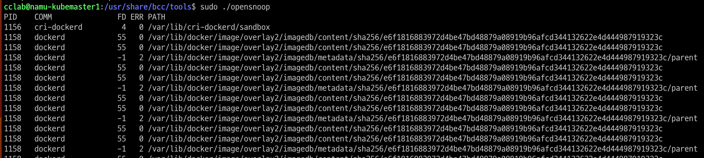

# seccomp

## 목차
* [1장. seccomp](#1-seccomp)
    * [1.1 sandbox](#11-sandbox)
    * [1.2 seccomp](#12-seccomp)
    * [1.3 seccomp-bpf](#13-seccomp-bpf)
    * [1.4 seccomp 모드](#14-seccomp-모드)
* [2장. seccomp 실습](#2-seccomp-실습)
    * [2.1 실습환경 구성](#21-실습환경-구성)
    * [2.2 세 개의 프로파일, 실습](#22-실습)
* [3장. eBPF](#3-ebpf)
    * [3.1 eBPF란?](#31-ebpf란)
    * [3.2 eBPF Register](#32-ebpf-register)
    * [3.3 eBPF maps](#33-ebpf-map)
    * [3.4 helper call](#34-helper-call)
    * [3.5 eBPF safety](#35-ebpf-safety)
    * [3.6 BCC install](#36-bcc-bpf-compiler-collection-설치)
    * [3.7 Kprobes](#37-kprobes-kernel-probes)
    * [3.7 BCC를 통한 eBPF 프로그램 작성](#38-bcc를-통한-ebpf-프로그램-작성)
* [4장. seccomp 실습](#4-seccomp-ebpf)
    * [4.1 eBPF 프로그램 동작](#41-ebpf-프로그램-동작)
    * [4.2 간단한 실습 모델](#42-간단한-모델)
* [프로젝트](#프로젝트에-대한-간략한-설명)
    * [1. 파드, 컨테이너의 pid 찾기](#1-파드-컨테이너의-pid-찾기)
    * [2. 시스템콜 차단](#2-시스템-콜-차단)
    * [3. 통합](#3-1-2-통합)


# 1. seccomp
컨테이너들이 같은 호스트에서 실행되어도 해당 워크로드들은 서로 분리된다.  
seccomp는 그러한 워크로드들의 격리를 강화하는 데 사용할 수 있는 도구 중 하나이다.

## 1.1 Sandbox
두 가지 방법이 있다.
1. 각각의 워크로드가 서로의 존재를 알지 못하도록 격리  
컨테이너와 VM이 이를 달성한다.
2. 다른 워크로드의 존재를 인식은 가능하나, 접근 및 실행할 수 있는 자원/연산 제한. 다른 워크로드에 영향 못 미치도록 함.  
자원 접근이 제한되도록 응용프로그램을 격리 = Sandbox

응용 프로그램이 컨테이너로 실행 -> 컨테이너를 샌드박싱을 위한 수단 중 하나로 사용  
응용 프로그램이 침해되면 공격자가 프로그램을 비정상적 방식으로 코드를 실행  
샌드박싱 메커니즘 = 코드가 할 수 있는 일을 제한. 이는 곧 시스템에 대한 공격자의 영향 제한

## 1.2 seccomp
secure computing mode, 샌드박싱을 실현하는 메커니즘 중 하나  
저수준에서 프로세스의 행동을 통제

응용 프로그램이 커널에 요청할 수 있는 시스템 콜의 집합을 제한하는 메커니즘  
* 응용 프로그램은 시스템 콜을 통해 자신이 직접 할 수 없는 작업을 커널에 요청한다
* seccomp는 스레드별로 성정되므로 프로세스의 각 스레드가 seccomp를 독립적으로 구성해야함

|System Call in OS|
|:-:|
||

최초 리눅스 커널에 도입된, 보안 컴퓨팅 모드.
1. sigreturn(신호 처리부에서 복귀)  
2. exit(프로세스 종료)  
3. read/write(파일 디스크립터에 읽기/쓰기)   

위 세가지의 시스템 호출만 사용가능했다.  

실행 가능한 시스템 호출이 몇 개 없어서 신뢰되지 않은 코드가 시스템에 별 피해를 못 친다. 
하지만 이와 반대로 신뢰된 코드도 할 수 있는게 없음.  

>__sigreturn__  
시그널 핸들링과 관련된 시스템 호출  
signal: OS가 프로세스에게 중요한 사건(ctrl+c 키 입력, 프로세스 간 통신 등..)이 발생했음을 알리는 메시지.  
시그널 핸들러: 특정 시그널이 발생했을 때 그에 대응하는 특별한 작업을 수행하는 코드.
>
>sigreturn은 시그널 핸들러의 실행 후, 프로세스가 원래의 실행흐름으로 돌아가기 위해 호출하는 시스템 콜이다.  
시그널 핸들러가 호출되면서 변경된 스택과 레지스터를 저장해둔 원래의 상태로 복원시킨다.  


## 1.3 seccomp-bpf
BPF, Berkeley Packet Filter  
요청된 시스템 호출의 허용 여부를 프로세스에 __적용된 seccomp 프로파일에 따라 결정한다.__

seccomp BPF 필터는 주어진 시스템 호출의 opcode와 매개변수를 보고 해당 프로세스의 seccomp 프로파일에 근거해서 호출의 허용 여부를 결정한다.  

프로파일: 시스템 호출이 주어진 필터와 부합할 때 어떤 일을 해야 할지를 명시
가능한 일에는 오류반환, 프로세스 종료, tracer(추적기) 호출 등이 존재.

>컨테이너의 맥락에서 프로파일이 그냥 시스템 호출을 허용할지 아니면 오류를 돌려줄지 결정하므로  
seccomp 프로파일이라는 것을 시스템 호출에 대한 화이트리스트 또는 블랙리스트로 이해할 수 있다. 

컨테이너 관점에서 보자면,  
컨테이너화된 응용 프로그램엔 필요없는 시스템 호출이 많다.  
ex) 호스트의 클록 시간 변경, 커널 모듈 변경 등  

seccomp 프로파일로 필요없는 시스템 콜을 제한함으로써 공격자가 시스템에 가할 수 있는 영향력을 효과적으로 낮춘다.  

Docker의 기본 seccomp 프로파일은 300개 이상의 시스템 호출 중 약 44개의 시스템 호출을 차단한다.  
프로파일은 기본적으로 시스템 호출에 대한 액세스를 거부한 다음 특정 시스템 호출을 허용 목록에 추가하는 화이트 리스트 방식으로 동작한다.  
SCMP_ACT_ERRNO의 기본 동작을 정의하고 특정 시스템 호출에 대해서만 해당 동작을 재정의하는데, SCMP_ACT_ERRNO의 효과는 Permission Deny 오류를 일으키는 것이다.  
SCMP_ACT_ALLOW로 허용하는 시스템 콜 목록을 정의한다.
[Docker 기본 seccomp 프로파일](https://github.com/moby/moby/blob/master/profiles/seccomp/default.json)

## 1.4 seccomp 모드
secoomp 모드는 prctl() 함수를 통해 모드를 적용한다.  

세 가지 주요 모드가 있다.

__첫째. STRICT_MODE__  
* read, write, exit ,sigreturn 시스템 콜 호출만 허용.  
* 이외 시스템콜 요청은 SIGKILL 시그널 발생시켜 프로그램을 종료한다.  

__둘째. FILTER_MODE__
* 원하는 시스템 콜 호출을 허용/거부 설정
* 일반적으로 BPF 문법을 통해 적용

__셋째. NNP MODE__, NO New Privileges
* 프로세스가 권한 상승을 통해 새로운 권한을 얻는 것을 막는다.  
* 즉, 실행 중 더 높은 권한의 취득을 금지한다.

1. STRICT_MODE
```c
#include <fcntl.h>
#include <stdio.h>
#include <unistd.h>
#include <string.h>
#include <linux/seccomp.h>
#include <sys/prctl.h>

int main(int argc, char **argv) {
        int output = open("output.txt", O_WRONLY);
        const char *val = "test";

        printf("prctl() 함수 호출로 Seccomp Strict Mode 적용\n");
        prctl(PR_SET_SECCOMP, SECCOMP_MODE_STRICT);

        printf("이미 열려있는 파일에 작성\n");
        write(output, val, strlen(val)+1);

        printf("readOnly로 파일 열기\n");
        int input = open("output.txt", O_RDONLY);

        printf("이 메세지는 출력되지 않는다.");
}
```

1. STRICT mode를 적용하는 코드 test.c 작성 후 컴파일  
   
2. 컴파일 된 t1 확인  
     
3. t1 실행, STRICT mode는 read, write, exit, sigreturn만을 허용한다.    
이미 열려있는 파일에 작성(write)는 할 수 있지만, 새로운 파일을 열려고하자 차단당했다.    
   

|함수|설명|
|:-:|:-:|
|seccomp_init()|Seccomp 모드의 기본값을 설정, 초기화. 임의의 시스템콜이 호출되면 해당하는 이벤트 발생|
|seccomp_rule_add()|Seccomp 규칙을 추가. 임의의 시스템콜을 허용/거부|
|seccomp_load()|추가한 규칙을 애플리케이션에 반영|
|seccomp_release()|init()이나 ~rule_add() 등 적용된 ctx 필터를 해방한다.(메모리 해제..) 커널에 이미 load()한 seccomp 필터는 영향받지 않는다.|

>SCMP_ACT_ALLOW, SCMP_ACT_KILL  
seccomp 필터에서 사용되는 action 값.  
sccomp 필터는 시스템 콜을 필터링하고 프로세스의 동작을 제어하기 위해 사용되는데,  
이때 각 시스템 콜에 대한 동작을 정의한다.  
>
>SCMP_ACT_ALLOW: 특정 시스템 콜 허용. 정상 실행함.  
SCMP_ACT_KILL: 특정 시스템 콜 차단, 프로세스 종료.  
다만, 액션에 대한 프로세스만 종료. 시스템 콜을 유발한 프로세스 자체가 종료되진 않는다.


2. seccomp-bpf
```C
#include <seccomp.h>
#include <unistd.h>
#include <stdio.h>
#include <errno.h>
void main(void)
{
        /* libseccomp 컨텍스트 초기화 */
        scmp_filter_ctx ctx = seccomp_init(SCMP_ACT_KILL);

        /* 종료 허용 */
        printf("규칙 추가 : exit_group 허용\n");
        seccomp_rule_add(ctx, SCMP_ACT_ALLOW, SCMP_SYS(exit_group), 0);

        /* 현재 pid 가져오기 허용 */
        //printf("Adding rule : Allow getpid\n");
        //seccomp_rule_add(ctx, SCMP_ACT_ALLOW, SCMP_SYS(getpid), 0);
        printf("규칙 추가 : getpid 거부\n");

    
        seccomp_rule_add(ctx, SCMP_ACT_ERRNO(EBADF), SCMP_SYS(getpid), 0);

        /* glibc에서 요구하는 대로 데이터 세그먼트 크기 변경 허용 */
        printf("Adding rule : Allow brk\n");
        seccomp_rule_add(ctx, SCMP_ACT_ALLOW, SCMP_SYS(brk), 0);

        /* fd 1에 최대 512바이트 쓰기 허용 */
        printf("규칙 추가 : FD 1에 최대 512바이트 쓰기 허용\n");
        seccomp_rule_add(ctx, SCMP_ACT_ALLOW, SCMP_SYS(write), 2,
        SCMP_A0(SCMP_CMP_EQ, 1),
        SCMP_A2(SCMP_CMP_LE, 512));

        /* 다른 fd에 쓰는 경우 -EBADF 반환 */
        printf("규칙 추가: 1을 제외한 모든 FD에 쓰기 거부 \n");
        seccomp_rule_add(ctx, SCMP_ACT_ERRNO(EBADF), SCMP_SYS(write), 1,
        SCMP_A0(SCMP_CMP_NE, 1));

        /* 필터를 로드하고 적용 */
        printf("규칙을 로드하고 적용 \n");
        seccomp_load(ctx);
        seccomp_release(ctx);
        printf("이 프로세스는 %d입니다\n", getpid());
}
```

### seccomp-bpf, getpid syscall 차단
1. 위 코드를 test2.c로 작성  
   

2. test2.c를 컴파일, libseccomp를 링킹해야 한다.  
   

3. t2를 실행한다  
  
getpid() 시스템 콜이 차단됐다. (pid는 1(=root)이상 자연수)  
현재 getpid()가 차단되어 쓰레기 값이 들어간 것을 확인할 수 있다.


### getpid syscall 허용
1. 위의 파일에서 getpid()에 관한 룰을 ALLOW로 수정  
   

2. t3로 컴파일  
   

3. 실행결과 getpid()가 정상 실행되면서, 정상적인 pid 값을 반환  
  

<br><br>

```py
import docker
import json

def apply_seccomp_profile(container_id, seccomp_profile_path):
    # Connect to the Docker daemon
    client = docker.from_env()

    # Read the seccomp profile JSON file
    with open(seccomp_profile_path, 'r') as profile_file:
        seccomp_profile = json.load(profile_file)

    # Apply seccomp profile to the container
    try:
        container = client.containers.get(container_id)
        container.update(security_opt=['seccomp=' + json.dumps(seccomp_profile)])
        print("Seccomp profile applied to container:", container_id)
    except docker.errors.NotFound:
        print("Container not found:", container_id)

if __name__ == "__main__":
    container_id = "your_container_id_here"
    seccomp_profile_path = "/path/to/seccomp-profile.json"
    apply_seccomp_profile(container_id, seccomp_profile_path)
```

# 2. seccomp 실습


## 2.1 실습환경 구성
>OS: Ubuntu 22.04.1 LTS  
>kernel: 5.15.0-76-generic  
>docker-ce: 24.0.5
>kubeadm, kubelet, kubectl: v.1.27.4


### swap off, 설치 전 환경설정
```bash
sudo swapoff -a
sudo sed -i '/swap.img/s/^/#/' /etc/fstab # (Ubuntu 22.04)
```

>Swap은 리눅스 운영 체제의 가상 메모리 관리 메커니즘.  
물리 메모리가 부족할 때 디스크 공간을 사용하여 메모리 확장을 수행하는 역할.(OS에서 나옴)
>
>컨테이너 오케스트레이션 시스템은 컨테이너의 성능, 격리 및 예측 가능성을 보장하기 위해 노드의 메모리를 효율적으로 사용하는 것이 중요하다.  
이를 위해 K8s는 기본적으로 Swap을 사용하지 않는 것을 권장하고, 그래서 Kubernetes를 설치할 때 Swap을 비활성화한다.
>
>1. 성능: Swap을 사용하면 디스크 I/O가 발생하여 컨테이너의 성능이 저하될 수 있다.
>
>2. 일관된 메모리 할당: Swap을 사용하면 컨테이너가 예상치 못한 메모리 부족 상황에 놓일 수 있다. 이로 인해 컨테이너의 동작이 예측할 수 없어지게 된다.
>
>3. 리소스 격리: 컨테이너와 호스트 시스템 간에 메모리 할당 및 격리를 보장하기 위해 Swap을 비활성화한다. 컨테이너 간 간섭을 방지하여 예측 가능한 환경을 유지한다.
>
>즉, K8s 클러스터를 구성할 때, 컨테이너의 메모리 관리 및 격리를 위해 Swap을 비활성화한다. 
>
>\+ v.1.22부터 swap을 메모리의 사용을 지원한다(알파버전)
[관련 링크](https://kubernetes.io/blog/2021/08/09/run-nodes-with-swap-alpha/)

```bash
# container.d를 위한 커널 모듈을 로드한다.
# overlay: 컨테이너 파일 시스템의 레이어링을 지원하기 위한 모듈. 컨테이너 이미지의 레이어를 효율적으로 관리하기 위해 사용.
# br_netfilter: 브리지 네트워크 필터링 기능을 제공. 컨테이너 런타임 및 네트워킹에서 필요한 네트워크 기능을 제공하기 위해 사용.
sudo tee /etc/modules-load.d/containerd.conf <<EOF
overlay
br_netfilter
EOF
sudo modprobe overlay # 커널 모듈을 사용하기 위해 현재 세션에 직접 로드.
sudo modprobe br_netfilter
```

```bash
# 쿠버네티스 네트워크와 관련된 설정을 위해 시스템 파라미터 설정
sudo tee /etc/sysctl.d/kubernetes.conf <<EOF
net.bridge.bridge-nf-call-ip6tables = 1
net.bridge.bridge-nf-call-iptables = 1
net.ipv4.ip_forward = 1
EOF
```

```bash
# 변경사항 적용
sudo sysctl --system
```

<br>

### containerd 설치
쿠버네티스를 위한 컨테이너 런타임으론 containerd를 사용한다.  


```bash
# 관련 의존성을 다운받는다.
sudo apt install -y curl gnupg2 software-properties-common apt-transport-https ca-certificates
```

```bash
# docker의 GPG키를 받아온다.
sudo curl -fsSL https://download.docker.com/linux/ubuntu/gpg | sudo gpg --dearmour -o /etc/apt/trusted.gpg.d/docker.gpg
# docker를 apt로 관리(설치/업데이트)하기 위해, docker의 공식 APT 레포를 시스템의 APT 레포 목록에 추가한다.
sudo add-apt-repository "deb [arch=amd64] https://download.docker.com/linux/ubuntu $(lsb_release -cs) stable"
```

```bash
# containerd 설치
sudo apt update
sudo apt install -y containerd.io
```

```bash
# containerd의 기본설정을 ~/config.toml에 저장
containerd config default | sudo tee /etc/containerd/config.toml >/dev/null 2>&1
# /etc/~/config.toml 파일 내용에서 SystemdCgroup = false를 true로 변경.
# containerd가 systemd cgroup을 사용하도록 설정. 
sudo sed -i 's/SystemdCgroup \= false/SystemdCgroup \= true/g' /etc/containerd/config.toml
```

```bash
sudo systemctl restart containerd
sudo systemctl enable containerd
```


### kubernetes 설치
```bash
# kubernetes의 GPG 키 발급
curl -s https://packages.cloud.google.com/apt/doc/apt-key.gpg | sudo apt-key add -
# 시스템의 apt 레포 목록에 kubernetes 공식 apt 레포 추가
sudo apt-add-repository "deb http://apt.kubernetes.io/ kubernetes-xenial main"
```


```bash
sudo apt update

sudo apt install -y kubelet kubeadm kubectl
# or (아래는 특정 버전 선택)
sudo apt install -y kubelet=1.27 kubeadm=1.27 kubectl=1.27

# apt로 설치한 패키지의 버전 업데이트를 막는다.
sudo apt-mark hold kubelet kubeadm kubectl
```
>kubelet: Kubernetes 노드에서 실행되는 에이전트, 컨테이너의 상태 및 리소스를 관리.
>
>kubeadm: Kubernetes 클러스터의 초기화 및 관리를 위한 도구, 클러스터를 설정하고 관리
>
>kubectl: Kubernetes 클러스터와 상호작용하기 위한 클라이언트 명령줄 도구

<br>

### master node, init and config

```bash
# --control-plane-endpoint를 init 명령의 옵션으로 삽입하는 경우, 에러가 자주 발생한다. 
# 빼고 실행.
sudo kubeadm init --pod-network-cidr=192.168.0.0/16
```

```bash
# kubectl을 통해 클러스터를 조작하기 위해 admin 권한을 부여하는 파일을 현재 유저의 홈으로 복사한다. 
mkdir -p $HOME/.kube
sudo cp -i /etc/kubernetes/admin.conf $HOME/.kube/config
# 복사해온 파일의 소유권을 현재 유저/그룹으로 변경한다.
sudo chown $(id -u):$(id -g) $HOME/.kube/config
```

kubectl을 통해 클러스터에 접근할 수 있는지 테스트해보자.
```bash
kubectl cluster-info
kubectl get nodes
```

<br>

### worker node, join to master
worker 노드를 master 노드에서 관리할 수 있도록 연결한다.  

```bash
# 아래 코드는 master 노드 init 시, 발급받은 토큰으로 대체해야 한다.
sudo kubeadm join k8smaster.example.net:6443 --token vt4ua6.wcma2y8pl4menxh2 \
   --discovery-token-ca-cert-hash sha256:0494aa7fc6ced8f8e7b20137ec0c5d2699dc5f8e6166
```
<br>

### kubernetes 삭제
```bash
sudo kubeadm reset
kubectl config delete-context kubernetes-admin@kubernetes
sudo rm -rf $HOME/.kube
sudo rm $HOME/k8s_init.log
```

### Cilium
[Cilium stable version](https://docs.cilium.io/en/stable/gettingstarted/k8s-install-default/#install-cilium)

<br>

## 2.2 실습  


실습을 위해 워커 노드에 세 종류의 seccomp 프로파일을 다운받는다.  
seccomp 프로파일은 워커 노드마다 존재해야 한다.  
```bash
mkdir ./profiles
curl -L -o profiles/audit.json https://k8s.io/examples/pods/security/seccomp/profiles/audit.json
curl -L -o profiles/violation.json https://k8s.io/examples/pods/security/seccomp/profiles/violation.json
curl -L -o profiles/fine-grained.json https://k8s.io/examples/pods/security/seccomp/profiles/fine-grained.json
```
  
  

### audit, system call 호출 시 로그 작성  
```json
{
    "defaultAction": "SCMP_ACT_LOG"
}
```  

audit.json profile로 seccomp를 적용한 pod를 생성한다.   
```bash
kubectl apply -f https://k8s.io/examples/pods/security/seccomp/ga/audit-pod.yaml
```   
  


```yaml
# audit-pod.yaml
apiVersion: v1
kind: Pod
metadata:
  name: audit-pod
  labels:
    app: audit-pod
spec:
  securityContext:
    seccompProfile:
      type: Localhost
      localhostProfile: profiles/audit.json
  containers:
  - name: test-container
    image: hashicorp/http-echo:0.2.3
    args:
    - "-text=just made some syscalls!"
    securityContext:
      allowPrivilegeEscalation: false
```

NodePort service로 특정 포트로의 외부 트래픽을 클러스터 내부 노드로 보낸다.  
```bash
kubectl expose pod audit-pod --type NodePort --port 5678
```  
  

http 통신, 'http://<워커노드 IP>:<NodePort>'에 접속한 결과  
  

var/log/syslog에 찍인 로그내용 확인  
```bash
tail -f /var/log/syslog | grep 'http-echo'
```  
  


### violation, ERRNO을 발생시킨다.
```json
{
    "defaultAction": "SCMP_ACT_ERRNO"
}
```

```bash
kubectl apply -f https://k8s.io/examples/pods/security/seccomp/ga/violation-pod.yaml
```
violation-pod를 생성하는 manifest 파일은 metadata-name과 metadata-labels-app의 내용을 violation-pod,  
spec-securityContext-seccompProfile-localhostProfile의 내용은 profiles/violation.json으로 수정했다.  


audit의 경우에서 확인했듯이 간단한 http-echo 서버에도 많은 시스템콜이 필요하다.  
violation 프로파일은 시스템 콜 호출 시 에러가 발생하므로 컨테이너가 정상적으로 실행되지 못 한다.  


### fine-grained, 필요한 syscall만 허용.
```json
{
    "defaultAction": "SCMP_ACT_ERRNO",
    "architectures": [
        "SCMP_ARCH_X86_64",
        "SCMP_ARCH_X86",
        "SCMP_ARCH_X32"
    ],
    "syscalls": [
        {
            "names": [
                "accept4",
                "epoll_wait",
                "pselect6",
                "futex",
                "madvise",
                "epoll_ctl",
                "getsockname",
                "setsockopt",
                "vfork",
                "mmap",
                "read",
                "write",
                "close",
                "arch_prctl",
                "sched_getaffinity",
                "munmap",
                "brk",
                "rt_sigaction",
                "rt_sigprocmask",
                "sigaltstack",
                "gettid",
                "clone",
                "bind",
                "socket",
                "openat",
                "readlinkat",
                "exit_group",
                "epoll_create1",
                "listen",
                "rt_sigreturn",
                "sched_yield",
                "clock_gettime",
                "connect",
                "dup2",
                "epoll_pwait",
                "execve",
                "exit",
                "fcntl",
                "getpid",
                "getuid",
                "ioctl",
                "mprotect",
                "nanosleep",
                "open",
                "poll",
                "recvfrom",
                "sendto",
                "set_tid_address",
                "setitimer",
                "writev"
            ],
            "action": "SCMP_ACT_ALLOW"
        }
    ]
}
```  

마찬가지로 audit-pod를 생성할 때 사용한 manifest 파일을 수정해서 사용한다.  
```bash
kubectl apply -f https://k8s.io/examples/pods/security/seccomp/ga/fine-pod.yaml
```  


NodePort 서비스를 통해 노출시킨다.  
  

기본이 ERRNO이고 필요한 시스템콜을 ALLOW 했기 때문에, 로그는 당연히 뜨지않는다.


http 통신, 'http://<워커노드 IP>:<NodePort>'  
  
<br><br>

# 3. ebpf  

## 3.1 ebpf란?  
좀 더 현대적인 방식의 eBPF 기반 유틸리티  
기존의 네트워크 패킷을 확인하는 것 뿐 아니라, 커널 수준에서 완벽하게 하나의 프로그램으로 동작한다.  

응용 프로그램이 요청한 시스템 호출을 파악할 수 있다.  
즉, ebpf를 통해 응용 프로그램이 사용하는 시스템 호출 목록을 얻어낼 수 있음  
-> Seccomp 프로파일이 응용 프로그램에 필요한 시스템 호출들만 제공하도록 구성

### hook 
eBPF 프로그램은 이벤트 기반이며 커널이나 app.이 특정 hook point를 통과할 때 실행됨  
pre-defined된 hook에는 system call, function entry/exit, kernel tracepoints, network events 등이 있음.  


요구사항에 맞는 hook이 pre-defined 되어있지 않은 경우, kprobe 또는 uprobe(사용자 프로브)를 생성하여 kernel 또는 userspace app.의 거의 모든 위치에 eBPF 프로그램을 연결할 수 있음.  

### structure

||
|:-:|
|11개의 64bit Register, 512개의 8bit Stack, Key-Value를 저장할 수 있는 무제한의 Map|
|https://ssup2.github.io/theory_analysis/Linux_BPF/|

cbpf, classic bpf는 사용할 수 있는 리소스의 한계가 분명했다.  
이에 ebpf를 정의하면서는, 더 많은 기능과 사용할 수 있는 리소스를 재정의했다.  


  

ebpf 프로그램은 LLVM/clang을 통해 바이트코드로 컴파일된다.  
컴파일된 ebpf 프로그램은 tc나 iproute2와 같은 ebpf 매니징 툴에 의해 커널에 적재된다.  
(tc, iproute2는 모두 리눅스 네트워크 매니징, 모니터링 툴)

tc, iproute2는 내부적으로 bpf system call을 이용해 ebpf 바이트코드를 ebpf에 적재  
이 단계에서 verifier는 ebpf 바이트코드가 정상적으로 실행이 되는지(이를테면 허용되지 않은 메모리 영역을 참조하는지..)를 검사    
필요에 따라 ebpf 프로그램의 일부는 JIT Compiler를 통해 native code로 변환되어 동작함    
이로써 커널을 다시 컴파일할 필요없이 ebpf 명령어를 프로세서의 기본 명령어(opcode)에 매핑  

bpf system call은 ebpf 프로그램을 적재할 뿐 아니라, ebpf가 작성하는 map에 App이 접근할 수 있도록 만들어준다.  
App과 ebpf는 Map을 통해 통신한다.

### 실질적인 hooking은 어디에서 일어나야 할까  
ebpf의 유용성으로 hook 수가 급증 -> 시스템 성능 저하 우려
NIC와 통신하는 드라이버에 ebpf를 배치시켜 패킷 송수신의 최전방에서 패킷을 죽일지 살릴지를 결정한다.  
* 기존 대비 4~5배 성능 향상  

  

위와 같은 eBPF 기반 고성능 data 경로를 XDP(eXpress Data Path)라고 한다.  


## 3.2 eBPF register
BPF는 세부분으로 구성된다.  
1. 32비트 하위 레지스터를 포함하는 11개의 64비트 레지스터.
2. 프로그램 카운터(PC).
3. 512바이트 크기의 eBPF 스택 공간.
레지스터의 이름은 r0에서 r10까지로 지정되며 BPF 호출 규칙은 다음과 같다.

* r0: 호출된 도우미 함수의 반환 값, eBPF 프로그램의 종료 값을 저장
* r1-r5: eBPF가 kernel helper 함수를 호출할 때 전달된 매개변수를 보유
* r6-r9: callee에 의해 저장되며 함수가 반환된 후 caller가 읽을 수 있다.
* r10: eBPF 스택 공간의 포인터 주소를 보유하는 읽기 전용 레지스터

스택 공간은 r1-r5 값을 임시로 보관하는 데 사용된다.  
레지스터 수가 제한되기 떄문에 레지스터의 값이 여러 보조 함수 호출 간 재사용되는 경우,  
eBPF 프로그램은 일시적으로 eBPF 스택에 덤프하거나 callee가 보유한 레지스터에 저장해야 한다.

>ex) bpf 프로그램이 실행되면 r1에는 프로그램의 컨텍스트(프로그램 입력 매개변수)가 저장된다.  
>ebpf는 100만개의 명령어를 사용할 수 있으며, 또 다른 ebpf 프로그램을 호출할 수 있는데 현재 depth 32레벨까지 tail call이 가능하다. 

<br>

## 3.3 eBPF Map
Map은 커널에 상주하는 효율적인 key-value 저장소  
Map의 데이터는 모든 eBPF 프로그램이 액세스할 수 있다.  
eBPF 프로그램 호출 간 상태 정보 등이 저장되며, file descripter를 통해 user space에서도 접근이 가능하다.  
따라서 Map을 통해 ebpf 프로그램과 ebpf 프로그램, 그리고 ebpf 프로그램과 user space App이 통신할 수 있다.  


<br>

## 3.4 helper call
eBPF 프로그램이 커널 함수를 호출하게 되면 프로그램이 특정 커널 버전에 binding되고 프로그램 호환성이 복잡해진다.  
대신 eBPF 프로그램은 커널에서 제공하는 안정적인 API인 helper 함수를 사용한다.  


<br>

## 3.5 eBPF safety
1. Required Privileges  
unprivileged eBPF가 활성화되지 않으면, linux kernel에 eBPF 프로그램을 적재하려고 하는 모든 프로세스는 privileged mode(root)나 CAP_BPF와 같은 능력이 필요.  
즉, 신뢰되지 않은 콛는 eBPF 프로그램을 적재하지 못함.  
unprivileged eBPF가 활성화된 경우 권한없는 프로세스는 제한된 functionality set와 kernerl에 제한된 access 능력을 갖는 eBPF 프로그램을 적재할 수 있음.  
2. Verifier  
eBPF 프로그램이 load 될 때, verifier를 통해 검증 (실행 전)  
무한 loop나 초기화되지 않은 변수 사용, 허용되지 않은 메모리에 액세스 하는 등의 프로그램을 검증  
이를 통과하기 위해 eBPF 프로그램은 유한한 복잡성을 가져야하며 주어진 크기 제한을 준수해야 한다.  
3. Hardening
eBPF 프로그램을 보유하고 있는 커널 메모리를 보호하고 readonly로 만듬.  
어떤 이유인든 eBPF 프로그램을 수정하려고 시도하면 커널은 이를 감지하고 고의적으로 충돌을 일으킴.  
4. Abstract Runtime Context
eBPF 프로그램은 임의 커널 메모리에 직접 액세스할 수 없음  
프로그램 컨텍스트 외부에 있는 데이터에는 eBPF helper를 통해 액세스해야함  
이는 일관된 데이터 액세스를 보장, eBPF 프로그램의 권한 부여를 통해 접근할 수 있는 집합을 적용할 수 있음  
즉 eBPF 프로그램은 eBPF helpers를 통해 허용된 데이터에만 접근할 수 있으므로 kernel 데이터 수정에 따른 위협을 회피할 수 있음.  
 
[ebpf.io - what is ebpf](https://ebpf.io/what-is-ebpf/)

<br>

## 3.6 BCC (BPF Compiler Collection) 설치
BPF는 커널에 포함되어 있지만, BPF를 가지고 코드를 작성하는 것은 어렵다.  
JS도 Vue나 React와 같은 프레임워크를 사용하듯 BPF는 BCC, bpftrace로 작성된다.  

BCC 패키지는 업데이트 되지 않고있어 최신버전은 Source를 통해 빌드해야한다.  
[Project: iovisor - bcc installing](https://github.com/iovisor/bcc/blob/master/INSTALL.md#ubuntu---binary)

### BCC 설치를 위한 빌드 종속성
환경: Ubuntu 22.04 jammy  
```bash
sudo apt install -y zip bison build-essential cmake flex git libedit-dev \
  libllvm14 llvm-14-dev libclang-14-dev python3 zlib1g-dev libelf-dev libfl-dev python3-setuptools \
  liblzma-dev libdebuginfod-dev arping netperf iperf
```

### BCC 설치 및 컴파일
```bash
git clone https://github.com/iovisor/bcc.git
mkdir bcc/build; cd bcc/build
cmake ..
make
sudo make install
cmake -DPYTHON_CMD=python3 .. # build python3 binding
pushd src/python/
make
sudo make install
popd
```

### tutorial  
opensnoop은 open system call을 hooking하는 예제 프로그램.  

  

다만, opensnoop 실행 시 python을 찾지 못하는 문제가 발생했고.  
'python'라는 이름의 python3 심볼릭 링크를 생성하여 해결하였다.  

  


### /bcc/examples/hello_world.py  


```sh
sudo python3 hello_world.py
```


각 라인에 대한 설명  
* text='...': BPF 프로그램을 인라인으로 정의. 프로그램은 C로 작성되어 Python 문자열로 파싱됨.  
* kprobe__sys_clone(): kprobes를 통한 kernel 동적 트레이싱 숏컷
* bpf_trace_printk(): 공통 Trace_pipe(/sys/kernel/debug/tracing/trace_pipe)에 대한 printf()용 간단한 커널 기능.
* .trace_print(): Trace_pipe를 읽어 출력하는 bcc routine

<br>

## 3.7 kprobes (Kernel Probes)
Kernel routine에 동적인 break를 삽입하여 디버그와 성능 정보를 수집한다.  
분석하고 싶은 Kernel 코드 address에 trap을 삽입하여 breakpoint에 도달하면 handler 함수가 동작한다.  
특정 커널 코드가 실행되는 위치(심볼, 함수)에서 여러가지 정보(Instruction address, register, stack, data..)를 확인할 수 있다.

kprobes에는 두가지가 있다.  
1. kprobes: 어떠한 커널 코드에도 삽입가능  
2. kretprobes(return probes): 특정 함수가 리턴될 때 동작  

kprobes를 위해서는 아래와 같은 kernel config 상수들이 Enable 되어있어야 한다.  
>CONFIG_KPROBES  
>CONFIG_MODULES  
>CONFIG_MODULE_UNLOAD  
>CONFIG_KALL_SYMS  
>CONFIG_KALL_SYMS_ALL  
>CONFIG_DEBUG_INFO  

#### '/kernel/kprobes.c',  kernel source level의 모듈 프로그래밍  
kprobes을 위한 API
```C
#include <linux/kporbes.h>
#include <linux/ptrace.h>
int register_kprobe(struct kprobe *kp); // kprobes 등록 
int pre_handler(struct kprobe *p, struct pt_regs *regs); // 앞(들어가는 지점)에서 처리되는 핸들러 함수
void post_handler(struct kprobe *p, struct pt_regs *regs, unsigned long flags); // 뒤(나가는 지점)에서 처리되는 핸들러 함수
int fault_handler(struct kprobe *p, struct pt_regs *regs, int trapnr); // 오류를 처리하는 핸들러 함수
```  

kretprobes을 위한 API
```C
#include <linux/kprobes.h>
#include <linux/ptrace.h>
int register_kretprobee(struct kretprobe *rp);  // kretprobes 등록
int kretprobe_handler(struct kretprobe_instance *ri, struct pt_regs *regs); // kretprobes 핸들러 함수
```  

기타 kprobes 처리 API
```C
#include <linux/kporbes.h>
// kprobes 동작을 가능하게 하는 API
int enable_kprobe(struct kprobe *kp);
int enable_kretprobe(struct kretprobe *rp);

// kprobes 동작을 불가능하게 하는 API
int disable_kprobe(struct kprobe *kp);
int disable_kretprobe(struct kretprobe *rp);

// kprobes 등록을 해제하는 API
void unregister_kprobe(struct kprobe *kp);
void unregister_kretprobe(struct kretprobe *rp);
```  

kprobes.c를 통해 새로운 kprobes을 모듈을 만들려면, 커널 소스가 필요하다.  
```bash
sudo apt-get update
uname -r # kernel 버전
sudo apt-get install linux-source-<kernel-version> # linux-source-5.15.0
```  

이렇게 다운받은 커널 소스는 /usr/src에 저장된다.  
다운받은 tar파일(linux kernel 소스)에서 소스 코드를 추출한다.
```bash
cd /usr/src
sudo tar xvf linux-source-<your_kernel_version>.tar.bz2
```

kprobes의 기본적인 에제코드는 'samples/kprobes/kprobes_example.c'에서 확인할 수 있다.  
이 코드는 커널 모듈 프로그래밍 되어있어 모듈로 빌드하여 실행할 수 있다.  
```C
// SPDX-License-Identifier: GPL-2.0-only
/*
 * Here's a sample kernel module showing the use of kprobes to dump a
 * stack trace and selected registers when kernel_clone() is called.
 *
 * For more information on theory of operation of kprobes, see
 * Documentation/trace/kprobes.rst
 *
 * You will see the trace data in /var/log/messages and on the console
 * whenever kernel_clone() is invoked to create a new process.
 */

#define pr_fmt(fmt) "%s: " fmt, __func__

#include <linux/kernel.h>
#include <linux/module.h>
#include <linux/kprobes.h>

#define MAX_SYMBOL_LEN  64
static char symbol[MAX_SYMBOL_LEN] = "kernel_clone";
module_param_string(symbol, symbol, sizeof(symbol), 0644);

/* For each probe you need to allocate a kprobe structure */
static struct kprobe kp = {
        .symbol_name    = symbol,
};

/* kprobe pre_handler: called just before the probed instruction is executed */
static int __kprobes handler_pre(struct kprobe *p, struct pt_regs *regs)
{
#ifdef CONFIG_X86
        pr_info("<%s> p->addr = 0x%p, ip = %lx, flags = 0x%lx\n",
                p->symbol_name, p->addr, regs->ip, regs->flags);
#endif
#ifdef CONFIG_PPC
        pr_info("<%s> p->addr = 0x%p, nip = 0x%lx, msr = 0x%lx\n",
                p->symbol_name, p->addr, regs->nip, regs->msr);
#endif
#ifdef CONFIG_MIPS
        pr_info("<%s> p->addr = 0x%p, epc = 0x%lx, status = 0x%lx\n",
                p->symbol_name, p->addr, regs->cp0_epc, regs->cp0_status);
#endif
#ifdef CONFIG_ARM64
        pr_info("<%s> p->addr = 0x%p, pc = 0x%lx, pstate = 0x%lx\n",
                p->symbol_name, p->addr, (long)regs->pc, (long)regs->pstate);
#endif
#ifdef CONFIG_ARM
        pr_info("<%s> p->addr = 0x%p, pc = 0x%lx, cpsr = 0x%lx\n",
                p->symbol_name, p->addr, (long)regs->ARM_pc, (long)regs->ARM_cpsr);
#endif
#ifdef CONFIG_RISCV
        pr_info("<%s> p->addr = 0x%p, pc = 0x%lx, status = 0x%lx\n",
                p->symbol_name, p->addr, regs->epc, regs->status);
```

'/sys/kernel/debug/kprobes'에 있는 파일로 사용자가 접근할 수 인터페이스 제공  

  

'list': kprobes을 위해서 등록한 커널 코드의 심볼 리스트  
'enabled': kprobes 기능을 Enable ON 혹은 Disable OFF 시킴

'/proc/sys/debug/kprobes-optimization': kprobes 최적화 ON/OFF

<br>
<br>

샘플코드를 분석해보자.  
```C
static int __init kprobe_init(void)
{
        int ret;
        kp.pre_handler = handler_pre;
        kp.post_handler = handler_post;

        ret = register_kprobe(&kp);
        if (ret < 0) {
                pr_err("register_kprobe failed, returned %d\n", ret);
                return ret;
        }
        pr_info("Planted kprobe at %p\n", kp.addr);
        return 0;
}

static void __exit kprobe_exit(void)
{
        unregister_kprobe(&kp);
        pr_info("kprobe at %p unregistered\n", kp.addr);
}

module_init(kprobe_init)
module_exit(kprobe_exit)
```

__static int __init kprobe_init(void)__  
* 해당 부분은 모듈이 로드될 때 호출되어 초기화하는 함수
* pre_handler와 post_handler (각각 모듈의 호출 전/후)를 설정
* register_kprobe(): kp 구조체 주소를 매개변수로 받아 kprobes를 등록한다.  
```C
#define MAX_SYMBOL_LEN  64
static char symbol[MAX_SYMBOL_LEN] = "kernel_clone";
module_param_string(symbol, symbol, sizeof(symbol), 0644);

/* For each probe you need to allocate a kprobe structure */
static struct kprobe kp = {
        .symbol_name    = symbol,
};
```

* 구조체 kp는 다음과 같이 정의되어있다.  
* symbol은 kprobes가 동작을 시작하는 커널 코드 심볼이다.  
* 즉, 디버깅을 시작하는 커널 소스에 있는 심볼로 가장 일반적인 형태는 함수이다.  
* 위에서는 kernel_clone 을 디폴트 심볼로 정의했다.  
* 이 kp 구조체를 통해 kprobes가 등록되면 커널이 실행되다가 clone()이 실행되는 시작지점에 handler_pre()가 동작하며, 끝나는 지점에서 handler_post() 핸들러 함수가 실행된다.  
* 각 함수 내에서 디버깅 정보들은 /var/log/syslog 파일에 출력된다.  

<br>

## 3.8 BCC를 통한 eBPF 프로그램 작성  
아래는 clone system call이 호출될 때마다 hello() 함수를 호출하는 eBPF 프로그램이다.

```python
from bcc import BPF
from bcc.utils import printb

# define BPF program
prog = """
int hello(void *ctx) {
    bpf_trace_printk("Hello, World!\\n");
    return 0;
}
"""

# load BPF program
b = BPF(text=prog)
b.attach_kprobe(event=b.get_syscall_fnname("clone"), fn_name="hello")

# header
print("%-18s %-16s %-6s %s" % ("TIME(s)", "COMM", "PID", "MESSAGE"))

# format output
while 1:
    try:
        (task, pid, cpu, flags, ts, msg) = b.trace_fields()
    except ValueError:
        continue
    except KeyboardInterrupt:
        exit()
    printb(b"%-18.9f %-16s %-6d %s" % (ts, task, pid, msg))
```

* b.attach_kprobe(): hello()라는 함수를 syscall_clone에 매핑시킨다. 즉, clone syscall이 호출되면 hello()가 실행된다.  


<br>

# 4. Seccomp-ebpf
여기서는 ebpf를 이용한 seccomp 동적 모델에 대해 논의한다.  

기존 컨테이너 환경에서 seccomp-bpf는 컨테이너 생성 시 seccomp profile을 넘겨 정적으로 적용하고 있다.  

여기서 발생되는 문제는 다음과 같은 것들이 있다.  
* seccomp와 관련된 정책 변경 -> 기존 컨테이너 삭제, 변경사항 적용한 새 컨테이너 생성
* 기존 서비스의 무중단 배포를 위해 롤링, 블루-그린 deploy 등 사용  
* 서비스 실행 흐름에 따라 동적인 system call 제어 불가능

여기서는 system call을 차단하는 ebpf 프로그램을 작성하고, k8s 클러스터에서 해당하는 pod에 동적으로 seccomp 정책을 적용하는 새로운 모델인 seccomp-ebpf를 제안한다.  

eBPF 프로그램을 작성하고 컴파일 및 커널에 로드하기 위해 의존성을 다운받는다.  
* gcc-multilib: clang을 통해 eBPF 프로그램을 컴파일하기 위한 헤더파일 등이 들어있다.   
* linux-tools-common: bpf 프로그램을 커널에 로드, 관리하는 bpftool이 포함되어있다.  

```bash
sudo apt update
sudo apt install gcc-multilib
sudo apt install linux-tools-common

# 위의 tools-common만으로 충분하지 않아 추가적인 패키지를 설치했다.  
sudo apt install linux-tools-5.15.0-79-generic
```

<br>

## 4.1 ebpf 프로그램 동작 
여기서는 ebpf 프로그램 작성과 실행에 대한 이해를 돕기위해 간단한 실습을 진행한다.  

일반적으로 실행중인 ebpf trace를 조회하면 두 개의 프로세스를 확인할 수 있다.  
이는 해당 ebpf 프로그램이 entry와 return 두 개의 bpf program이 attach 되어있기 때문  

bcc에서 제공하는 툴을 조회하면 syscall__<syscall_name>과 do_ret_sys_<syscall_name>를 확인할 수 있다.  
각각은 핸들러의 entry와 return에서 사용된다.  


## 4.2 간단한 모델 
여기서는 ebpf와 bcc에 대한 이해를 돕기위해 간단한 모델을 작성하고 그 결과를 살펴본다.  

> 코드가 정상적으로 컴파일되고 정상적으로 커널에 로드되지 않아 eunomia-bpf로 실습을 대체한다.  
https://eunomia.dev/tutorials/0-introduce/


# 프로젝트에 대한 간략한 설명
eBPF를 이용하여 Linux 커널의 Seccomp처럼 동작하는 Seccomp-eBPF 모델 건의

Seccomp-bpf는 Linux 커널의 기능 사용. -> 시스템 콜 차단.  
다만, 정적으로 적용할 수 밖에 없다 -> 현재는 롤링 업데이트, 블루-그린 배포 등의 방법을 통해 새로운 프로파일을 적용하고 있다.
우리의 목표는 '동적으로', '런타임 시간'에 새로운 구칙(rule)을 적용하는 것.  

eBPF 프로그램은 JIT 컴파일러를 통해 네이티브 코드로 변환되어 커널을 다시 로드하지 않고 동적으로 적용이 가능하다.  
우리는 이러한 eBPF 프로그램을 작성하여 동적으로 특정 프로세스의 시스템 콜을 차단하는 모델을 제안하려고 한다.  

여기서 '특정 프로세스'란, 호스트 머신에서 수행되는 단순한 프로세스일수도, 컨테이너 일수도, 혹은 쿠버네티스 클러스터의 워커노드에서 수행되는 파드일수도 있다.  
노드의 입장에서 보면 컨테이너도, 파드도 결국은 하나의 프로세스임을 기억하자.  

구현을 위한 실질적인 설계는 크게 두 파트로 나뉜다.  
1. eBPF 프로그램을 통해 특정 프로세스의 시스템콜을 차단
2. 이를 쿠버네티스 클러스터에 적용하기 위해, 컨트롤 플레인이 쿠버네티스 클러스터 상에 파드를 찾는 방법. 

## 1. 파드, 컨테이너의 pid 찾기  
호스트 머신의 입장에서 '파드' = 하나의 프로세스  
<br>

```bash
sudo crictl ps
```

  

crictl(cri 호환 컨테이너 런타임 전용 cli)을 통해 호스트 머신이 바라보는 파드의 정보를 가져옴  
여기서 파드의 컨테이너 ID를 얻는다.  

<br>
<br>

```bash
sudo crtctl inspect [컨테이너 ID]
```

  

컨테이너 ID를 통해 호스트가 바라보는 파드의 pid 확인 

<br><br>

  

같은 명령으로 워커노드에서도 파드의 컨테이너 ID와 pid 확인   

## 2. 시스템 콜 차단
단순히 시스템콜에 kprobe을 붙여 'return ERROR'를 반환한다고 해도 시스템 콜이 죽지는 않는다.  

이를 이해하기 위해서는 시스템콜과 Kprobe, 그리고 LSM 모듈에 대한 이해가 어느정도 필요하다.  

  

* Kprobe : 커널의 특정 이벤트(시스템콜, 네트워크,)에 trap을 삽입하여 breakpoint에 도달하면 지정된 handler 함수가 동작
    * 특정 커널 코드가 실행되는 위치(심볼, 함수)에서 여러가지 정보(Instruction address, register, stack, data..)를 확인할 수 있다.

System Call을 호출하게 되면 내부적으로, 그에 맞는 LSM이 호출된다. open() -> security_file_open() 호출됨.  

참고: [Using LSM Hooks with Tracee to Overcome Gaps with Syscall Tracing](https://blog.aquasec.com/linux-vulnerabilitie-tracee)  

따라서 System Call을 정상적으로 block 하기 위해서는 'security_xx_xx()'의 LSM 모듈이 에러(-EPERM)를 반환해야 한다.  

이를 위해 System Call과 LSM 모듈에 Kprobes를 attach한다.  
1. Kprobes - Syscall : 차단할 시스템콜과 관련된 정보를 eBPF 맵에 저장해야 한다.
    * eBPF 맵에 저장된 정보를 통해 프로세스를 식별해야 할 수 있어야 함.
2. Kprobes - LSM : 실질적으로 시스템콜 차단. 
    * 앞서 eBPF 맵에 저장된 정보를 'lookup'해서 현재 '호출된 시스템콜/프로세스'에 대해 시스템콜이 차단되야하는지를 결정한다.

## 3. 1-2 통합
seccomp 정책을 eBPF 맵에 작성하고, 이를 통해 syscall이 호출되었을 때, 알맞는 pid를 찾아 맵에 존재할 경우 block 

__clang 설치__
```bash
sudo apt update
sudo apt install clang
```
__bpftool 설치__
```bash
git clone https://github.com/libbpf/bpftool.git
cd bpftool/src
make
sudo cp bpftool /usr/bin/bpftool
```

간혹 make가 안되는 경우가 있다. 종속성을 설치해야 한다.  
```bash
sudo apt install -y zip bison build-essential cmake flex git libedit-dev \
  libllvm14 llvm-14-dev libclang-14-dev python3 zlib1g-dev libelf-dev libfl-dev python3-setuptools \
  liblzma-dev libdebuginfod-dev arping netperf iperf
```


bpf를 위해 JIT 활성화
```bash
echo 1 > /proc/sys/net/core/bpf_jit_enable
```


```bash
#include <uapi/linux/ptrace.h>
#include <bcc/proto.h>
// BPF map to hold container IDs
BPF_HASH(container_ids, u32, char[8]);
int trace_do_start(struct pt_regs *ctx) {
    u32 pid = bpf_get_current_pid_tgid();
    char container_id[8];
    // Extract the container ID from function arguments or context.
    // Note: This is a simplified example. The actual way to extract the container ID might differ.
    bpf_probe_read_str(&container_id, sizeof(container_id), (void *) PT_REGS_PARM1(ctx));
    container_ids.update(&pid, &container_id);
    return 0;
}
```


```bash
# bpf 프로그램 컴파일 -> 어셈블리 bpf 프로그램
clang -O2 -target bpf -c bpf_program.c -o bpf_program.o
```

```C
// load_bpf_file() : 바이너리 bpf 프로그램을 커널에 로드, 'bpf_load.h'에 존재
#include <stdio.h>
#include <uapi/linux/bpf.h>
#include "bpf_load.h"

int main(int argc, char **argv) {
  if (load_bpf_file("hello_world_kern.o") != 0) {
    printf("The kernel didn't load the BPF program\n");
    return -1;
  }

  read_trace_pipe();

  return 0;
}
```


커널 tracepoints 
```bash
sudo ls /sys/kernel/debug/tracing/events/
sudo ls /sys/kernel/debug/tracing/events/syscalls
```

kprobes
```bash
sudo cat /proc/kallsyms
sudo cat /proc/kallsyms | grep security_file
```

https://lwn.net/Articles/874168/
https://stackoverflow.com/questions/71668868/what-is-the-difference-between-syscalls-openat-and-sys-enter-openat


bpf 프로그램의 약점은 이식성 (생각해보면 bcc는 bpf 프로그램의 이식성을 위한 도구임. 근데 무겁고 느림)   
libbpf는 BPF CO-RE라는 개념을 통해 이식성을 강화한다. BPF CO-RE는 BTF 유형 정보, libbpf 및 컴파일러를 결합하여 여러 커널 버전 및 구성에서 실행할 수 있는 단일 executable 바이너리를 생성한다.  
즉, libbpf는 이식성을 위해 실행 중인 커널의 BTF 메타데이터에 의존한다.  

__실행중인 커널의 BTF 정보를 생성__  
이 명령은 실행 중인 커널이 사용하는 vmlinux.h모든 커널 유형( BTF 유형 )으로 헤더 파일로 생성한다.   
BPF 프로그램에 포함하면 vmlinux.h시스템 전체 커널 헤더에 대한 종속성이 사라진다.  
```bash

bpftool btf dump file /sys/kernel/btf/vmlinux format c > vmlinux.h
```
https://libbpf.readthedocs.io/en/latest/libbpf_overview.html#bpf-co-re-compile-once-run-everywhere