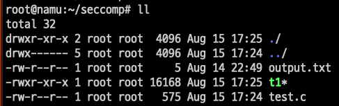

# seccomp

## 목차
* [1장. seccomp](#1-seccomp)
    * [1.1 sandbox](#11-sandbox)
    * [1.2 seccomp](#12-seccomp)
    * [1.3 seccomp-bpf](#13-seccomp-bpf)
    * [1.4 ebpf](#14-ebpf)
    * [1.5 seccomp 모드](#15-seccomp-모드)
* [2장. seccomp 실습](#2-seccomp-실습)
    * [2.1 실습환경 구성](#21-실습환경-구성)
    * [2.2 세 개의 프로파일, 실습](#22-실습)
* [3장. ebpf](#3-ebpf)


# 1. seccomp
컨테이너들이 같은 호스트에서 실행되어도 해당 워크로드들은 서로 분리된다.  
seccomp는 그러한 워크로드들의 격리를 강화하는 데 사용할 수 있는 도구 중 하나이다.

## 1.1 Sandbox
두 가지 방법이 있다.
1. 각각의 워크로드가 서로의 존재를 알지 못하도록 격리  
컨테이너와 VM이 이를 달성한다.
2. 다른 워크로드의 존재를 인식은 가능하나, 접근 및 실행할 수 있는 자원/연산 제한. 다른 워크로드에 영향 못 미치도록 함.  
자원 접근이 제한되도록 응용프로그램을 격리 = Sandbox

응용 프로그램이 컨테이너로 실행 -> 컨테이너를 샌드박싱을 위한 수단 중 하나로 사용  
응용 프로그램이 침해되면 공격자가 프로그램을 비정상적 방식으로 코드를 실행  
샌드박싱 메커니즘 = 코드가 할 수 있는 일을 제한. 이는 곧 시스템에 대한 공격자의 영향 제한

## 1.2 seccomp
secure computing mode, 샌드박싱을 실현하는 메커니즘 중 하나  
저수준에서 프로세스의 행동을 통제

응용 프로그램이 커널에 요청할 수 있는 시스템 콜의 집합을 제한하는 메커니즘  
* 응용 프로그램은 시스템 콜을 통해 자신이 직접 할 수 없는 작업을 커널에 요청한다
* seccomp는 스레드별로 성정되므로 프로세스의 각 스레드가 seccomp를 독립적으로 구성해야함

|System Call in OS|
|:-:|
||

최초 리눅스 커널에 도입된, 보안 컴퓨팅 모드.
1. sigreturn(신호 처리부에서 복귀)  
2. exit(프로세스 종료)  
3. read/write(파일 디스크립터에 읽기/쓰기)   

위 세가지의 시스템 호출만 사용가능했다.  

실행 가능한 시스템 호출이 몇 개 없어서 신뢰되지 않은 코드가 시스템에 별 피해를 못 친다. 
하지만 이와 반대로 신뢰된 코드도 할 수 있는게 없음.  

>__sigreturn__  
시그널 핸들링과 관련된 시스템 호출  
signal: OS가 프로세스에게 중요한 사건(ctrl+c 키 입력, 프로세스 간 통신 등..)이 발생했음을 알리는 메시지.  
시그널 핸들러: 특정 시그널이 발생했을 때 그에 대응하는 특별한 작업을 수행하는 코드.
>
>sigreturn은 시그널 핸들러의 실행 후, 프로세스가 원래의 실행흐름으로 돌아가기 위해 호출하는 시스템 콜이다.  
시그널 핸들러가 호출되면서 변경된 스택과 레지스터를 저장해둔 원래의 상태로 복원시킨다.  


## 1.3 seccomp-bpf
BPF, Berkeley Packet Filter  
요청된 시스템 호출의 허용 여부를 프로세스에 __적용된 seccomp 프로파일에 따라 결정한다.__

seccomp BPF 필터는 주어진 시스템 호출의 opcode와 매개변수를 보고 해당 프로세스의 seccomp 프로파일에 근거해서 호출의 허용 여부를 결정한다.  

프로파일: 시스템 호출이 주어진 필터와 부합할 때 어떤 일을 해야 할지를 명시
가능한 일에는 오류반환, 프로세스 종료, tracer(추적기) 호출 등이 존재.

>컨테이너의 맥락에서 프로파일이 그냥 시스템 호출을 허용할지 아니면 오류를 돌려줄지 결정하므로  
seccomp 프로파일이라는 것을 시스템 호출에 대한 화이트리스트 또는 블랙리스트로 이해할 수 있다. 

컨테이너 관점에서 보자면,  
컨테이너화된 응용 프로그램엔 필요없는 시스템 호출이 많다.  
ex) 호스트의 클록 시간 변경, 커널 모듈 변경 등  

seccomp 프로파일로 필요없는 시스템 콜을 제한함으로써 공격자가 시스템에 가할 수 있는 영향력을 효과적으로 낮춘다.  

Docker의 기본 seccomp 프로파일은 300개 이상의 시스템 호출 중 약 44개의 시스템 호출을 차단한다.  
프로파일은 기본적으로 시스템 호출에 대한 액세스를 거부한 다음 특정 시스템 호출을 허용 목록에 추가하는 화이트 리스트 방식으로 동작한다.  
SCMP_ACT_ERRNO의 기본 동작을 정의하고 특정 시스템 호출에 대해서만 해당 동작을 재정의하는데, SCMP_ACT_ERRNO의 효과는 Permission Deny 오류를 일으키는 것이다.  
SCMP_ACT_ALLOW로 허용하는 시스템 콜 목록을 정의한다.
[Docker 기본 seccomp 프로파일](https://github.com/moby/moby/blob/master/profiles/seccomp/default.json)


## 1.4 ebpf
extended bpf
좀 더 현대적인 방식으로 eBPF 기반 유틸리티로 응용 프로그램이 요청한 시스템 호출들을 파악할 수 있다.  
즉, ebpf를 이용해 응용 프로그램이 사용하는 시스템 호출 목록을 얻어낸다.  
이를 이용해 seccomp 프로파일이 응용 프로그램에 딱 필요한 시스템 호출들만 제공하도록 구성할 수 있다.  

## 1.5 seccomp 모드
secoomp 모드는 prctl() 함수를 통해 모드를 적용한다.  

세 가지 주요 모드가 있다.

__첫째. STRICT_MODE__  
* read, write, exit ,sigreturn 시스템 콜 호출만 허용.  
* 이외 시스템콜 요청은 SIGKILL 시그널 발생시켜 프로그램을 종료한다.  

__둘째. FILTER_MODE__
* 원하는 시스템 콜 호출을 허용/거부 설정
* 일반적으로 BPF 문법을 통해 적용

__셋째. NNP MODE__, NO New Privileges
* 프로세스가 권한 상승을 통해 새로운 권한을 얻는 것을 막는다.  
* 즉, 실행 중 더 높은 권한의 취득을 금지한다.

1. STRICT_MODE
```c
#include <fcntl.h>
#include <stdio.h>
#include <unistd.h>
#include <string.h>
#include <linux/seccomp.h>
#include <sys/prctl.h>

int main(int argc, char **argv) {
        int output = open("output.txt", O_WRONLY);
        const char *val = "test";

        printf("prctl() 함수 호출로 Seccomp Strict Mode 적용\n");
        prctl(PR_SET_SECCOMP, SECCOMP_MODE_STRICT);

        printf("이미 열려있는 파일에 작성\n");
        write(output, val, strlen(val)+1);

        printf("readOnly로 파일 열기\n");
        int input = open("output.txt", O_RDONLY);

        printf("이 메세지는 출력되지 않는다.");
}
```

1. STRICT mode를 적용하는 코드 test.c 작성 후 컴파일  
   
2. 컴파일 된 t1 확인  
     
3. t1 실행, STRICT mode는 read, write, exit, sigreturn만을 허용한다.    
이미 열려있는 파일에 작성(write)는 할 수 있지만, 새로운 파일을 열려고하자 차단당했다.    
   

|함수|설명|
|:-:|:-:|
|seccomp_init()|Seccomp 모드의 기본값을 설정, 초기화. 임의의 시스템콜이 호출되면 해당하는 이벤트 발생|
|seccomp_rule_add()|Seccomp 규칙을 추가. 임의의 시스템콜을 허용/거부|
|seccomp_load()|추가한 규칙을 애플리케이션에 반영|
|seccomp_release()|init()이나 ~rule_add() 등 적용된 ctx 필터를 해방한다.(메모리 해제..) 커널에 이미 load()한 seccomp 필터는 영향받지 않는다.|

>SCMP_ACT_ALLOW, SCMP_ACT_KILL  
seccomp 필터에서 사용되는 action 값.  
sccomp 필터는 시스템 콜을 필터링하고 프로세스의 동작을 제어하기 위해 사용되는데,  
이때 각 시스템 콜에 대한 동작을 정의한다.  
>
>SCMP_ACT_ALLOW: 특정 시스템 콜 허용. 정상 실행함.  
SCMP_ACT_KILL: 특정 시스템 콜 차단, 프로세스 종료.  
다만, 액션에 대한 프로세스만 종료. 시스템 콜을 유발한 프로세스 자체가 종료되진 않는다.


2. seccomp-bpf
```C
#include <seccomp.h>
#include <unistd.h>
#include <stdio.h>
#include <errno.h>
void main(void)
{
        /* libseccomp 컨텍스트 초기화 */
        scmp_filter_ctx ctx = seccomp_init(SCMP_ACT_KILL);

        /* 종료 허용 */
        printf("규칙 추가 : exit_group 허용\n");
        seccomp_rule_add(ctx, SCMP_ACT_ALLOW, SCMP_SYS(exit_group), 0);

        /* 현재 pid 가져오기 허용 */
        //printf("Adding rule : Allow getpid\n");
        //seccomp_rule_add(ctx, SCMP_ACT_ALLOW, SCMP_SYS(getpid), 0);
        printf("규칙 추가 : getpid 거부\n");

    
        seccomp_rule_add(ctx, SCMP_ACT_ERRNO(EBADF), SCMP_SYS(getpid), 0);

        /* glibc에서 요구하는 대로 데이터 세그먼트 크기 변경 허용 */
        printf("Adding rule : Allow brk\n");
        seccomp_rule_add(ctx, SCMP_ACT_ALLOW, SCMP_SYS(brk), 0);

        /* fd 1에 최대 512바이트 쓰기 허용 */
        printf("규칙 추가 : FD 1에 최대 512바이트 쓰기 허용\n");
        seccomp_rule_add(ctx, SCMP_ACT_ALLOW, SCMP_SYS(write), 2,
        SCMP_A0(SCMP_CMP_EQ, 1),
        SCMP_A2(SCMP_CMP_LE, 512));

        /* 다른 fd에 쓰는 경우 -EBADF 반환 */
        printf("규칙 추가: 1을 제외한 모든 FD에 쓰기 거부 \n");
        seccomp_rule_add(ctx, SCMP_ACT_ERRNO(EBADF), SCMP_SYS(write), 1,
        SCMP_A0(SCMP_CMP_NE, 1));

        /* 필터를 로드하고 적용 */
        printf("규칙을 로드하고 적용 \n");
        seccomp_load(ctx);
        seccomp_release(ctx);
        printf("이 프로세스는 %d입니다\n", getpid());
}
```

### seccomp-bpf, getpid syscall 차단
1. 위 코드를 test2.c로 작성  
   

2. test2.c를 컴파일, libseccomp를 링킹해야 한다.  
   

3. t2를 실행한다  
  
getpid() 시스템 콜이 차단됐다. (pid는 1(=root)이상 자연수)  
현재 getpid()가 차단되어 쓰레기 값이 들어간 것을 확인할 수 있다.


### getpid syscall 허용
1. 위의 파일에서 getpid()에 관한 룰을 ALLOW로 수정  
   

2. t3로 컴파일  
   

3. 실행결과 getpid()가 정상 실행되면서, 정상적인 pid 값을 반환  
  

<br><br>

```py
import docker
import json

def apply_seccomp_profile(container_id, seccomp_profile_path):
    # Connect to the Docker daemon
    client = docker.from_env()

    # Read the seccomp profile JSON file
    with open(seccomp_profile_path, 'r') as profile_file:
        seccomp_profile = json.load(profile_file)

    # Apply seccomp profile to the container
    try:
        container = client.containers.get(container_id)
        container.update(security_opt=['seccomp=' + json.dumps(seccomp_profile)])
        print("Seccomp profile applied to container:", container_id)
    except docker.errors.NotFound:
        print("Container not found:", container_id)

if __name__ == "__main__":
    container_id = "your_container_id_here"
    seccomp_profile_path = "/path/to/seccomp-profile.json"
    apply_seccomp_profile(container_id, seccomp_profile_path)
```

# 2. seccomp 실습


## 2.1 실습환경 구성
>OS: Ubuntu 22.04.1 LTS  
>kernel: 5.15.0-76-generic  
>docker-ce: 24.0.5
>kubeadm, kubelet, kubectl: v.1.27.4


### swap off, 설치 전 환경설정
```bash
sudo swapoff -a
sudo sed -i '/swap.img/s/^/#/' /etc/fstab # (Ubuntu 22.04)
```

>Swap은 리눅스 운영 체제의 가상 메모리 관리 메커니즘.  
물리 메모리가 부족할 때 디스크 공간을 사용하여 메모리 확장을 수행하는 역할.(OS에서 나옴)
>
>컨테이너 오케스트레이션 시스템은 컨테이너의 성능, 격리 및 예측 가능성을 보장하기 위해 노드의 메모리를 효율적으로 사용하는 것이 중요하다.  
이를 위해 K8s는 기본적으로 Swap을 사용하지 않는 것을 권장하고, 그래서 Kubernetes를 설치할 때 Swap을 비활성화한다.
>
>1. 성능: Swap을 사용하면 디스크 I/O가 발생하여 컨테이너의 성능이 저하될 수 있다.
>
>2. 일관된 메모리 할당: Swap을 사용하면 컨테이너가 예상치 못한 메모리 부족 상황에 놓일 수 있다. 이로 인해 컨테이너의 동작이 예측할 수 없어지게 된다.
>
>3. 리소스 격리: 컨테이너와 호스트 시스템 간에 메모리 할당 및 격리를 보장하기 위해 Swap을 비활성화한다. 컨테이너 간 간섭을 방지하여 예측 가능한 환경을 유지한다.
>
>즉, K8s 클러스터를 구성할 때, 컨테이너의 메모리 관리 및 격리를 위해 Swap을 비활성화한다. 
>
>\+ v.1.22부터 swap을 메모리의 사용을 지원한다(알파버전)
[관련 링크](https://kubernetes.io/blog/2021/08/09/run-nodes-with-swap-alpha/)

```bash
# container.d를 위한 커널 모듈을 로드한다.
# overlay: 컨테이너 파일 시스템의 레이어링을 지원하기 위한 모듈. 컨테이너 이미지의 레이어를 효율적으로 관리하기 위해 사용.
# br_netfilter: 브리지 네트워크 필터링 기능을 제공. 컨테이너 런타임 및 네트워킹에서 필요한 네트워크 기능을 제공하기 위해 사용.
sudo tee /etc/modules-load.d/containerd.conf <<EOF
overlay
br_netfilter
EOF
sudo modprobe overlay # 커널 모듈을 사용하기 위해 현재 세션에 직접 로드.
sudo modprobe br_netfilter
```

```bash
# 쿠버네티스 네트워크와 관련된 설정을 위해 시스템 파라미터 설정
sudo tee /etc/sysctl.d/kubernetes.conf <<EOF
net.bridge.bridge-nf-call-ip6tables = 1
net.bridge.bridge-nf-call-iptables = 1
net.ipv4.ip_forward = 1
EOF
```

```bash
# 변경사항 적용
sudo sysctl --system
```

<br>

### containerd 설치
쿠버네티스를 위한 컨테이너 런타임으론 containerd를 사용한다.  


```bash
# 관련 의존성을 다운받는다.
sudo apt install -y curl gnupg2 software-properties-common apt-transport-https ca-certificates
```

```bash
# docker의 GPG키를 받아온다.
sudo curl -fsSL https://download.docker.com/linux/ubuntu/gpg | sudo gpg --dearmour -o /etc/apt/trusted.gpg.d/docker.gpg
# docker를 apt로 관리(설치/업데이트)하기 위해, docker의 공식 APT 레포를 시스템의 APT 레포 목록에 추가한다.
sudo add-apt-repository "deb [arch=amd64] https://download.docker.com/linux/ubuntu $(lsb_release -cs) stable"
```

```bash
# containerd 설치
sudo apt update
sudo apt install -y containerd.io
```

```bash
# containerd의 기본설정을 ~/config.toml에 저장
containerd config default | sudo tee /etc/containerd/config.toml >/dev/null 2>&1
# /etc/~/config.toml 파일 내용에서 SystemdCgroup = false를 true로 변경.
# containerd가 systemd cgroup을 사용하도록 설정. 
sudo sed -i 's/SystemdCgroup \= false/SystemdCgroup \= true/g' /etc/containerd/config.toml
```

```bash
sudo systemctl restart containerd
sudo systemctl enable containerd
```


### kubernetes 설치
```bash
# kubernetes의 GPG 키 발급
curl -s https://packages.cloud.google.com/apt/doc/apt-key.gpg | sudo apt-key add -
# 시스템의 apt 레포 목록에 kubernetes 공식 apt 레포 추가
sudo apt-add-repository "deb http://apt.kubernetes.io/ kubernetes-xenial main"
```


```bash
sudo apt update

sudo apt install -y kubelet kubeadm kubectl
# or (아래는 특정 버전 선택)
sudo apt install -y kubelet=1.27 kubeadm=1.27 kubectl=1.27

# apt로 설치한 패키지의 버전 업데이트를 막는다.
sudo apt-mark hold kubelet kubeadm kubectl
```
>kubelet: Kubernetes 노드에서 실행되는 에이전트, 컨테이너의 상태 및 리소스를 관리.
>
>kubeadm: Kubernetes 클러스터의 초기화 및 관리를 위한 도구, 클러스터를 설정하고 관리
>
>kubectl: Kubernetes 클러스터와 상호작용하기 위한 클라이언트 명령줄 도구

<br>

### master node, init and config

```bash
# --control-plane-endpoint를 init 명령의 옵션으로 삽입하는 경우, 에러가 자주 발생한다. 
# 빼고 실행.
sudo kubeadm init --pod-network-cidr=192.168.0.0/16
```

```bash
# kubectl을 통해 클러스터를 조작하기 위해 admin 권한을 부여하는 파일을 현재 유저의 홈으로 복사한다. 
mkdir -p $HOME/.kube
sudo cp -i /etc/kubernetes/admin.conf $HOME/.kube/config
# 복사해온 파일의 소유권을 현재 유저/그룹으로 변경한다.
sudo chown $(id -u):$(id -g) $HOME/.kube/config
```

kubectl을 통해 클러스터에 접근할 수 있는지 테스트해보자.
```bash
kubectl cluster-info
kubectl get nodes
```

<br>

### worker node, join to master
worker 노드를 master 노드에서 관리할 수 있도록 연결한다.  

```bash
# 아래 코드는 master 노드 init 시, 발급받은 토큰으로 대체해야 한다.
sudo kubeadm join k8smaster.example.net:6443 --token vt4ua6.wcma2y8pl4menxh2 \
   --discovery-token-ca-cert-hash sha256:0494aa7fc6ced8f8e7b20137ec0c5d2699dc5f8e6166
```
<br>

### kubernetes 삭제
```bash
sudo kubeadm reset
kubectl config delete-context kubernetes-admin@kubernetes
sudo rm -rf $HOME/.kube
sudo rm $HOME/k8s_init.log
```

### Cilium
[Cilium stable version](https://docs.cilium.io/en/stable/gettingstarted/k8s-install-default/#install-cilium)

<br>

## 2.2 실습  


실습을 위해 워커 노드에 세 종류의 seccomp 프로파일을 다운받는다.  
seccomp 프로파일은 워커 노드마다 존재해야 한다.  
```bash
mkdir ./profiles
curl -L -o profiles/audit.json https://k8s.io/examples/pods/security/seccomp/profiles/audit.json
curl -L -o profiles/violation.json https://k8s.io/examples/pods/security/seccomp/profiles/violation.json
curl -L -o profiles/fine-grained.json https://k8s.io/examples/pods/security/seccomp/profiles/fine-grained.json
```
  
  

### audit, system call 호출 시 로그 작성  
```json
{
    "defaultAction": "SCMP_ACT_LOG"
}
```  

audit.json profile로 seccomp를 적용한 pod를 생성한다.   
```bash
kubectl apply -f https://k8s.io/examples/pods/security/seccomp/ga/audit-pod.yaml
```   
  


```yaml
# audit-pod.yaml
apiVersion: v1
kind: Pod
metadata:
  name: audit-pod
  labels:
    app: audit-pod
spec:
  securityContext:
    seccompProfile:
      type: Localhost
      localhostProfile: profiles/audit.json
  containers:
  - name: test-container
    image: hashicorp/http-echo:0.2.3
    args:
    - "-text=just made some syscalls!"
    securityContext:
      allowPrivilegeEscalation: false
```

NodePort service로 특정 포트로의 외부 트래픽을 클러스터 내부 노드로 보낸다.  
```bash
kubectl expose pod audit-pod --type NodePort --port 5678
```  
  

http 통신, 'http://<워커노드 IP>:<NodePort>'에 접속한 결과  
  

var/log/syslog에 찍인 로그내용 확인  
```bash
tail -f /var/log/syslog | grep 'http-echo'
```  
  


### violation, ERRNO을 발생시킨다.
```json
{
    "defaultAction": "SCMP_ACT_ERRNO"
}
```

```bash
kubectl apply -f https://k8s.io/examples/pods/security/seccomp/ga/violation-pod.yaml
```
violation-pod를 생성하는 manifest 파일은 metadata-name과 metadata-labels-app의 내용을 violation-pod,  
spec-securityContext-seccompProfile-localhostProfile의 내용은 profiles/violation.json으로 수정했다.  


audit의 경우에서 확인했듯이 간단한 http-echo 서버에도 많은 시스템콜이 필요하다.  
violation 프로파일은 시스템 콜 호출 시 에러가 발생하므로 컨테이너가 정상적으로 실행되지 못 한다.  


### fine-grained, 필요한 syscall만 허용.
```json
{
    "defaultAction": "SCMP_ACT_ERRNO",
    "architectures": [
        "SCMP_ARCH_X86_64",
        "SCMP_ARCH_X86",
        "SCMP_ARCH_X32"
    ],
    "syscalls": [
        {
            "names": [
                "accept4",
                "epoll_wait",
                "pselect6",
                "futex",
                "madvise",
                "epoll_ctl",
                "getsockname",
                "setsockopt",
                "vfork",
                "mmap",
                "read",
                "write",
                "close",
                "arch_prctl",
                "sched_getaffinity",
                "munmap",
                "brk",
                "rt_sigaction",
                "rt_sigprocmask",
                "sigaltstack",
                "gettid",
                "clone",
                "bind",
                "socket",
                "openat",
                "readlinkat",
                "exit_group",
                "epoll_create1",
                "listen",
                "rt_sigreturn",
                "sched_yield",
                "clock_gettime",
                "connect",
                "dup2",
                "epoll_pwait",
                "execve",
                "exit",
                "fcntl",
                "getpid",
                "getuid",
                "ioctl",
                "mprotect",
                "nanosleep",
                "open",
                "poll",
                "recvfrom",
                "sendto",
                "set_tid_address",
                "setitimer",
                "writev"
            ],
            "action": "SCMP_ACT_ALLOW"
        }
    ]
}
```  

마찬가지로 audit-pod를 생성할 때 사용한 manifest 파일을 수정해서 사용한다.  
```bash
kubectl apply -f https://k8s.io/examples/pods/security/seccomp/ga/fine-pod.yaml
```  


NodePort 서비스를 통해 노출시킨다.  
  

기본이 ERRNO이고 필요한 시스템콜을 ALLOW 했기 때문에, 로그는 당연히 뜨지않는다.


http 통신, 'http://<워커노드 IP>:<NodePort>'  
  
<br><br>

# 3. ebpf  

## 3.1 ebpf란?  
extended bpf는 기존의 classic bpf를 확장하여  
기존의 네트워크 패킷을 확인하는 것 뿐 아니라, 커널 수준에서 완벽하게 하나의 프로그램으로 동작한다.  
||
|:-:|
|11개의 64bit Register, 512개의 8bit Stack, Key-Value를 저장할 수 있는 무제한의 Map|
|https://ssup2.github.io/theory_analysis/Linux_BPF/|

cbpf, classic bpf는 사용할 수 있는 리소스의 한계가 분명했다.  
이에 ebpf를 정의하면서는, 더 많은 기능과 사용할 수 있는 리소스를 재정의했다.  


  
ebpf 프로그램은 LLVM/clang을 통해 바이트코드로 컴파일된다.  
컴파일된 ebpf 프로그램은 tc나 iproute2와 같은 ebpf 매니징 툴에 의해 커널에 적재된다.  
(tc, iproute2는 모두 리눅스 네트워크 매니징, 모니터링 툴)

tc, iproute2는 내부적으로 bpf system call을 이용해 ebpf 바이트코드를 ebpf에 적재한다.
이 단계에서 verifier는 ebpf 바이트코드가 정상적으로 실행이 되는지(이를테면 허용되지 않은 메모리 영역을 참조하는지..)를 검사한다.  
필요에 따라 ebpf 프로그램의 일부는 JIT Compiler를 통해 native code로 변환되어 동작한다.  
이를 통해 ebpf 명령어를 프로세서의 기본 명령어(opcode)에 매핑할 수 있어, 커널을 다시 컴파일할 필요가 없다.

bpf system call은 ebpf 프로그램을 적재할 뿐 아니라, ebpf가 작성하는 map에 App이 접근할 수 있도록 만들어준다.  
App과 ebpf는 Map을 통해 통신한다.

### 실질적인 hooking은 어디에서 일어나야 할까  
ebpf의 유용성으로 hook 수가 급증 -> 시스템 성능 저하 우려
NIC와 통신하는 드라이버에 ebpf를 배치시켜 패킷 송수신의 최전방에서 패킷을 죽일지 살릴지를 결정한다.  
* 기존 대비 4~5배 성능 향상  
  

위와 같은 eBPF 기반 고성능 data 경로를 XDP(eXpress Data Path)라고 한다.  


## 3.2 eBPF register
BPF는 세부분으로 구성된다.  
1. 32비트 하위 레지스터를 포함하는 11개의 64비트 레지스터.
2. 프로그램 카운터(PC).
3. 512바이트 크기의 eBPF 스택 공간.
레지스터의 이름은 r0에서 r10까지로 지정되며 BPF 호출 규칙은 다음과 같다.

* r0: 호출된 도우미 함수의 반환 값, eBPF 프로그램의 종료 값을 저장
* r1-r5: eBPF가 kernel helper 함수를 호출할 때 전달된 매개변수를 보유
* r6-r9: callee에 의해 저장되며 함수가 반환된 후 caller가 읽을 수 있다.
* r10: eBPF 스택 공간의 포인터 주소를 보유하는 읽기 전용 레지스터

스택 공간은 r1-r5 값을 임시로 보관하는 데 사용된다.  
레지스터 수가 제한되기 떄문에 레지스터의 값이 여러 보조 함수 호출 간 재사용되는 경우,  
eBPF 프로그램은 일시적으로 eBPF 스택에 덤프하거나 callee가 보유한 레지스터에 저장해야 한다.

>ex) bpf 프로그램이 실행되면 r1에는 프로그램의 컨텍스트(프로그램 입력 매개변수)가 저장된다.  
>ebpf는 100만개의 명령어를 사용할 수 있으며, 또 다른 ebpf 프로그램을 호출할 수 있는데 현재 depth 32레벨까지 tail call이 가능하다. 

## 3.3 eBPF Map
Map은 커널에 상주하는 효율적인 key-value 저장소  
Map의 데이터는 모든 eBPF 프로그램이 액세스할 수 있다.  
eBPF 프로그램 호출 간 상태 정보 등이 저장되며, file descripter를 통해 user space에서도 접근이 가능하다.  
따라서 Map을 통해 ebpf 프로그램과 ebpf 프로그램, 그리고 ebpf 프로그램과 user space App이 통신할 수 있다.